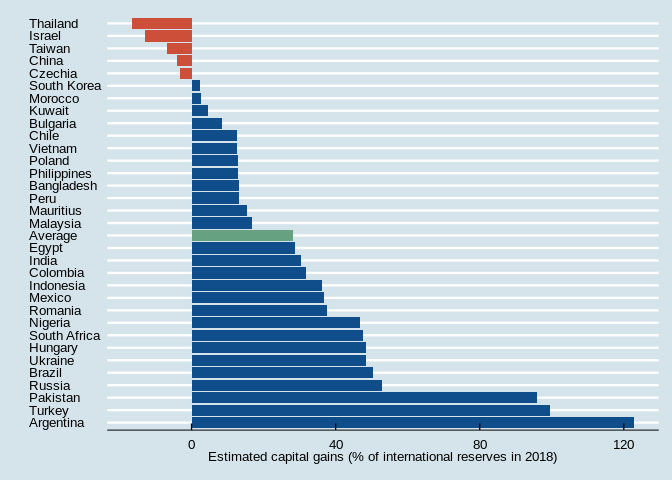

Capital gains
================
João Pedro S. Macalós
2/10/2020

The objective of this notebook is to show how the Figure 3 “Estimated
capital gains, several countries, 2002-2018” of the paper “Does the
accounting framework affect the operational capacity of the central
bank? Lessons from the Brazilian experience” was built, step by step.
The collection and cleaning steps are presented, but static versions of
the data were saved for future reproducibility of the paper.

The first step is to load the `tidyverse` and the `lubridate` packages
that are extensively
    used:

``` r
library(tidyverse)
```

    ## ── Attaching packages ────────────────────────────────────────────────────────────────────────────────────────────────────────────── tidyverse 1.3.0 ──

    ## ✓ ggplot2 3.2.1     ✓ purrr   0.3.3
    ## ✓ tibble  2.1.3     ✓ dplyr   0.8.3
    ## ✓ tidyr   1.0.0     ✓ stringr 1.4.0
    ## ✓ readr   1.3.1     ✓ forcats 0.4.0

    ## ── Conflicts ───────────────────────────────────────────────────────────────────────────────────────────────────────────────── tidyverse_conflicts() ──
    ## x dplyr::filter() masks stats::filter()
    ## x dplyr::lag()    masks stats::lag()

``` r
library(lubridate)
```

    ## 
    ## Attaching package: 'lubridate'

    ## The following object is masked from 'package:base':
    ## 
    ##     date

## Download the raw data:

The following function downloads and clean the data from the IMF, using
the `imfr` package:

``` r
ifs_getA <- function(id, country = list_em2, start = 2000) {
  imfr::imf_data(database_id = "IFS", indicator = id, freq = "A", country = country, start = start) %>%
    as_tibble() %>%
    mutate(date = ymd(year, truncated = 2)) %>%
    select(iso2c, date, id) %>%
    gather(key, value, -date, -iso2c)
}
```

List of
NIEs:

``` r
url_emes <- xml2::read_html("https://en.wikipedia.org/wiki/Emerging_market")

list_emes_wiki <- url_emes %>% rvest::html_nodes(xpath = "/html/body/div[3]/div[3]/div[4]/div/table[1]") %>% rvest::html_table()

list_em_wiki <- list_emes_wiki[[1]]  %>%
  filter(Country != "Greece") %>%
  pull(Country)

list_em2 <- countrycode::countrycode(list_em_wiki, 'country.name', 'iso2c')

#list_em2_backup <- list_em2 %>% enframe %>% select(iso2c = value)
#write_tsv(list_em2_backup, 'list_em2.tsv')
```

To make the estimation of the capital gains, two series are required:
the exchange rate (to the USD) and the stocks of international reserves.
Their codes in the IMF-IFS database are `ENDE_XDC_USD_RATE` and
`RAFA_USD`,
respectively.

``` r
res_nies <- ifs_getA('RAFA_USD', list_em2, 2002) %>% select(date, iso2c, res = value)
exr_nies <- ifs_getA('ENDE_XDC_USD_RATE', list_em2, 2002) %>% select(date, iso2c, exr = value)
```

Capital gains are calculated following Godley and Lavoie (2007, p. 135),
and are defined as the price variation from t-1 to t times the stocks in
t. Algebraically:

\[
KG = \Delta exr \cdot RES
\] To measure the capital gains, the `res_nies` series is joined to the
`exr_nies` series, a new column representing the variation of the
exchange rate (`d_exr`) is created and the capital gains are calculated
by multiplying this series by the lag of
reserves:

``` r
capital_gains_nies <- inner_join(res_nies, exr_nies, by=c('iso2c', 'date')) %>%
  group_by(iso2c) %>%
  mutate(d_exr = exr - lag(exr)) %>%
  mutate(capital_gains = d_exr*lag(res))

#write_tsv(capital_gains_nies, 'capital_gains_nies_raw.tsv')
```

The next step is to calculate the accumulated capital gains in 2018,
convert them to 2018 USDs and compare them to the stocks of
international reserves in 2018.

Accumulated capital gains in 2018:

``` r
k_gains_total <- capital_gains_nies  %>%
  drop_na() %>%
  mutate(cumsum_gains = cumsum(capital_gains)) %>%
  summarize(cumsum_gains = last(cumsum_gains)) %>%
  filter(cumsum_gains != 0) %>%
  arrange(desc(cumsum_gains))
```

Exchange rates in 2018:

``` r
exr_2018 = exr_nies %>%
  filter(date == '2018-01-01') %>%
  select(iso2c, date, exr)
```

Reserves in 2018:

``` r
res_2018 = res_nies %>%
  filter(date == '2018-01-01') %>%
  select(iso2c, res)
```

Joining these 3 series together and calculating capital gains as a
proportion of 2018
reserves:

``` r
kgains <- inner_join(k_gains_total, exr_2018) %>% inner_join(res_2018) %>%
  mutate(k_gains_usd = cumsum_gains/exr) %>%
  mutate(k_gains_usd = k_gains_usd/res) %>%
  arrange(desc(k_gains_usd)) %>%
  mutate(iso2c = countrycode::countrycode(iso2c,'iso2c', 'country.name')) %>%
  mutate(iso2c = fct_reorder(iso2c, k_gains_usd, .desc = T)) %>%
  mutate(sign = if_else(k_gains_usd > 0, 'Positive', 'Negative'))
```

Calculate the mean capital gains accross countries:

``` r
inner_join(k_gains_total, exr_2018) %>% inner_join(res_2018) %>%
  mutate(k_gains_usd = cumsum_gains/exr) %>%
  mutate(k_gains_usd = k_gains_usd/res) %>%
  summarize(med = mean(k_gains_usd))
```

    ## # A tibble: 1 x 1
    ##     med
    ##   <dbl>
    ## 1 0.281

``` r
mean_kg = tribble(
  ~iso2c, ~cumsum_gains, ~date, ~exr, ~res, ~k_gains_usd, ~sign,
  'Average', NA, as.Date('2018-01-01'), NA, NA, 0.281, 'Mean'
)
```

# Figure 3

``` r
bind_rows(kgains, mean_kg) %>%
  mutate(iso2c = fct_reorder(iso2c, k_gains_usd, .desc = T)) %>%
  ggplot(aes(x=iso2c, y=100 * k_gains_usd)) +
  geom_bar(stat = 'identity', aes(fill = sign)) +
  coord_flip() +
  theme(legend.position = 'none') +
  scale_fill_manual('',values = c('#66a182', 'tomato3', 'dodgerblue4')) +
  labs(y='Estimated capital gains (% of international reserves in 2018)', x = '') +
  ggthemes::theme_economist() +
  theme(legend.position = 'none')
```

<!-- -->
