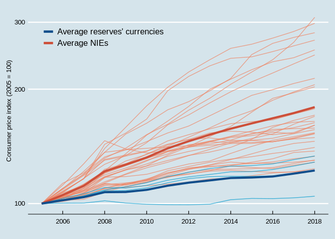

Consumer Price Indices
================
João Pedro S. Macalós
2/9/2020

The objective of this notebook is to show how the Figure 2 of the paper
“Does the accounting framework affect the operational capacity of the
central bank? Lessons from the Brazilian experience” was built, step by
step. The collection and cleaning steps are presented, but static
versions of the clean data were saved for future reproducibility of the
paper.

The first step is to load the `tidyverse` and `lubridate` packages that
are used extensively for cleaning the
    data:

``` r
library(tidyverse)
```

    ## ── Attaching packages ───────────────────────────────────────────────────────────────────────────────────────────────────────────── tidyverse 1.3.0 ──

    ## ✓ ggplot2 3.2.1     ✓ purrr   0.3.3
    ## ✓ tibble  2.1.3     ✓ dplyr   0.8.3
    ## ✓ tidyr   1.0.0     ✓ stringr 1.4.0
    ## ✓ readr   1.3.1     ✓ forcats 0.4.0

    ## ── Conflicts ──────────────────────────────────────────────────────────────────────────────────────────────────────────────── tidyverse_conflicts() ──
    ## x dplyr::filter() masks stats::filter()
    ## x dplyr::lag()    masks stats::lag()

``` r
library(lubridate)
```

    ## 
    ## Attaching package: 'lubridate'

    ## The following object is masked from 'package:base':
    ## 
    ##     date

The following functions are going to be useful:

``` r
# Download and clean data from the IMF
ifs_getA <- function(id, country = list_em2) {
  imfr::imf_data(database_id = "IFS", indicator = id, freq = "A", country = country, start = 2000) %>%
    as_tibble() %>%
    mutate(date = ymd(year, truncated = 2)) %>%
    select(iso2c, date, id) %>%
    gather(key, value, -date, -iso2c)
}
```

``` r
# Not in function
'%!in%' <- function(x,y)!('%in%'(x,y))
```

## Downloading the data

Required steps:

1.  Selection of the newly integrated economies (NIEs).
2.  Download NIEs data.
3.  Download the data for Euro area countries plus Japan, United States
    and United Kingdom.

## NIEs

### List of NIEs

The list of countries selected for this study is based on the Wikipedia
entry of [Emerging
Markets](https://en.wikipedia.org/wiki/Emerging_market).

``` r
url_emes <- xml2::read_html("https://en.wikipedia.org/wiki/Emerging_market")

list_emes_wiki <- url_emes %>% rvest::html_nodes(xpath = "/html/body/div[3]/div[3]/div[4]/div/table[1]") %>% rvest::html_table()

list_em_wiki <- list_emes_wiki[[1]]  %>%
  filter(Country != "Greece") %>%
  pull(Country)

list_em2 <- countrycode::countrycode(list_em_wiki, 'country.name', 'iso2c')
```

### Download

``` r
cpi_nies <- ifs_getA('PCPI_IX', country = list_em2)
#write_tsv(cpi_nies, 'cpi_nies_raw.tsv')
```

Check the data:

``` r
cpi_nies %>%
  filter(date >= '2005-01-01') %>%
  group_by(iso2c) %>%
  count() %>%
  arrange(n)
```

    ## # A tibble: 37 x 2
    ## # Groups:   iso2c [37]
    ##    iso2c     n
    ##    <chr> <int>
    ##  1 TW        2
    ##  2 VE        9
    ##  3 AE       13
    ##  4 IR       13
    ##  5 BD       14
    ##  6 EG       14
    ##  7 IN       14
    ##  8 KW       14
    ##  9 MA       14
    ## 10 MY       14
    ## # … with 27 more rows

Argentina is missing completely and there is not enough data about
Taiwan and Venezuela.

``` r
BIS_datasets <- BIS::get_datasets()
bis_cpi <- BIS::get_bis(BIS_datasets$url[BIS_datasets$name == "Consumer prices"])
```

Data from Argentina can be obtained in the BIS database:

``` r
bis_cpi_missing <- bis_cpi %>%
  filter(freq == 'A',
         unit_of_measure == 'Index, 2010 = 100') %>%
  filter(ref_area %in% list_em2) %>%
  mutate(date = as.numeric(date)) %>%
  filter(date > 2004) %>%
  select(ref_area, date, obs_value) %>%
  set_names('iso2c', 'date', 'value') %>%
  filter(iso2c %in% c('AR', 'TW', 'VE', 'AE', 'IR')) %>%
  mutate(date = ymd(date, truncated = 2))

#write_tsv(bis_cpi_missing, 'cpi_nies_missing_raw.tsv')
```

Check the countries with the higher inflation rates in 2018:

``` r
cpi_nies %>%
  bind_rows(bis_cpi_missing) %>%
  filter(iso2c %!in% c('VE', 'TW')) %>%
  select(-key) %>%
  filter(date == '2018-01-01') %>%
  arrange(desc(value)) %>% 
  slice(1:4)
```

    ## # A tibble: 4 x 3
    ##   iso2c date       value
    ##   <chr> <date>     <dbl>
    ## 1 AR    2018-01-01  417.
    ## 2 EG    2018-01-01  264.
    ## 3 UA    2018-01-01  261.
    ## 4 NG    2018-01-01  240.

To consolidate the data, Venezuela, Taiwan, and Iran are deleted due to
insufficient data (less than 14 observations). Furthermore, Argentina,
Egypt, Ukraine and Nigeria are deleted since they are the 4 highest
cases of consumer price indices in 2018.

``` r
cpi_nies2 <-
  cpi_nies %>%
  filter(iso2c != 'AE') %>%
  bind_rows(bis_cpi_missing) %>%
  filter(iso2c %!in% c('VE', 'TW', 'AR', 'EG', 'UA', 'NG', 'IR')) %>%
  arrange(iso2c)

# AE is added back together with AR
```

Define the date range (from 2005 to 2018) and set 2005 as 100.

``` r
cpi_nies3 <- cpi_nies2 %>%
  select(-key) %>%
  spread(iso2c, value) %>%
  filter(date >= '2005-01-01', date < '2019-01-01') %>%
  mutate_at(vars(-date), list(~ . * 100 / (.[1])))
```

## Reserves’ currencies countries

The consumer price indices (CPI) of the NIEs are compared to the CPIs of
the countries that issue the currencies that denominate the majority of
the global international reserves, i.e., United States, Europe, Japan
and United Kingdom.

The CPI inside the Eurozone is calculated as the average CPI between the
countries inside the Eurozone in each year starting from 2005. To get
this series, the first step is to find a list of the countries inside
the Eurozone in each, a list that can be found in the Wikipedia entry
for the
[Eurozone](https://en.wikipedia.org/wiki/Eurozone):

``` r
url_eurozone <- xml2::read_html('https://en.wikipedia.org/wiki/Eurozone')
table_eurozone <- url_eurozone %>% 
  rvest::html_nodes(xpath = "/html/body/div[3]/div[3]/div[4]/div/table[3]") %>% 
  rvest::html_table()

list_eurozone <- 
  table_eurozone[[1]] %>%
  as_tibble() %>%
  mutate(Adopted = str_remove_all(Adopted, pattern = "\\[[0-9]{2}\\]$")) %>%
  select(State, Adopted) %>%
  mutate(date_adopted = ymd(Adopted)) %>%
  drop_na %>%
  mutate(iso2c = countrycode::countrycode(State, 'country.name', 'iso2c')) %>%
  mutate(inside = TRUE) %>%
  select(date_adopted, iso2c)
```

    ## Warning: 1 failed to parse.

``` r
list_eurozone
```

    ## # A tibble: 19 x 2
    ##    date_adopted iso2c
    ##    <date>       <chr>
    ##  1 1999-01-01   AT   
    ##  2 1999-01-01   BE   
    ##  3 2008-01-01   CY   
    ##  4 2011-01-01   EE   
    ##  5 1999-01-01   FI   
    ##  6 1999-01-01   FR   
    ##  7 1999-01-01   DE   
    ##  8 2001-01-01   GR   
    ##  9 1999-01-01   IE   
    ## 10 1999-01-01   IT   
    ## 11 2014-01-01   LV   
    ## 12 2015-01-01   LT   
    ## 13 1999-01-01   LU   
    ## 14 2008-01-01   MT   
    ## 15 1999-01-01   NL   
    ## 16 1999-01-01   PT   
    ## 17 2009-01-01   SK   
    ## 18 2007-01-01   SI   
    ## 19 1999-01-01   ES

With a list that includes the date of adoption of the Euro it is
possible to proceed to the download of the data:

``` r
cpi_euro <- ifs_getA('PCPI_IX', country = list_eurozone$iso2c)
#write_tsv(cpi_euro, 'cpi_euro_raw.tsv')
```

The next step is to summarize the data by year. In order to do that, we
filter out the countries prior to the adoption of the Euro:

``` r
cpi_euro2 <-
  cpi_euro %>%
  full_join(list_eurozone, by='iso2c') %>%
  mutate(inside = if_else(date >= date_adopted, TRUE, FALSE)) %>%
  filter(inside == TRUE) %>%
  group_by(date) %>%
  summarize(eurozone = mean(value)) %>%
  gather(iso2c, value, -date)
```

This data must be joined to the data on the United States, Japan, and
the United Kingdom:

``` r
cpi_usjpuk <- ifs_getA('PCPI_IX', country = c('US', 'JP', 'GB'))
#write_tsv(cpi_usjpuk, 'cpi_usjpuk_raw.tsv')
```

Consolidate the data for the reserve’ currencies countries:

``` r
cpi_res <- cpi_usjpuk %>%
  select(-key) %>%
  bind_rows(cpi_euro2) %>%
  filter(date >= '2005-01-01')
```

``` r
cpi_res2 <-
  cpi_res %>%
  spread(iso2c, value) %>%
  filter(date < '2019-01-01') %>%
  mutate_at(vars(-date), list(~ . * 100 / (.[1])))
```

#### Consolidate the data and save a backup file:

Here the data must be consolidated (already in the long format) and a
backup file is saved for future use:

``` r
cpi_consolidated <- cpi_nies3 %>%
  left_join(cpi_res2) %>%
  gather(iso2c, value, -date)
```

    ## Joining, by = "date"

``` r
#write_tsv(cpi_consolidated, 'cpi_consolidated.tsv')
```

## Figure:

Before building the Figure, a grouping variable `classification` is
added:

``` r
cpi_consolidated <- cpi_consolidated %>%
  mutate(classification = if_else(iso2c %in% list_em2, 'EME', 'AE'))
```

Calculate the mean CPI for each
group:

``` r
mean_groups <- cpi_consolidated %>% group_by(date, classification) %>% summarize(mean = mean(value, na.rm = T)) %>% ungroup
```

``` r
ggplot(cpi_consolidated, aes(x=date)) +
  geom_line(data = cpi_consolidated %>% filter(classification == 'EME'), aes(y=value, group = iso2c), color = 'salmon2', alpha = 0.7) +
  geom_line(data = cpi_consolidated %>% filter(classification == 'AE'), aes(y=value, group = iso2c), color = 'deepskyblue3', alpha = 0.7) +
  geom_line(data = (mean_groups %>% filter(classification == 'EME')), aes(x=date, y = mean, color = classification), size = 1.5) +
  geom_line(data = (mean_groups %>% filter(classification == 'AE')), aes(x=date, y = mean, color = classification), size = 1.5) +
  scale_color_manual("", labels = c("Average reserves' currencies", 'Average NIEs'), values = c('dodgerblue4', 'tomato3')) +
  scale_y_log10() +
  ggthemes::theme_economist() +
  theme(legend.position = c(0.25, 0.88),
        legend.background = element_blank()) +
  scale_x_date(breaks = '2 years', date_labels = '%Y') +
  labs(x='', y = 'Consumer price index (2005 = 100)')
```

<!-- -->
