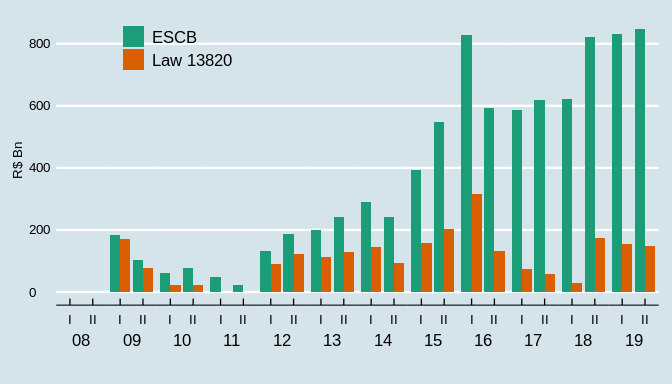
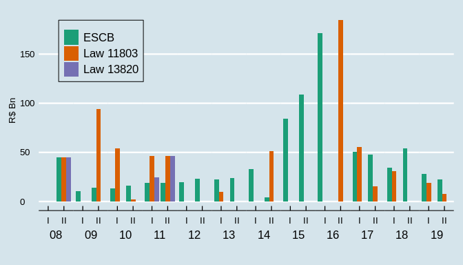
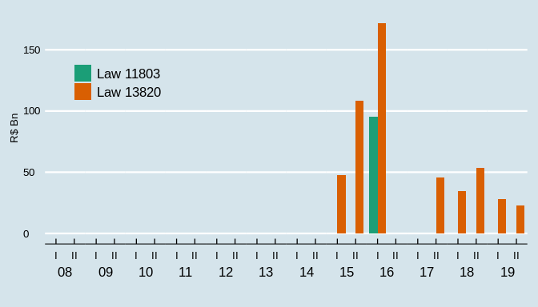

Accounting simulations
================
João Pedro S. Macalós
2/14/2020

The objective of this notebook is to demonstrate how we did the
simulations of how the transfers between the Brazilian Central Bank and
the Brazilian treasury would have been under different accounting
regimes. These simulations are the heart of the section 6.3 of the paper
“Does the accounting framework affect the operational capacity of the
central bank? Lessons from the Brazilian experience”.

To make these simulations, some results are key:

1.  Realized and unrealized results of the central bank.
2.  Foreign exchange operations and operational result of the central
    bank.

## Methodological note

The realized results of the BCB on its foreign exchange operations are
composed of three items:

1.  Financial results with FX swaps;
2.  Carrying costs of international reserves;
3.  Interest income

The unrealized FX results of the BCB are composed by:

1.  Exchange rate retranslation of international reserves;
2.  Price variation (in dollars) of its international reserves.

Before 2011, the information available on the financial reports of the
BCB did not segregate the data on the income of the BCB on its
international reserves; it only contained data on the profit rate and on
the cost rate faced by the central bank. From 2011 onwards, the BCB
started to disclose the profitability of the international reserves
excluding the exchange rate variation. However, the distinction between
unrealized and realized results of the BCB excluding the retranslation
of reserves is only made in the body of the text. Therefore, these data
was obtained by hand, and a table with the collected values is shared in
this notebook. The reader can find these values in the section c) of the
“Lei de resposabilidade fiscal” item in the financial reports of the
BCB.

### Definitions

Some definitions:

According to the BCB, the gross profits from the international reserves
are defined as the sum of the interest income in dollars plus the price
variation of the foreign assets (in dollars) plus the retranslation of
of the value of the assets from dollars to Brazilian reals:

  
  

The left hand side can be divided between its realized and unrealized
components:

  
  
  
  

Where UR stands for unrealized results and RRfor realized results on
international reserves. By substituting on the first equation, it is
possible to derive the unrealized results as:

  
  

This definition will be used in this notebook.

To find the total realized results of the BCB, on the other hand, we
aggregate the
 with the financial income or expenses on FX swaps
(competence results) plus the carrying costs of the international
reserves, measured as the average stock of international reserves
multiplied by the average cost rate:

  
  
Where CC is carrying cost.

# Simulations

Load python libraries:

``` python
import pandas as pd
import numpy as np
```

Pandas display configuration:

``` python
pd.set_option('display.max_columns', 10)
pd.set_option('display.max_rows', 50)
pd.set_option('display.width', 1000)
```

``` python
bcb_det = pd.read_csv('table4_detailed_files/table4_detailed_raw.csv', index_col = 0)
bcb_det.columns
```

    ## Index(['year', 'sem', 'reserves', 'cost_rate_annual', 'notional', 'competence', 'gross_profits', 'carrying', 'net_profits', 'equalization', 'operational', 'total_res', 'realized', 'd_er'], dtype='object')

Select important columns and multiply carrying costs by
-1:

``` python
bcb_profits = (bcb_det[['year', 'sem', 'reserves', 'gross_profits', 'carrying', 'net_profits',
               'realized', 'equalization']]
               .assign(unreal_profits = lambda x: x.gross_profits)
               .assign(carrying = lambda x: -1 * x.carrying)
               )
```

``` python
bcb_profits[['year', 'sem', 'realized']].tail()
```

    ##     year  sem   realized
    ## 18  2017    1 -52865.706
    ## 19  2017    2 -41420.377
    ## 20  2018    1 -63637.238
    ## 21  2018    2 -43393.464
    ## 22  2019    1 -37328.203

Load interest income table and
clean:

``` python
bcb_intincome = pd.read_csv('../../table_exclusivecambial_2011_2019.md', sep = '|')
bcb_ii = bcb_intincome.iloc[1:,1:4]
bcb_ii = bcb_ii.rename(columns=lambda x: x.strip())
bcb_ii[['year', 'quarter']] = bcb_ii.date.str.split('-', expand = True)
bcb_ii = bcb_ii.assign(sem = lambda x: np.where(bcb_ii.quarter.str.contains('01|02'), 1, 2))
bcb_ii = bcb_ii[['year', 'sem', 'interest', 'price']]
bcb_ii = bcb_ii.apply(pd.to_numeric, errors = 'coerce')

bcb_ii.head()
```

    ##    year  sem  interest  price
    ## 1  2011    1      0.54  -0.48
    ## 2  2011    1      0.65   0.81
    ## 3  2011    2      0.40   1.23
    ## 4  2011    2      0.29   0.09
    ## 5  2012    1      0.33  -0.14

Summarize interest rate
received:

``` python
bcb_iisum = bcb_ii.assign(int_y = lambda x: 100 * (((1 + (x.interest/100)) ** 4) - 1))
bcb_iisum.agg({'int_y':'mean'})
```

    ## int_y    1.098023
    ## dtype: float64

Convert to semiannual
values

``` python
bcb_ii2 = bcb_ii.assign(int_s = lambda x: (((1 + (x.interest/100)) ** 2) - 1))
bcb_ii2 = bcb_ii2.groupby(['year', 'sem']).agg({'int_s':'mean'}).reset_index()
bcb_ii2.head()
```

    ##    year  sem     int_s
    ## 0  2011    1  0.011936
    ## 1  2011    2  0.006912
    ## 2  2012    1  0.006310
    ## 3  2012    2  0.005447
    ## 4  2013    1  0.004605

Join with tables and calculate the corrected realized values from 2011
onwards:

``` python
bcb_profits = bcb_profits.merge(bcb_ii2, how = 'left', on = ['year', 'sem'])
bcb_profits = bcb_profits.fillna(0)
bcb_profits = (bcb_profits.assign(int_income = lambda x: x.int_s * x.reserves)
                    .assign(realized = lambda x: x.realized + x.int_income)
                    )
```

``` python
bcb_profits.tail()
```

    ##     year  sem     reserves  gross_profits   carrying  ...      realized  equalization  unreal_profits     int_s    int_income
    ## 18  2017    1  1194202.052      37120.917 -56202.572  ... -47485.604828    -15744.789       37120.917  0.004505   5380.101172
    ## 19  2017    2  1220361.996      10743.016 -44366.254  ... -34332.001975    -30677.360       10743.016  0.005808   7088.375025
    ## 20  2018    1  1309456.844     209838.617 -45972.087  ... -53797.501322    146201.379      209838.617  0.007514   9839.736678
    ## 21  2018    2  1481125.927      24259.658 -46798.282  ... -28396.227153    -19133.806       24259.658  0.010126  14997.236847
    ## 22  2019    1  1469645.384      29767.401 -42202.101  ... -22742.700038     -7560.802       29767.401  0.009925  14585.502962
    ## 
    ## [5 rows x 11 columns]

### Numerical simulation

This numerical simulation is a proof of concept. It is intended to show
that the code works:

``` python
gp = [10, 10, -30, 20, 10, -50, 70, 0]
carrying = [5, 5, 5, 5, 5, 5, 5, 5]
d = {'gp':gp, 'carrying':carrying}

gp1 = pd.DataFrame(d)
gp1 = gp1.assign(revaluation = 0).assign(transfer = 0)
```

``` python
for row, v in gp1.iterrows():
    if row>0:
        gp1.loc[row, 'revaluation'] = gp1.shift(1).loc[row, 'gp'] + gp1.shift(1).loc[row, 'revaluation']
        gp1.loc[row, 'transfer'] = gp1.loc[row, 'revaluation'] + gp1.shift(1).loc[row, 'transfer'] + gp1.shift(1).loc[row, 'carrying'] if \
        gp1.loc[row, 'revaluation'] < 0 else gp1.shift(1).loc[row, 'transfer'] - gp1.shift(1).loc[row, 'carrying']
        gp1.loc[row, 'revaluation'] = 0 if gp1.loc[row, 'revaluation'] < 0 else gp1.loc[row, 'revaluation']
        #gp1.loc[row, 'transfer'] = gp1.shift(1).loc[row, 'transfer'] - gp1.shift(1).loc[row, 'carrying']
```

``` python
gp1
```

    ##    gp  carrying  revaluation  transfer
    ## 0  10         5          0.0       0.0
    ## 1  10         5         10.0      -5.0
    ## 2 -30         5         20.0     -10.0
    ## 3  20         5          0.0     -15.0
    ## 4  10         5         20.0     -20.0
    ## 5 -50         5         30.0     -25.0
    ## 6  70         5          0.0     -40.0
    ## 7   0         5         70.0     -45.0

## ESCB

Remember that in the ESCB accounting framework, the important
distinction is between the realized and the unrealized results of the
central bank.

**Unrealized**:

1.  If unreal\_profits \> 0, add to revaluation;
2.  If unreal\_profits \< 0, subtract from revaluation;
3.  If revaluation \< 0, add to transfer to treasury.

**Realized**

1.  Transferred directly to the
    treasury.

<!-- end list -->

``` python
bcb_profits.head()
```

    ##    year  sem    reserves  gross_profits   carrying  ...   realized  equalization  unreal_profits  int_s  int_income
    ## 0  2008    1  327650.405     -26570.114 -13008.729  ... -18226.832    -44798.256      -26570.114    0.0         0.0
    ## 1  2008    2  397776.298     182208.219 -21358.998  ... -10812.771    171416.012      182208.219    0.0         0.0
    ## 2  2009    1  438075.574     -79393.613 -16678.701  ... -14381.068    -93787.316      -79393.613    0.0         0.0
    ## 3  2009    2  402004.990     -40231.955 -13672.457  ... -13689.005    -53931.576      -40231.955    0.0         0.0
    ## 4  2010    1  440389.220      14160.113 -16077.276  ... -16077.276     -1893.172       14160.113    0.0         0.0
    ## 
    ## [5 rows x 11 columns]

``` python
final_row = [{'year':'2019', 'sem':'2', 'gross_profits':0, 'carrying':0, 'net_profits':0, \
            'realized':0, 'equalization':0, 'unreal_profits':0}]

bcb_profits1 = bcb_profits.append(final_row).reset_index().iloc[:, 1:10]
```

``` python
bcb_profits1.columns
```

    ## Index(['year', 'sem', 'reserves', 'gross_profits', 'carrying', 'net_profits', 'realized', 'equalization', 'unreal_profits'], dtype='object')

``` python
df = bcb_profits1.assign(revaluation = 0).assign(transfers_T = 0)
```

``` python
for row, v in df.iterrows():
    if row > 0:
        df.loc[row, 'revaluation'] = df.shift(1).loc[row, 'unreal_profits'] + df.shift(1).loc[row, 'revaluation']
        df.loc[row, 'transfers_T'] = df.shift(1).loc[row, 'realized'] + df.loc[row, 'revaluation'] if df.loc[row, 'revaluation'] < 0 \
        else df.shift(1).loc[row, 'realized']
        df.loc[row, 'transfer_from_T'] = df.loc[row, 'transfers_T'] if df.loc[row, 'transfers_T'] < 0 else 0
        df.loc[row, 'transfer_to_T'] = df.loc[row, 'transfers_T'] if df.loc[row, 'transfers_T'] > 0 else 0
        df.loc[row, 'revaluation'] = 0 if df.loc[row, 'revaluation'] < 0 else df.loc[row, 'revaluation']
```

``` python
escb = df.assign(total_transfers = np.cumsum(df.transfers_T))
escb[['year', 'sem', 'equalization', 'unreal_profits', 'revaluation', 'realized', \
      'transfers_T', 'total_transfers', 'transfer_to_T', 'transfer_from_T']]
```

    ##     year sem  equalization  unreal_profits  revaluation       realized    transfers_T  total_transfers  transfer_to_T  transfer_from_T
    ## 0   2008   1    -44798.256      -26570.114        0.000  -18226.832000       0.000000         0.000000            NaN              NaN
    ## 1   2008   2    171416.012      182208.219        0.000  -10812.771000  -44796.946000    -44796.946000       0.000000    -44796.946000
    ## 2   2009   1    -93787.316      -79393.613   182208.219  -14381.068000  -10812.771000    -55609.717000       0.000000    -10812.771000
    ## 3   2009   2    -53931.576      -40231.955   102814.606  -13689.005000  -14381.068000    -69990.785000       0.000000    -14381.068000
    ## 4   2010   1     -1893.172       14160.113    62582.651  -16077.276000  -13689.005000    -83679.790000       0.000000    -13689.005000
    ## 5   2010   2    -46636.548      -27450.640    76742.764  -19149.102000  -16077.276000    -99757.066000       0.000000    -16077.276000
    ## 6   2011   1    -46199.286      -20777.299    49292.124  -19232.679616  -19149.102000   -118906.168000       0.000000    -19149.102000
    ## 7   2011   2     90240.059      114338.120    28514.825  -19992.038899  -19232.679616   -138138.847616       0.000000    -19232.679616
    ## 8   2012   1     32210.001       59664.739   142852.945  -23193.372491  -19992.038899   -158130.886515       0.000000    -19992.038899
    ## 9   2012   2     -9900.595       16818.895   202517.684  -22519.221207  -23193.372491   -181324.259006       0.000000    -23193.372491
    ## 10  2013   1     15766.502       43498.072   219336.579  -24216.059223  -22519.221207   -203843.480213       0.000000    -22519.221207
    ## 11  2013   2     15918.931       52063.356   262834.651  -33177.131465  -24216.059223   -228059.539437       0.000000    -24216.059223
    ## 12  2014   1    -51223.638      -44452.354   314898.007   -4431.215079  -33177.131465   -261236.670902       0.000000    -33177.131465
    ## 13  2014   2     65173.472      152617.460   270445.653  -84079.244296   -4431.215079   -265667.885981       0.000000     -4431.215079
    ## 14  2015   1     46406.614      157653.446   423063.113 -108592.459060  -84079.244296   -349747.130277       0.000000    -84079.244296
    ## 15  2015   2    110938.088      286010.132   580716.559 -171652.539131 -108592.459060   -458339.589337       0.000000   -108592.459060
    ## 16  2016   1   -184645.401     -234337.424   866726.691   52599.127143 -171652.539131   -629992.128467       0.000000   -171652.539131
    ## 17  2016   2    -55673.843       -1259.935   632389.267  -50602.651650   52599.127143   -577393.001325   52599.127143         0.000000
    ## 18  2017   1    -15744.789       37120.917   631129.332  -47485.604828  -50602.651650   -627995.652975       0.000000    -50602.651650
    ## 19  2017   2    -30677.360       10743.016   668250.249  -34332.001975  -47485.604828   -675481.257804       0.000000    -47485.604828
    ## 20  2018   1    146201.379      209838.617   678993.265  -53797.501322  -34332.001975   -709813.259779       0.000000    -34332.001975
    ## 21  2018   2    -19133.806       24259.658   888831.882  -28396.227153  -53797.501322   -763610.761101       0.000000    -53797.501322
    ## 22  2019   1     -7560.802       29767.401   913091.540  -22742.700038  -28396.227153   -792006.988254       0.000000    -28396.227153
    ## 23  2019   2         0.000           0.000   942858.941       0.000000  -22742.700038   -814749.688292       0.000000    -22742.700038

``` python
#escb.to_csv('sim_escb.csv')
```

## Law 13.820

In this framework, what matters is the foreing exchange operations (the
equalization account).

1.  If equalization \> 0, add to revaluation;
2.  If equalization \< 0, subtract from revaluation;
3.  If revaluation \< 0, add to transfer to treasury.

The simulations starts with the central bank holding 160000 in bonds
that can be used for monetary policy. This is approximately the stocks
of free bonds on the BCB accounts in the end of 2007. Check the paper
for further
details.

``` python
law13 = bcb_profits1.assign(revaluation = 0).assign(transfer_from_T = 0).assign(available_bonds = 160000).assign(recap = 0)

for row, v in law13.iterrows():
    if row>0:
        law13.loc[row, 'revaluation'] = law13.shift(1).loc[row, 'equalization'] + law13.shift(1).loc[row, 'revaluation']
        law13.loc[row, 'transfer_from_T'] = law13.loc[row, 'revaluation'] if law13.loc[row, 'revaluation'] < 0 else 0
        law13.loc[row, 'revaluation'] = 0 if law13.loc[row, 'revaluation'] < 0 else law13.loc[row, 'revaluation']
        law13.loc[row, 'available_bonds'] = -1 * law13.loc[row, 'transfer_from_T'] + law13.shift(1).loc[row, 'realized'] + \
        law13.shift(1).loc[row, 'available_bonds']
        law13.loc[row, 'further_recap'] = -1 * law13.loc[row, 'available_bonds'] if law13.loc[row, 'available_bonds'] < 0 else 0
        law13.loc[row, 'available_bonds'] = 0 if law13.loc[row, 'available_bonds'] < 0 else law13.loc[row, 'available_bonds']
        
```

``` python
law132 = law13[['year', 'sem', 'equalization', 'realized', 'revaluation', 'transfer_from_T', 'available_bonds', 'further_recap']]
law132 = law132.assign(total_recap = lambda x: np.cumsum(x.further_recap))
law132
```

    ##     year sem  equalization       realized  revaluation  transfer_from_T  available_bonds  further_recap    total_recap
    ## 0   2008   1    -44798.256  -18226.832000        0.000            0.000    160000.000000            NaN            NaN
    ## 1   2008   2    171416.012  -10812.771000        0.000       -44798.256    186571.424000       0.000000       0.000000
    ## 2   2009   1    -93787.316  -14381.068000   171416.012            0.000    175758.653000       0.000000       0.000000
    ## 3   2009   2    -53931.576  -13689.005000    77628.696            0.000    161377.585000       0.000000       0.000000
    ## 4   2010   1     -1893.172  -16077.276000    23697.120            0.000    147688.580000       0.000000       0.000000
    ## 5   2010   2    -46636.548  -19149.102000    21803.948            0.000    131611.304000       0.000000       0.000000
    ## 6   2011   1    -46199.286  -19232.679616        0.000       -24832.600    137294.802000       0.000000       0.000000
    ## 7   2011   2     90240.059  -19992.038899        0.000       -46199.286    164261.408384       0.000000       0.000000
    ## 8   2012   1     32210.001  -23193.372491    90240.059            0.000    144269.369485       0.000000       0.000000
    ## 9   2012   2     -9900.595  -22519.221207   122450.060            0.000    121075.996994       0.000000       0.000000
    ## 10  2013   1     15766.502  -24216.059223   112549.465            0.000     98556.775787       0.000000       0.000000
    ## 11  2013   2     15918.931  -33177.131465   128315.967            0.000     74340.716563       0.000000       0.000000
    ## 12  2014   1    -51223.638   -4431.215079   144234.898            0.000     41163.585098       0.000000       0.000000
    ## 13  2014   2     65173.472  -84079.244296    93011.260            0.000     36732.370019       0.000000       0.000000
    ## 14  2015   1     46406.614 -108592.459060   158184.732            0.000         0.000000   47346.874277   47346.874277
    ## 15  2015   2    110938.088 -171652.539131   204591.346            0.000         0.000000  108592.459060  155939.333337
    ## 16  2016   1   -184645.401   52599.127143   315529.434            0.000         0.000000  171652.539131  327591.872467
    ## 17  2016   2    -55673.843  -50602.651650   130884.033            0.000     52599.127143       0.000000  327591.872467
    ## 18  2017   1    -15744.789  -47485.604828    75210.190            0.000      1996.475492       0.000000  327591.872467
    ## 19  2017   2    -30677.360  -34332.001975    59465.401            0.000         0.000000   45489.129336  373081.001804
    ## 20  2018   1    146201.379  -53797.501322    28788.041            0.000         0.000000   34332.001975  407413.003779
    ## 21  2018   2    -19133.806  -28396.227153   174989.420            0.000         0.000000   53797.501322  461210.505101
    ## 22  2019   1     -7560.802  -22742.700038   155855.614            0.000         0.000000   28396.227153  489606.732254
    ## 23  2019   2         0.000       0.000000   148294.812            0.000         0.000000   22742.700038  512349.432292

``` python
#law132.to_csv('sim_law13.csv')
```

## Law 11.803 framework

This framework was quite simple:

1.  If equalization \> 0, transfer to the treasury;
2.  If equalization \< 0, covered by the treasury.

<!-- end list -->

``` python
law11 = bcb_profits1
law11 = (law11.assign(transfer_to_T = pd.np.where(law11.shift(1).equalization > 0, law11.shift(1).equalization, 0))
        .assign(transfer_from_T = -1 * pd.np.where(law11.shift(1).equalization < 0, law11.shift(1).equalization, 0))
        )

law11b = law11[['year', 'sem', 'equalization', 'realized', 'transfer_to_T', 'transfer_from_T']]
```

``` python
law11b.head()
```

    ##    year sem  equalization   realized  transfer_to_T  transfer_from_T
    ## 0  2008   1    -44798.256 -18226.832          0.000           -0.000
    ## 1  2008   2    171416.012 -10812.771          0.000        44798.256
    ## 2  2009   1    -93787.316 -14381.068     171416.012           -0.000
    ## 3  2009   2    -53931.576 -13689.005          0.000        93787.316
    ## 4  2010   1     -1893.172 -16077.276          0.000        53931.576

``` python
law11b = law11b.assign(available_bonds = 160000).assign(further_recap = 0)

for row, v in law11b.iterrows():
    if row>0:
        law11b.loc[row, 'available_bonds'] = law11b.shift(1).loc[row, 'available_bonds'] + \
        law11b.shift(1).loc[row, 'transfer_from_T'] + law11b.shift(1).loc[row, 'realized']
        law11b.loc[row, 'further_recap'] = -1 * law11b.loc[row, 'available_bonds'] if law11b.loc[row, 'available_bonds'] < 0 else 0
        law11b.loc[row, 'available_bonds'] = 0 if law11b.loc[row, 'available_bonds'] < 0 else law11b.loc[row, 'available_bonds']
```

``` python
law11b
#law11b.to_csv('sim_law11.csv')
```

    ##     year sem  equalization       realized  transfer_to_T  transfer_from_T  available_bonds  further_recap
    ## 0   2008   1    -44798.256  -18226.832000          0.000           -0.000    160000.000000       0.000000
    ## 1   2008   2    171416.012  -10812.771000          0.000        44798.256    141773.168000       0.000000
    ## 2   2009   1    -93787.316  -14381.068000     171416.012           -0.000    175758.653000       0.000000
    ## 3   2009   2    -53931.576  -13689.005000          0.000        93787.316    161377.585000       0.000000
    ## 4   2010   1     -1893.172  -16077.276000          0.000        53931.576    241475.896000       0.000000
    ## 5   2010   2    -46636.548  -19149.102000          0.000         1893.172    279330.196000       0.000000
    ## 6   2011   1    -46199.286  -19232.679616          0.000        46636.548    262074.266000       0.000000
    ## 7   2011   2     90240.059  -19992.038899          0.000        46199.286    289478.134384       0.000000
    ## 8   2012   1     32210.001  -23193.372491      90240.059           -0.000    315685.381485       0.000000
    ## 9   2012   2     -9900.595  -22519.221207      32210.001           -0.000    292492.008994       0.000000
    ## 10  2013   1     15766.502  -24216.059223          0.000         9900.595    269972.787787       0.000000
    ## 11  2013   2     15918.931  -33177.131465      15766.502           -0.000    255657.323563       0.000000
    ## 12  2014   1    -51223.638   -4431.215079      15918.931           -0.000    222480.192098       0.000000
    ## 13  2014   2     65173.472  -84079.244296          0.000        51223.638    218048.977019       0.000000
    ## 14  2015   1     46406.614 -108592.459060      65173.472           -0.000    185193.370723       0.000000
    ## 15  2015   2    110938.088 -171652.539131      46406.614           -0.000     76600.911663       0.000000
    ## 16  2016   1   -184645.401   52599.127143     110938.088           -0.000         0.000000   95051.627467
    ## 17  2016   2    -55673.843  -50602.651650          0.000       184645.401     52599.127143       0.000000
    ## 18  2017   1    -15744.789  -47485.604828          0.000        55673.843    186641.876492       0.000000
    ## 19  2017   2    -30677.360  -34332.001975          0.000        15744.789    194830.114664       0.000000
    ## 20  2018   1    146201.379  -53797.501322          0.000        30677.360    176242.901689       0.000000
    ## 21  2018   2    -19133.806  -28396.227153     146201.379           -0.000    153122.760366       0.000000
    ## 22  2019   1     -7560.802  -22742.700038          0.000        19133.806    124726.533213       0.000000
    ## 23  2019   2         0.000       0.000000          0.000         7560.802    121117.639175       0.000000

## Plot the main findings

Switch to R to plot the main
    findings:

``` r
library(tidyverse)
```

    ## ── Attaching packages ──────────────────────────────────────────────────────────────────────────────────────────────────── tidyverse 1.3.0 ──

    ## ✓ ggplot2 3.2.1     ✓ purrr   0.3.3
    ## ✓ tibble  2.1.3     ✓ dplyr   0.8.3
    ## ✓ tidyr   1.0.0     ✓ stringr 1.4.0
    ## ✓ readr   1.3.1     ✓ forcats 0.4.0

    ## ── Conflicts ─────────────────────────────────────────────────────────────────────────────────────────────────────── tidyverse_conflicts() ──
    ## x dplyr::filter() masks stats::filter()
    ## x dplyr::lag()    masks stats::lag()

``` r
library(reticulate)
library(lubridate)
```

    ## 
    ## Attaching package: 'lubridate'

    ## The following object is masked from 'package:base':
    ## 
    ##     date

``` r
escb_raw = py$escb %>% mutate_at(vars(year, sem), list(~ unlist(.))) %>% unite('date', year:sem, sep = '-0')
law13_raw = py$law132 %>% mutate_at(vars(year, sem), list(~ unlist(.))) %>% unite('date', year:sem, sep = '-0')
law11_raw = py$law11b %>% mutate_at(vars(year, sem), list(~ unlist(.))) %>% unite('date', year:sem, sep = '-0')
```

### Revaluation accounts (Figure 7)

This figure involves only the ESCB and Law 13.820 frameworks:

Merging and cleaning the data:

``` r
rev_df = escb_raw %>% select(date, escb = revaluation) %>%
  bind_cols(law13_raw %>% select(law13 = revaluation))

#rev_df

rev_df1 = rev_df %>%
  mutate(date = str_replace(date, '-01', '-04-30'),
         date = str_replace(date, '-02', '-09-30')) %>%
  mutate(date = ymd(date))

rev_df1
```

    ##          date      escb     law13
    ## 1  2008-04-30      0.00      0.00
    ## 2  2008-09-30      0.00      0.00
    ## 3  2009-04-30 182208.22 171416.01
    ## 4  2009-09-30 102814.61  77628.70
    ## 5  2010-04-30  62582.65  23697.12
    ## 6  2010-09-30  76742.76  21803.95
    ## 7  2011-04-30  49292.12      0.00
    ## 8  2011-09-30  28514.82      0.00
    ## 9  2012-04-30 142852.94  90240.06
    ## 10 2012-09-30 202517.68 122450.06
    ## 11 2013-04-30 219336.58 112549.47
    ## 12 2013-09-30 262834.65 128315.97
    ## 13 2014-04-30 314898.01 144234.90
    ## 14 2014-09-30 270445.65  93011.26
    ## 15 2015-04-30 423063.11 158184.73
    ## 16 2015-09-30 580716.56 204591.35
    ## 17 2016-04-30 866726.69 315529.43
    ## 18 2016-09-30 632389.27 130884.03
    ## 19 2017-04-30 631129.33  75210.19
    ## 20 2017-09-30 668250.25  59465.40
    ## 21 2018-04-30 678993.26  28788.04
    ## 22 2018-09-30 888831.88 174989.42
    ## 23 2019-04-30 913091.54 155855.61
    ## 24 2019-09-30 942858.94 148294.81

``` r
rev_df1 %>%
  gather(var, value, -date) %>%
  mutate(year = year(date),
         semester = rep(c('I', 'II'), 24))  %>%
  mutate(year = as.character(year)) %>%
  mutate(year = substr(year, start = 3, stop = 4)) %>%
  ggplot(aes(x=semester, y= value/1000, fill = var)) +
  geom_bar(stat = 'identity', position = 'dodge') +
  facet_wrap(~year, ncol = 12, strip.position = 'bottom') +
  ggthemes::theme_economist() +
  theme(panel.spacing = unit(0, 'lines'),
        strip.placement = "outside",
        legend.position = c(0.2, 0.9),
        legend.title = element_blank()) +
  labs(x = '', y = 'R$ Bn') +
  scale_fill_brewer(palette = 'Dark2', labels = c('ESCB', 'Law 13820'))
```

<!-- -->

### Losses covered by the treasury (Figure 8)

``` r
transf_df = escb_raw %>% select(date, escb = transfer_from_T) %>%
  bind_cols(law13_raw %>% select(law13 = transfer_from_T)) %>%
  bind_cols(law11_raw %>% select(law11 = transfer_from_T))

trans_df1 = transf_df %>%
  mutate(escb = replace_na(escb, 0)) %>%
  mutate(date = str_replace(date, '-01', '-06-01'),
         date = str_replace(date, '-02', '-12-01')) %>%
  mutate(date = ymd(date)) %>%
  #set_names('date', 'escb', 'uip', 'law11') %>%
  mutate_at(vars(escb, law13), list(~ -1 * .))

trans_df1
```

    ##          date       escb    law13      law11
    ## 1  2008-06-01      0.000     0.00      0.000
    ## 2  2008-12-01  44796.946 44798.26  44798.256
    ## 3  2009-06-01  10812.771     0.00      0.000
    ## 4  2009-12-01  14381.068     0.00  93787.316
    ## 5  2010-06-01  13689.005     0.00  53931.576
    ## 6  2010-12-01  16077.276     0.00   1893.172
    ## 7  2011-06-01  19149.102 24832.60  46636.548
    ## 8  2011-12-01  19232.680 46199.29  46199.286
    ## 9  2012-06-01  19992.039     0.00      0.000
    ## 10 2012-12-01  23193.372     0.00      0.000
    ## 11 2013-06-01  22519.221     0.00   9900.595
    ## 12 2013-12-01  24216.059     0.00      0.000
    ## 13 2014-06-01  33177.131     0.00      0.000
    ## 14 2014-12-01   4431.215     0.00  51223.638
    ## 15 2015-06-01  84079.244     0.00      0.000
    ## 16 2015-12-01 108592.459     0.00      0.000
    ## 17 2016-06-01 171652.539     0.00      0.000
    ## 18 2016-12-01      0.000     0.00 184645.401
    ## 19 2017-06-01  50602.652     0.00  55673.843
    ## 20 2017-12-01  47485.605     0.00  15744.789
    ## 21 2018-06-01  34332.002     0.00  30677.360
    ## 22 2018-12-01  53797.501     0.00      0.000
    ## 23 2019-06-01  28396.227     0.00  19133.806
    ## 24 2019-12-01  22742.700     0.00   7560.802

``` r
trans_df1 %>%
  gather(var, value, -date) %>%
  mutate(year = year(date),
         semester = rep(c('I', 'II'), 36))  %>%
  mutate(year = as.character(year)) %>%
  mutate(year = substr(year, start = 3, stop = 4)) %>%
  ggplot(aes(x=semester, y= value/1000, fill = var)) +
  geom_bar(stat = 'identity', position = 'dodge') +
  facet_wrap(~year, ncol = 12, strip.position = 'bottom') +
  ggthemes::theme_economist() +
  theme(panel.spacing = unit(0, 'lines'),
        strip.placement = "outside",
        legend.position = c(0.15, 0.80),
        legend.title = element_blank(),
        legend.box.background = element_rect(colour = "black", fill = '#d5e4eb')) +
  labs(x = '', y = 'R$ Bn') +
  scale_fill_brewer(palette = 'Dark2', labels = c('ESCB', 'Law 11803', 'Law 13820'))
```

<!-- -->

### Further recapitalization (Figure 9)

``` r
further_df = law13_raw %>% select(date, law13 = further_recap) %>%
  bind_cols(law11_raw %>% select(law11 = further_recap))

further_df1 = further_df %>% 
  mutate(date = str_replace(date, '-01', '-06-01'),
         date = str_replace(date, '-02', '-12-01')) %>%
  mutate(date = ymd(date)) %>%
  mutate(law13 = replace_na(law13, 0))

further_df1
```

    ##          date     law13    law11
    ## 1  2008-06-01      0.00     0.00
    ## 2  2008-12-01      0.00     0.00
    ## 3  2009-06-01      0.00     0.00
    ## 4  2009-12-01      0.00     0.00
    ## 5  2010-06-01      0.00     0.00
    ## 6  2010-12-01      0.00     0.00
    ## 7  2011-06-01      0.00     0.00
    ## 8  2011-12-01      0.00     0.00
    ## 9  2012-06-01      0.00     0.00
    ## 10 2012-12-01      0.00     0.00
    ## 11 2013-06-01      0.00     0.00
    ## 12 2013-12-01      0.00     0.00
    ## 13 2014-06-01      0.00     0.00
    ## 14 2014-12-01      0.00     0.00
    ## 15 2015-06-01  47346.87     0.00
    ## 16 2015-12-01 108592.46     0.00
    ## 17 2016-06-01 171652.54 95051.63
    ## 18 2016-12-01      0.00     0.00
    ## 19 2017-06-01      0.00     0.00
    ## 20 2017-12-01  45489.13     0.00
    ## 21 2018-06-01  34332.00     0.00
    ## 22 2018-12-01  53797.50     0.00
    ## 23 2019-06-01  28396.23     0.00
    ## 24 2019-12-01  22742.70     0.00

``` r
further_df1 %>%
  gather(var, value, -date) %>%
  mutate(year = year(date),
         semester = rep(c('I', 'II'), 24))  %>%
  mutate(year = as.character(year)) %>%
  mutate(year = substr(year, start = 3, stop = 4)) %>%
  ggplot(aes(x=semester, y= value/1000, fill = var)) +
  geom_bar(stat = 'identity', position = 'dodge') +
  facet_wrap(~year, ncol = 12, strip.position = 'bottom') +
  ggthemes::theme_economist() +
  theme(panel.spacing = unit(0, 'lines'),
        strip.placement = "outside",
        legend.position = c(0.15, 0.71),
        legend.title = element_blank()) +
  labs(x = '', y = 'R$ Bn') +
  scale_fill_brewer(palette = 'Dark2', labels = c('Law 11803', 'Law 13820'))
```

<!-- -->
