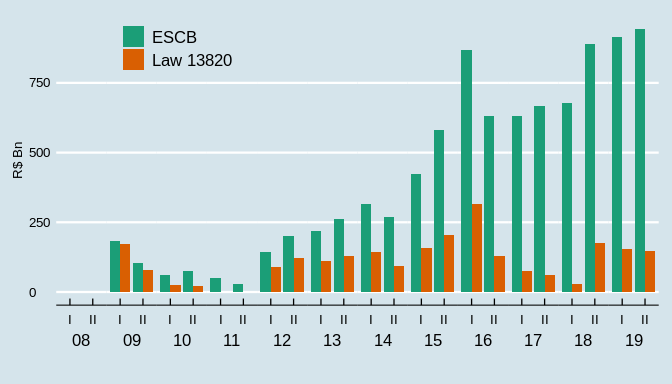
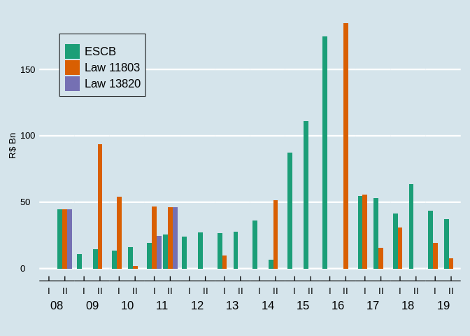
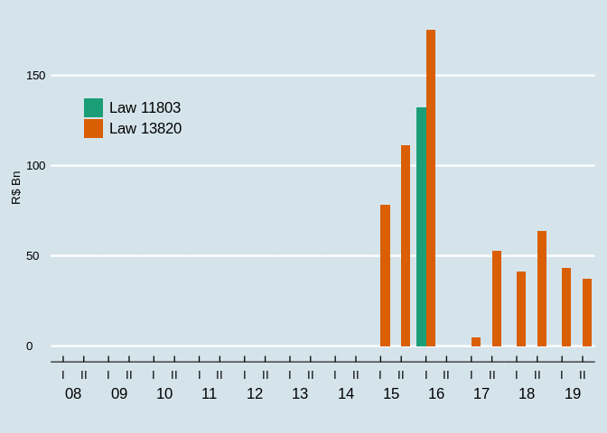

Accounting simulations
================
João Pedro S. Macalós
2/14/2020

The objective of this notebook is to demonstrate how we did the
simulations of how the transfers between the Brazilian Central Bank and
the Brazilian treasury would have been under different accounting
regimes. These simulations are the heart of the section 6.3 of the paper
“Does the accounting framework affect the operational capacity of the
central bank? Lessons from the Brazilian experience”.

To make these simulations, some results are key:

1.  Realized and unrealized results of the central bank.
2.  Foreign exchange operations and operational result of the central
    bank.

## Methodological note

The realized results of the BCB on its foreign exchange operations are
composed of three items:

1.  Financial results with FX swaps;
2.  Carrying costs of international reserves;
3.  Interest income

The unrealized FX results of the BCB are composed by:

1.  Exchange rate retranslation of international reserves;
2.  Price variation (in dollars) of its international reserves.

Before 2011, the information available on the financial reports of the
BCB did not segregate the data on the income of the BCB on its
international reserves; it only contained data on the profit rate and on
the cost rate faced by the central bank. From 2011 onwards, the BCB
started to disclose the profitability of the international reserves
excluding the exchange rate variation. However, the distinction between
unrealized and realized results of the BCB excluding the retranslation
of reserves is only made in the body of the text. In the disclosed
table, on the other hand, this information is aggregated.

Since the volume of these profits not related to exchange rate
depreciation is not really substantial and it is not available for the
whole series, we decided to assume that they are equal to zero
throughout this work. Therefore, we assume that the realized interest
rate income on the international reserves is equal to zero, as well as
the price variation in dollars of the foreign assets. In practice, this
means that we assumed implicitly that these results were all unrealized
results. This hypothesis is consistent with the fact that in most of the
years in which these items were more substantial (as in the first
semester of 2019) they were dominated by the price variation of the
foreign assets in dollars, an unrealized result. We further assumed away
the operational results of the central bank to focus on its foreign
exchange operations. With these cautions in mind, we can proceed to the
simulations.

# Simulations

### Definitions

Some definitions:

According to the BCB, the gross profits from the international reserves
are defined as the sum of the interest income in dollars plus the price
variation of the foreign assets (in dollars) plus the retranslation of
of the value of the assets from dollars to Brazilian reals:

  
  

Since we assume that 
and  are both equal to zero;

  
  
Where UR stands for Unrealized results.

The realized results, on the other hand, are the sum of the financial
income or expenses on FX swaps (competence results) plus the carrying
costs of reserves, measured as the average stock of international
reserves multiplied by the average cost rate:

  
  
Where CC is carrying cost.

Load python libraries:

``` python
import pandas as pd
import numpy as np
```

``` python
bcb_det = pd.read_csv('table4_detailed_files/table4_detailed_raw.csv', index_col = 0)
bcb_det.columns
```

    ## Index(['year', 'sem', 'reserves', 'cost_rate_annual', 'notional', 'competence',
    ##        'gross_profits', 'carrying', 'net_profits', 'equalization',
    ##        'operational', 'total_res', 'realized', 'd_er'],
    ##       dtype='object')

Select important columns and multiply carrying costs by
-1:

``` python
bcb_profits = (bcb_det[['year', 'sem', 'gross_profits', 'carrying', 'net_profits',
               'realized', 'equalization']]
               .assign(unreal_profits = lambda x: x.gross_profits)
               .assign(carrying = lambda x: -1 * x.carrying)
               )
```

``` python
bcb_profits.head()
```

    ##    year  sem  gross_profits  ...   realized  equalization  unreal_profits
    ## 0  2008    1     -26570.114  ... -18226.832    -44798.256      -26570.114
    ## 1  2008    2     182208.219  ... -10812.771    171416.012      182208.219
    ## 2  2009    1     -79393.613  ... -14381.068    -93787.316      -79393.613
    ## 3  2009    2     -40231.955  ... -13689.005    -53931.576      -40231.955
    ## 4  2010    1      14160.113  ... -16077.276     -1893.172       14160.113
    ## 
    ## [5 rows x 8 columns]

### Numerical simulation

This numerical simulation is a proof of concept. It is intended to show
that the code works:

``` python
gp = [10, 10, -30, 20, 10, -50, 70, 0]
carrying = [5, 5, 5, 5, 5, 5, 5, 5]
d = {'gp':gp, 'carrying':carrying}

gp1 = pd.DataFrame(d)
gp1 = gp1.assign(revaluation = 0).assign(transfer = 0)
```

``` python
for row, v in gp1.iterrows():
    if row>0:
        gp1.loc[row, 'revaluation'] = gp1.shift(1).loc[row, 'gp'] + gp1.shift(1).loc[row, 'revaluation']
        gp1.loc[row, 'transfer'] = gp1.loc[row, 'revaluation'] + gp1.shift(1).loc[row, 'transfer'] + gp1.shift(1).loc[row, 'carrying'] if \
        gp1.loc[row, 'revaluation'] < 0 else gp1.shift(1).loc[row, 'transfer'] - gp1.shift(1).loc[row, 'carrying']
        gp1.loc[row, 'revaluation'] = 0 if gp1.loc[row, 'revaluation'] < 0 else gp1.loc[row, 'revaluation']
        #gp1.loc[row, 'transfer'] = gp1.shift(1).loc[row, 'transfer'] - gp1.shift(1).loc[row, 'carrying']
```

``` python
gp1
```

    ##    gp  carrying  revaluation  transfer
    ## 0  10         5          0.0       0.0
    ## 1  10         5         10.0      -5.0
    ## 2 -30         5         20.0     -10.0
    ## 3  20         5          0.0     -15.0
    ## 4  10         5         20.0     -20.0
    ## 5 -50         5         30.0     -25.0
    ## 6  70         5          0.0     -40.0
    ## 7   0         5         70.0     -45.0

## ESCB

Remember that in the ESCB accounting framework, the important
distinction is between the realized and the unrealized results of the
central bank.

**Unrealized**:

1.  If unreal\_profits \> 0, add to revaluation;
2.  If unreal\_profits \< 0, subtract from revaluation;
3.  If revaluation \< 0, add to transfer to treasury.

**Realized**

1.  Transferred directly to the
    treasury.

<!-- end list -->

``` python
bcb_profits.head()
```

    ##    year  sem  gross_profits  ...   realized  equalization  unreal_profits
    ## 0  2008    1     -26570.114  ... -18226.832    -44798.256      -26570.114
    ## 1  2008    2     182208.219  ... -10812.771    171416.012      182208.219
    ## 2  2009    1     -79393.613  ... -14381.068    -93787.316      -79393.613
    ## 3  2009    2     -40231.955  ... -13689.005    -53931.576      -40231.955
    ## 4  2010    1      14160.113  ... -16077.276     -1893.172       14160.113
    ## 
    ## [5 rows x 8 columns]

``` python
final_row = [{'year':'2019', 'sem':'2', 'gross_profits':0, 'carrying':0, 'net_profits':0, \
            'realized':0, 'equalization':0, 'unreal_profits':0}]

bcb_profits1 = bcb_profits.append(final_row).reset_index().iloc[:, 1:10]
```

``` python
df = bcb_profits1.assign(revaluation = 0).assign(transfers_T = 0)
```

``` python
for row, v in df.iterrows():
    if row > 0:
        df.loc[row, 'revaluation'] = df.shift(1).loc[row, 'unreal_profits'] + df.shift(1).loc[row, 'revaluation']
        df.loc[row, 'transfers_T'] = df.shift(1).loc[row, 'realized'] + df.loc[row, 'revaluation'] if df.loc[row, 'revaluation'] < 0 \
        else df.shift(1).loc[row, 'realized']
        df.loc[row, 'transfer_from_T'] = df.loc[row, 'transfers_T'] if df.loc[row, 'transfers_T'] < 0 else 0
        df.loc[row, 'transfer_to_T'] = df.loc[row, 'transfers_T'] if df.loc[row, 'transfers_T'] > 0 else 0
        df.loc[row, 'revaluation'] = 0 if df.loc[row, 'revaluation'] < 0 else df.loc[row, 'revaluation']
```

``` python
escb = df.assign(total_transfers = np.cumsum(df.transfers_T))
escb[['year', 'sem', 'equalization', 'unreal_profits', 'revaluation', 'realized', \
      'transfers_T', 'total_transfers', 'transfer_to_T', 'transfer_from_T']]
```

    ##     year sem  equalization  ...  total_transfers  transfer_to_T  transfer_from_T
    ## 0   2008   1    -44798.256  ...            0.000            NaN              NaN
    ## 1   2008   2    171416.012  ...       -44796.946          0.000       -44796.946
    ## 2   2009   1    -93787.316  ...       -55609.717          0.000       -10812.771
    ## 3   2009   2    -53931.576  ...       -69990.785          0.000       -14381.068
    ## 4   2010   1     -1893.172  ...       -83679.790          0.000       -13689.005
    ## 5   2010   2    -46636.548  ...       -99757.066          0.000       -16077.276
    ## 6   2011   1    -46199.286  ...      -118906.168          0.000       -19149.102
    ## 7   2011   2     90240.059  ...      -144340.500          0.000       -25434.332
    ## 8   2012   1     32210.001  ...      -168486.317          0.000       -24145.817
    ## 9   2012   2     -9900.595  ...      -195969.282          0.000       -27482.965
    ## 10  2013   1     15766.502  ...      -222687.666          0.000       -26718.384
    ## 11  2013   2     15918.931  ...      -250430.457          0.000       -27742.791
    ## 12  2014   1    -51223.638  ...      -286511.898          0.000       -36081.441
    ## 13  2014   2     65173.472  ...      -293283.177          0.000        -6771.279
    ## 14  2015   1     46406.614  ...      -380727.142          0.000       -87443.965
    ## 15  2015   2    110938.088  ...      -491973.974          0.000      -111246.832
    ## 16  2016   1   -184645.401  ...      -667046.018          0.000      -175072.044
    ## 17  2016   2    -55673.843  ...      -617353.995      49692.023            0.000
    ## 18  2017   1    -15744.789  ...      -671767.903          0.000       -54413.908
    ## 19  2017   2    -30677.360  ...      -724633.609          0.000       -52865.706
    ## 20  2018   1    146201.379  ...      -766053.986          0.000       -41420.377
    ## 21  2018   2    -19133.806  ...      -829691.224          0.000       -63637.238
    ## 22  2019   1     -7560.802  ...      -873084.688          0.000       -43393.464
    ## 23  2019   2         0.000  ...      -910412.891          0.000       -37328.203
    ## 
    ## [24 rows x 10 columns]

``` python
#escb.to_csv('sim_escb.csv')
```

## Law 13.820

In this framework, what matters is the foreing exchange operations (the
equalization account).

1.  If equalization \> 0, add to revaluation;
2.  If equalization \< 0, subtract from revaluation;
3.  If revaluation \< 0, add to transfer to treasury.

The simulations starts with the central bank holding 160000 in bonds
that can be used for monetary policy. This is approximately the stocks
of free bonds on the BCB accounts in the end of 2007. Check the paper
for further
details.

``` python
law13 = bcb_profits1.assign(revaluation = 0).assign(transfer_from_T = 0).assign(available_bonds = 160000).assign(recap = 0)

for row, v in law13.iterrows():
    if row>0:
        law13.loc[row, 'revaluation'] = law13.shift(1).loc[row, 'equalization'] + law13.shift(1).loc[row, 'revaluation']
        law13.loc[row, 'transfer_from_T'] = law13.loc[row, 'revaluation'] if law13.loc[row, 'revaluation'] < 0 else 0
        law13.loc[row, 'revaluation'] = 0 if law13.loc[row, 'revaluation'] < 0 else law13.loc[row, 'revaluation']
        law13.loc[row, 'available_bonds'] = -1 * law13.loc[row, 'transfer_from_T'] + law13.shift(1).loc[row, 'realized'] + \
        law13.shift(1).loc[row, 'available_bonds']
        law13.loc[row, 'further_recap'] = -1 * law13.loc[row, 'available_bonds'] if law13.loc[row, 'available_bonds'] < 0 else 0
        law13.loc[row, 'available_bonds'] = 0 if law13.loc[row, 'available_bonds'] < 0 else law13.loc[row, 'available_bonds']
        
```

``` python
law132 = law13[['year', 'sem', 'equalization', 'realized', 'revaluation', 'transfer_from_T', 'available_bonds', 'further_recap']]
law132 = law132.assign(total_recap = lambda x: np.cumsum(x.further_recap))
law132
```

    ##     year sem  equalization  ...  available_bonds  further_recap  total_recap
    ## 0   2008   1    -44798.256  ...       160000.000            NaN          NaN
    ## 1   2008   2    171416.012  ...       186571.424          0.000        0.000
    ## 2   2009   1    -93787.316  ...       175758.653          0.000        0.000
    ## 3   2009   2    -53931.576  ...       161377.585          0.000        0.000
    ## 4   2010   1     -1893.172  ...       147688.580          0.000        0.000
    ## 5   2010   2    -46636.548  ...       131611.304          0.000        0.000
    ## 6   2011   1    -46199.286  ...       137294.802          0.000        0.000
    ## 7   2011   2     90240.059  ...       158059.756          0.000        0.000
    ## 8   2012   1     32210.001  ...       133913.939          0.000        0.000
    ## 9   2012   2     -9900.595  ...       106430.974          0.000        0.000
    ## 10  2013   1     15766.502  ...        79712.590          0.000        0.000
    ## 11  2013   2     15918.931  ...        51969.799          0.000        0.000
    ## 12  2014   1    -51223.638  ...        15888.358          0.000        0.000
    ## 13  2014   2     65173.472  ...         9117.079          0.000        0.000
    ## 14  2015   1     46406.614  ...            0.000      78326.886    78326.886
    ## 15  2015   2    110938.088  ...            0.000     111246.832   189573.718
    ## 16  2016   1   -184645.401  ...            0.000     175072.044   364645.762
    ## 17  2016   2    -55673.843  ...        49692.023          0.000   364645.762
    ## 18  2017   1    -15744.789  ...            0.000       4721.885   369367.647
    ## 19  2017   2    -30677.360  ...            0.000      52865.706   422233.353
    ## 20  2018   1    146201.379  ...            0.000      41420.377   463653.730
    ## 21  2018   2    -19133.806  ...            0.000      63637.238   527290.968
    ## 22  2019   1     -7560.802  ...            0.000      43393.464   570684.432
    ## 23  2019   2         0.000  ...            0.000      37328.203   608012.635
    ## 
    ## [24 rows x 9 columns]

``` python
#law132.to_csv('sim_law13.csv')
```

## Law 11.803 framework

This framework was quite simple:

1.  If equalization \> 0, transfer to the treasury;
2.  If equalization \< 0, covered by the treasury.

<!-- end list -->

``` python
law11 = bcb_profits1
law11 = (law11.assign(transfer_to_T = pd.np.where(law11.shift(1).equalization > 0, law11.shift(1).equalization, 0))
        .assign(transfer_from_T = -1 * pd.np.where(law11.shift(1).equalization < 0, law11.shift(1).equalization, 0))
        )

law11b = law11[['year', 'sem', 'equalization', 'realized', 'transfer_to_T', 'transfer_from_T']]
```

``` python
law11b.head()
```

    ##    year sem  equalization   realized  transfer_to_T  transfer_from_T
    ## 0  2008   1    -44798.256 -18226.832          0.000           -0.000
    ## 1  2008   2    171416.012 -10812.771          0.000        44798.256
    ## 2  2009   1    -93787.316 -14381.068     171416.012           -0.000
    ## 3  2009   2    -53931.576 -13689.005          0.000        93787.316
    ## 4  2010   1     -1893.172 -16077.276          0.000        53931.576

``` python
law11b = law11b.assign(available_bonds = 160000).assign(further_recap = 0)

for row, v in law11b.iterrows():
    if row>0:
        law11b.loc[row, 'available_bonds'] = law11b.shift(1).loc[row, 'available_bonds'] + \
        law11b.shift(1).loc[row, 'transfer_from_T'] + law11b.shift(1).loc[row, 'realized']
        law11b.loc[row, 'further_recap'] = -1 * law11b.loc[row, 'available_bonds'] if law11b.loc[row, 'available_bonds'] < 0 else 0
        law11b.loc[row, 'available_bonds'] = 0 if law11b.loc[row, 'available_bonds'] < 0 else law11b.loc[row, 'available_bonds']
```

``` python
law11b
#law11b.to_csv('sim_law11.csv')
```

    ##     year sem  equalization  ...  transfer_from_T  available_bonds  further_recap
    ## 0   2008   1    -44798.256  ...           -0.000       160000.000          0.000
    ## 1   2008   2    171416.012  ...        44798.256       141773.168          0.000
    ## 2   2009   1    -93787.316  ...           -0.000       175758.653          0.000
    ## 3   2009   2    -53931.576  ...        93787.316       161377.585          0.000
    ## 4   2010   1     -1893.172  ...        53931.576       241475.896          0.000
    ## 5   2010   2    -46636.548  ...         1893.172       279330.196          0.000
    ## 6   2011   1    -46199.286  ...        46636.548       262074.266          0.000
    ## 7   2011   2     90240.059  ...        46199.286       283276.482          0.000
    ## 8   2012   1     32210.001  ...           -0.000       305329.951          0.000
    ## 9   2012   2     -9900.595  ...           -0.000       277846.986          0.000
    ## 10  2013   1     15766.502  ...         9900.595       251128.602          0.000
    ## 11  2013   2     15918.931  ...           -0.000       233286.406          0.000
    ## 12  2014   1    -51223.638  ...           -0.000       197204.965          0.000
    ## 13  2014   2     65173.472  ...        51223.638       190433.686          0.000
    ## 14  2015   1     46406.614  ...           -0.000       154213.359          0.000
    ## 15  2015   2    110938.088  ...           -0.000        42966.527          0.000
    ## 16  2016   1   -184645.401  ...           -0.000            0.000     132105.517
    ## 17  2016   2    -55673.843  ...       184645.401        49692.023          0.000
    ## 18  2017   1    -15744.789  ...        55673.843       179923.516          0.000
    ## 19  2017   2    -30677.360  ...        15744.789       182731.653          0.000
    ## 20  2018   1    146201.379  ...        30677.360       157056.065          0.000
    ## 21  2018   2    -19133.806  ...           -0.000       124096.187          0.000
    ## 22  2019   1     -7560.802  ...        19133.806        80702.723          0.000
    ## 23  2019   2         0.000  ...         7560.802        62508.326          0.000
    ## 
    ## [24 rows x 8 columns]

## Plot the main findings

Switch to R to plot the main
    findings:

``` r
library(tidyverse)
```

    ## ── Attaching packages ──────────────────────────────────────────────────────────────────────────────────────────────────── tidyverse 1.3.0 ──

    ## ✓ ggplot2 3.2.1     ✓ purrr   0.3.3
    ## ✓ tibble  2.1.3     ✓ dplyr   0.8.3
    ## ✓ tidyr   1.0.0     ✓ stringr 1.4.0
    ## ✓ readr   1.3.1     ✓ forcats 0.4.0

    ## ── Conflicts ─────────────────────────────────────────────────────────────────────────────────────────────────────── tidyverse_conflicts() ──
    ## x dplyr::filter() masks stats::filter()
    ## x dplyr::lag()    masks stats::lag()

``` r
library(reticulate)
library(lubridate)
```

    ## 
    ## Attaching package: 'lubridate'

    ## The following object is masked from 'package:base':
    ## 
    ##     date

``` r
escb_raw = py$escb %>% mutate_at(vars(year, sem), list(~ unlist(.))) %>% unite('date', year:sem, sep = '-0')
law13_raw = py$law132 %>% mutate_at(vars(year, sem), list(~ unlist(.))) %>% unite('date', year:sem, sep = '-0')
law11_raw = py$law11b %>% mutate_at(vars(year, sem), list(~ unlist(.))) %>% unite('date', year:sem, sep = '-0')
```

### Revaluation accounts (Figure 7)

This figure involves only the ESCB and Law 13.820 frameworks:

Merging and cleaning the data:

``` r
rev_df = escb_raw %>% select(date, escb = revaluation) %>%
  bind_cols(law13_raw %>% select(law13 = revaluation))

#rev_df

rev_df1 = rev_df %>%
  mutate(date = str_replace(date, '-01', '-04-30'),
         date = str_replace(date, '-02', '-09-30')) %>%
  mutate(date = ymd(date))

rev_df1
```

    ##          date      escb     law13
    ## 1  2008-04-30      0.00      0.00
    ## 2  2008-09-30      0.00      0.00
    ## 3  2009-04-30 182208.22 171416.01
    ## 4  2009-09-30 102814.61  77628.70
    ## 5  2010-04-30  62582.65  23697.12
    ## 6  2010-09-30  76742.76  21803.95
    ## 7  2011-04-30  49292.12      0.00
    ## 8  2011-09-30  28514.82      0.00
    ## 9  2012-04-30 142852.94  90240.06
    ## 10 2012-09-30 202517.68 122450.06
    ## 11 2013-04-30 219336.58 112549.47
    ## 12 2013-09-30 262834.65 128315.97
    ## 13 2014-04-30 314898.01 144234.90
    ## 14 2014-09-30 270445.65  93011.26
    ## 15 2015-04-30 423063.11 158184.73
    ## 16 2015-09-30 580716.56 204591.35
    ## 17 2016-04-30 866726.69 315529.43
    ## 18 2016-09-30 632389.27 130884.03
    ## 19 2017-04-30 631129.33  75210.19
    ## 20 2017-09-30 668250.25  59465.40
    ## 21 2018-04-30 678993.26  28788.04
    ## 22 2018-09-30 888831.88 174989.42
    ## 23 2019-04-30 913091.54 155855.61
    ## 24 2019-09-30 942858.94 148294.81

``` r
rev_df1 %>%
  gather(var, value, -date) %>%
  mutate(year = year(date),
         semester = rep(c('I', 'II'), 24))  %>%
  mutate(year = as.character(year)) %>%
  mutate(year = substr(year, start = 3, stop = 4)) %>%
  ggplot(aes(x=semester, y= value/1000, fill = var)) +
  geom_bar(stat = 'identity', position = 'dodge') +
  facet_wrap(~year, ncol = 12, strip.position = 'bottom') +
  ggthemes::theme_economist() +
  theme(panel.spacing = unit(0, 'lines'),
        strip.placement = "outside",
        legend.position = c(0.2, 0.9),
        legend.title = element_blank()) +
  labs(x = '', y = 'R$ Bn') +
  scale_fill_brewer(palette = 'Dark2', labels = c('ESCB', 'Law 13820'))
```

<!-- -->

### Losses covered by the treasury (Figure 8)

``` r
transf_df = escb_raw %>% select(date, escb = transfer_from_T) %>%
  bind_cols(law13_raw %>% select(law13 = transfer_from_T)) %>%
  bind_cols(law11_raw %>% select(law11 = transfer_from_T))

trans_df1 = transf_df %>%
  mutate(escb = replace_na(escb, 0)) %>%
  mutate(date = str_replace(date, '-01', '-06-01'),
         date = str_replace(date, '-02', '-12-01')) %>%
  mutate(date = ymd(date)) %>%
  #set_names('date', 'escb', 'uip', 'law11') %>%
  mutate_at(vars(escb, law13), list(~ -1 * .))

trans_df1
```

    ##          date       escb    law13      law11
    ## 1  2008-06-01      0.000     0.00      0.000
    ## 2  2008-12-01  44796.946 44798.26  44798.256
    ## 3  2009-06-01  10812.771     0.00      0.000
    ## 4  2009-12-01  14381.068     0.00  93787.316
    ## 5  2010-06-01  13689.005     0.00  53931.576
    ## 6  2010-12-01  16077.276     0.00   1893.172
    ## 7  2011-06-01  19149.102 24832.60  46636.548
    ## 8  2011-12-01  25434.332 46199.29  46199.286
    ## 9  2012-06-01  24145.817     0.00      0.000
    ## 10 2012-12-01  27482.965     0.00      0.000
    ## 11 2013-06-01  26718.384     0.00   9900.595
    ## 12 2013-12-01  27742.791     0.00      0.000
    ## 13 2014-06-01  36081.441     0.00      0.000
    ## 14 2014-12-01   6771.279     0.00  51223.638
    ## 15 2015-06-01  87443.965     0.00      0.000
    ## 16 2015-12-01 111246.832     0.00      0.000
    ## 17 2016-06-01 175072.044     0.00      0.000
    ## 18 2016-12-01      0.000     0.00 184645.401
    ## 19 2017-06-01  54413.908     0.00  55673.843
    ## 20 2017-12-01  52865.706     0.00  15744.789
    ## 21 2018-06-01  41420.377     0.00  30677.360
    ## 22 2018-12-01  63637.238     0.00      0.000
    ## 23 2019-06-01  43393.464     0.00  19133.806
    ## 24 2019-12-01  37328.203     0.00   7560.802

``` r
trans_df1 %>%
  gather(var, value, -date) %>%
  mutate(year = year(date),
         semester = rep(c('I', 'II'), 36))  %>%
  mutate(year = as.character(year)) %>%
  mutate(year = substr(year, start = 3, stop = 4)) %>%
  ggplot(aes(x=semester, y= value/1000, fill = var)) +
  geom_bar(stat = 'identity', position = 'dodge') +
  facet_wrap(~year, ncol = 12, strip.position = 'bottom') +
  ggthemes::theme_economist() +
  theme(panel.spacing = unit(0, 'lines'),
        strip.placement = "outside",
        legend.position = c(0.15, 0.80),
        legend.title = element_blank(),
        legend.box.background = element_rect(colour = "black", fill = '#d5e4eb')) +
  labs(x = '', y = 'R$ Bn') +
  scale_fill_brewer(palette = 'Dark2', labels = c('ESCB', 'Law 11803', 'Law 13820'))
```

<!-- -->

### Further recapitalization (Figure 9)

``` r
further_df = law13_raw %>% select(date, law13 = further_recap) %>%
  bind_cols(law11_raw %>% select(law11 = further_recap))

further_df1 = further_df %>% 
  mutate(date = str_replace(date, '-01', '-06-01'),
         date = str_replace(date, '-02', '-12-01')) %>%
  mutate(date = ymd(date)) %>%
  mutate(law13 = replace_na(law13, 0))

further_df1
```

    ##          date      law13    law11
    ## 1  2008-06-01      0.000      0.0
    ## 2  2008-12-01      0.000      0.0
    ## 3  2009-06-01      0.000      0.0
    ## 4  2009-12-01      0.000      0.0
    ## 5  2010-06-01      0.000      0.0
    ## 6  2010-12-01      0.000      0.0
    ## 7  2011-06-01      0.000      0.0
    ## 8  2011-12-01      0.000      0.0
    ## 9  2012-06-01      0.000      0.0
    ## 10 2012-12-01      0.000      0.0
    ## 11 2013-06-01      0.000      0.0
    ## 12 2013-12-01      0.000      0.0
    ## 13 2014-06-01      0.000      0.0
    ## 14 2014-12-01      0.000      0.0
    ## 15 2015-06-01  78326.886      0.0
    ## 16 2015-12-01 111246.832      0.0
    ## 17 2016-06-01 175072.044 132105.5
    ## 18 2016-12-01      0.000      0.0
    ## 19 2017-06-01   4721.885      0.0
    ## 20 2017-12-01  52865.706      0.0
    ## 21 2018-06-01  41420.377      0.0
    ## 22 2018-12-01  63637.238      0.0
    ## 23 2019-06-01  43393.464      0.0
    ## 24 2019-12-01  37328.203      0.0

``` r
further_df1 %>%
  gather(var, value, -date) %>%
  mutate(year = year(date),
         semester = rep(c('I', 'II'), 24))  %>%
  mutate(year = as.character(year)) %>%
  mutate(year = substr(year, start = 3, stop = 4)) %>%
  ggplot(aes(x=semester, y= value/1000, fill = var)) +
  geom_bar(stat = 'identity', position = 'dodge') +
  facet_wrap(~year, ncol = 12, strip.position = 'bottom') +
  ggthemes::theme_economist() +
  theme(panel.spacing = unit(0, 'lines'),
        strip.placement = "outside",
        legend.position = c(0.15, 0.71),
        legend.title = element_blank()) +
  labs(x = '', y = 'R$ Bn') +
  scale_fill_brewer(palette = 'Dark2', labels = c('Law 11803', 'Law 13820'))
```

<!-- -->
