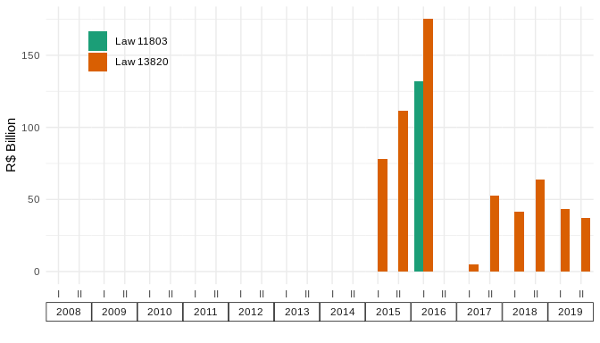

Accounting simulations
================
João Pedro S. Macalós
2/14/2020

The objective of this notebook is to demonstrate how we did the
simulations of how the transfers between the Brazilian Central Bank and
the Brazilian treasury would have been under different accounting
regimes. These simulations are the heart of the section 6.3 of the paper
“Does the accounting framework affect the operational capacity of the
central bank? Lessons from the Brazilian experience”.

To make these simulations, some results are key:

1.  Realized and unrealized results of the central bank.
2.  Foreign exchange operations and operational result of the central
    bank.

## Methodological note

The realized results of the BCB on its foreign exchange operations are
composed of three items:

1.  Financial results with FX swaps;
2.  Carrying costs of international reserves;
3.  Interest income

The unrealized FX results of the BCB are composed by:

1.  Exchange rate retranslation of international reserves;
2.  Price variation (in dollars) of its international reserves.

Before 2011, the information available on the financial reports of the
BCB did not segregate the data on the income of the BCB on its
international reserves; it only contained data on the profit rate and on
the cost rate faced by the central bank. From 2011 onwards, the BCB
started to disclose the profitability of the international reserves
excluding the exchange rate variation, although the distinction between
unrealized and realized results of the BCB excluding the retranslation
of reserves is only made in the body of the financial reports.
Therefore, these data was obtained by hand, and a table with the
collected values is shared with this notebook. The reader can find these
values in the section c) of the “Lei de resposabilidade fiscal” item in
the financial reports of the BCB.

However, these data was assumed to be zero due to the incompleteness of
the series. Moreover, since the interest income is a realized result
that does not affect the overall liquidity of the Brazilian economy,
this assumption further simplifies the coding for the further
recapitalization requirements since they would have to be excluded again
otherwise. A description of this dataset is presented below.

### Definitions

Some definitions:

According to the BCB, the gross profits from the international reserves
are defined as the sum of the interest income in dollars plus the price
variation of the foreign assets (in dollars) plus the retranslation of
of the value of the assets from dollars to Brazilian reals:

  
  

The left hand side can be divided between its realized and unrealized
components:

  
  
  
  

Where UR stands for unrealized results and RRfor realized results on
international reserves. By substituting on the first equation, it is
possible to derive the unrealized results as:

  
  
Since we assume that ,

  
  

This definition will be used in this notebook.

To find the total realized results of the BCB, on the other hand, we
aggregate the financial income or expenses with FX swaps (competence
results) with the carrying costs of the international reserves, measured
as the average stock of international reserves multiplied by the average
cost rate:

  
  
Where CC is carrying cost.

# Simulations

Load python libraries:

``` python
import pandas as pd
import numpy as np
```

Pandas display configuration:

``` python
pd.set_option('display.max_columns', 10)
pd.set_option('display.max_rows', 50)
pd.set_option('display.width', 1000)
```

``` python
bcb_det = pd.read_csv('table4_detailed_files/table4_detailed_raw.csv', index_col = 0)
bcb_profits = (bcb_det[['year', 'sem', 'reserves', 'gross_profits', 'carrying', 'net_profits',
               'realized', 'equalization']])
               
bcb_profits = (bcb_profits.assign(unreal_profits = lambda x: x.gross_profits)
                    .assign(carrying = lambda x: -1 * x.carrying)
                    )
```

``` python
bcb_profits.tail()
```

    ##     year  sem     reserves  gross_profits   carrying  net_profits   realized  equalization  unreal_profits
    ## 18  2017    1  1194202.052      37120.917 -56202.572   -19081.655 -52865.706    -15744.789       37120.917
    ## 19  2017    2  1220361.996      10743.016 -44366.254   -33623.238 -41420.377    -30677.360       10743.016
    ## 20  2018    1  1309456.844     209838.617 -45972.087   163866.530 -63637.238    146201.379      209838.617
    ## 21  2018    2  1481125.927      24259.658 -46798.282   -22538.624 -43393.464    -19133.806       24259.658
    ## 22  2019    1  1469645.384      29767.401 -42202.101   -12434.700 -37328.203     -7560.802       29767.401

Load interest income table and
clean:

``` python
bcb_intincome = pd.read_csv('fig789_simulations_files/table_exclusivecambial_2011_2019.md', sep = '|')
bcb_ii = bcb_intincome.iloc[1:,1:4]
bcb_ii = bcb_ii.rename(columns=lambda x: x.strip())
bcb_ii[['year', 'quarter']] = bcb_ii.date.str.split('-', expand = True)
bcb_ii = bcb_ii.assign(sem = lambda x: np.where(bcb_ii.quarter.str.contains('01|02'), 1, 2))
bcb_ii = bcb_ii[['year', 'sem', 'interest', 'price']]
bcb_ii = bcb_ii.apply(pd.to_numeric, errors = 'coerce')

bcb_ii.head()
```

    ##    year  sem  interest  price
    ## 1  2011    1      0.54  -0.48
    ## 2  2011    1      0.65   0.81
    ## 3  2011    2      0.40   1.23
    ## 4  2011    2      0.29   0.09
    ## 5  2012    1      0.33  -0.14

Summarize interest rate
received:

``` python
bcb_iisum = bcb_ii.assign(int_y = lambda x: 100 * (((1 + (x.interest/100)) ** 4) - 1))
bcb_iisum.agg({'int_y':'mean'})
```

    ## int_y    1.098023
    ## dtype: float64

Convert to semiannual
values

``` python
bcb_ii2 = bcb_ii.assign(int_s = lambda x: (((1 + (x.interest/100)) ** 2) - 1))
bcb_ii2 = bcb_ii2.groupby(['year', 'sem']).agg({'int_s':'mean'}).reset_index()
bcb_ii2.head()
```

    ##    year  sem     int_s
    ## 0  2011    1  0.011936
    ## 1  2011    2  0.006912
    ## 2  2012    1  0.006310
    ## 3  2012    2  0.005447
    ## 4  2013    1  0.004605

Join with tables and calculate the corrected realized values from 2011
onwards:

``` python
bcb_iisum2 = bcb_profits.merge(bcb_ii2, how = 'left', on = ['year', 'sem'])
bcb_iisum2 = bcb_iisum2.fillna(0)
bcb_iisum2 = bcb_iisum2.assign(int_income = lambda x: x.int_s * x.reserves)
                    
```

Calculate accumulated interest rate income (and accumulated carrying
costs):

``` python
bcb_iisum2.agg({'int_income':'sum', 'carrying':'sum'})
```

    ## int_income     95663.202708
    ## carrying     -858279.609000
    ## dtype: float64

### Numerical simulation

This numerical simulation is a proof of concept. It is intended to show
that the code works:

``` python
gp = [10, 10, -30, 20, 10, -50, 70, 0]
carrying = [5, 5, 5, 5, 5, 5, 5, 5]
d = {'gp':gp, 'carrying':carrying}

gp1 = pd.DataFrame(d)
gp1 = gp1.assign(revaluation = 0).assign(transfer = 0)
```

``` python
for row, v in gp1.iterrows():
    if row>0:
        gp1.loc[row, 'revaluation'] = gp1.shift(1).loc[row, 'gp'] + gp1.shift(1).loc[row, 'revaluation']
        gp1.loc[row, 'transfer'] = gp1.loc[row, 'revaluation'] + gp1.shift(1).loc[row, 'transfer'] + gp1.shift(1).loc[row, 'carrying'] if \
        gp1.loc[row, 'revaluation'] < 0 else gp1.shift(1).loc[row, 'transfer'] - gp1.shift(1).loc[row, 'carrying']
        gp1.loc[row, 'revaluation'] = 0 if gp1.loc[row, 'revaluation'] < 0 else gp1.loc[row, 'revaluation']
        #gp1.loc[row, 'transfer'] = gp1.shift(1).loc[row, 'transfer'] - gp1.shift(1).loc[row, 'carrying']
```

``` python
gp1
```

    ##    gp  carrying  revaluation  transfer
    ## 0  10         5          0.0       0.0
    ## 1  10         5         10.0      -5.0
    ## 2 -30         5         20.0     -10.0
    ## 3  20         5          0.0     -15.0
    ## 4  10         5         20.0     -20.0
    ## 5 -50         5         30.0     -25.0
    ## 6  70         5          0.0     -40.0
    ## 7   0         5         70.0     -45.0

## ESCB

Remember that in the ESCB accounting framework, the important
distinction is between the realized and the unrealized results of the
central bank.

**Unrealized**:

1.  If unreal\_profits \> 0, add to revaluation;
2.  If unreal\_profits \< 0, subtract from revaluation;
3.  If revaluation \< 0, add to transfer to treasury.

**Realized**

1.  Transferred directly to the
    treasury.

<!-- end list -->

``` python
bcb_profits.head()
```

    ##    year  sem    reserves  gross_profits   carrying  net_profits   realized  equalization  unreal_profits
    ## 0  2008    1  327650.405     -26570.114 -13008.729   -39580.153 -18226.832    -44798.256      -26570.114
    ## 1  2008    2  397776.298     182208.219 -21358.998   160869.785 -10812.771    171416.012      182208.219
    ## 2  2009    1  438075.574     -79393.613 -16678.701   -96084.949 -14381.068    -93787.316      -79393.613
    ## 3  2009    2  402004.990     -40231.955 -13672.457   -53915.028 -13689.005    -53931.576      -40231.955
    ## 4  2010    1  440389.220      14160.113 -16077.276    -1893.172 -16077.276     -1893.172       14160.113

``` python
final_row = [{'year':'2019', 'sem':'2', 'gross_profits':0, 'carrying':0, 'net_profits':0, \
            'realized':0, 'equalization':0, 'unreal_profits':0}]

bcb_profits1 = bcb_profits.append(final_row).reset_index()
```

``` python
bcb_profits1.tail()
```

    ##     index  year sem     reserves  gross_profits   carrying  net_profits   realized  equalization  unreal_profits
    ## 19     19  2017   2  1220361.996      10743.016 -44366.254   -33623.238 -41420.377    -30677.360       10743.016
    ## 20     20  2018   1  1309456.844     209838.617 -45972.087   163866.530 -63637.238    146201.379      209838.617
    ## 21     21  2018   2  1481125.927      24259.658 -46798.282   -22538.624 -43393.464    -19133.806       24259.658
    ## 22     22  2019   1  1469645.384      29767.401 -42202.101   -12434.700 -37328.203     -7560.802       29767.401
    ## 23      0  2019   2          NaN          0.000      0.000        0.000      0.000         0.000           0.000

``` python
df = bcb_profits1.assign(revaluation = 0).assign(transfers_T = 0)
```

``` python
for row, v in df.iterrows():
    if row > 0:
        df.loc[row, 'revaluation'] = df.shift(1).loc[row, 'unreal_profits'] + df.shift(1).loc[row, 'revaluation']
        df.loc[row, 'transfers_T'] = df.shift(1).loc[row, 'realized'] + df.loc[row, 'revaluation'] if df.loc[row, 'revaluation'] < 0 \
        else df.shift(1).loc[row, 'realized']
        df.loc[row, 'transfer_from_T'] = df.loc[row, 'transfers_T'] if df.loc[row, 'transfers_T'] < 0 else 0
        df.loc[row, 'transfer_to_T'] = df.loc[row, 'transfers_T'] if df.loc[row, 'transfers_T'] > 0 else 0
        df.loc[row, 'revaluation'] = 0 if df.loc[row, 'revaluation'] < 0 else df.loc[row, 'revaluation']
```

``` python
escb = df.assign(total_transfers = np.cumsum(df.transfers_T))
escb[['year', 'sem', 'equalization', 'unreal_profits', 'revaluation', 'realized', \
      'transfers_T', 'total_transfers', 'transfer_to_T', 'transfer_from_T']]
```

    ##     year sem  equalization  unreal_profits  revaluation    realized  transfers_T  total_transfers  transfer_to_T  transfer_from_T
    ## 0   2008   1    -44798.256      -26570.114        0.000  -18226.832        0.000            0.000            NaN              NaN
    ## 1   2008   2    171416.012      182208.219        0.000  -10812.771   -44796.946       -44796.946          0.000       -44796.946
    ## 2   2009   1    -93787.316      -79393.613   182208.219  -14381.068   -10812.771       -55609.717          0.000       -10812.771
    ## 3   2009   2    -53931.576      -40231.955   102814.606  -13689.005   -14381.068       -69990.785          0.000       -14381.068
    ## 4   2010   1     -1893.172       14160.113    62582.651  -16077.276   -13689.005       -83679.790          0.000       -13689.005
    ## 5   2010   2    -46636.548      -27450.640    76742.764  -19149.102   -16077.276       -99757.066          0.000       -16077.276
    ## 6   2011   1    -46199.286      -20777.299    49292.124  -25434.332   -19149.102      -118906.168          0.000       -19149.102
    ## 7   2011   2     90240.059      114338.120    28514.825  -24145.817   -25434.332      -144340.500          0.000       -25434.332
    ## 8   2012   1     32210.001       59664.739   142852.945  -27482.965   -24145.817      -168486.317          0.000       -24145.817
    ## 9   2012   2     -9900.595       16818.895   202517.684  -26718.384   -27482.965      -195969.282          0.000       -27482.965
    ## 10  2013   1     15766.502       43498.072   219336.579  -27742.791   -26718.384      -222687.666          0.000       -26718.384
    ## 11  2013   2     15918.931       52063.356   262834.651  -36081.441   -27742.791      -250430.457          0.000       -27742.791
    ## 12  2014   1    -51223.638      -44452.354   314898.007   -6771.279   -36081.441      -286511.898          0.000       -36081.441
    ## 13  2014   2     65173.472      152617.460   270445.653  -87443.965    -6771.279      -293283.177          0.000        -6771.279
    ## 14  2015   1     46406.614      157653.446   423063.113 -111246.832   -87443.965      -380727.142          0.000       -87443.965
    ## 15  2015   2    110938.088      286010.132   580716.559 -175072.044  -111246.832      -491973.974          0.000      -111246.832
    ## 16  2016   1   -184645.401     -234337.424   866726.691   49692.023  -175072.044      -667046.018          0.000      -175072.044
    ## 17  2016   2    -55673.843       -1259.935   632389.267  -54413.908    49692.023      -617353.995      49692.023            0.000
    ## 18  2017   1    -15744.789       37120.917   631129.332  -52865.706   -54413.908      -671767.903          0.000       -54413.908
    ## 19  2017   2    -30677.360       10743.016   668250.249  -41420.377   -52865.706      -724633.609          0.000       -52865.706
    ## 20  2018   1    146201.379      209838.617   678993.265  -63637.238   -41420.377      -766053.986          0.000       -41420.377
    ## 21  2018   2    -19133.806       24259.658   888831.882  -43393.464   -63637.238      -829691.224          0.000       -63637.238
    ## 22  2019   1     -7560.802       29767.401   913091.540  -37328.203   -43393.464      -873084.688          0.000       -43393.464
    ## 23  2019   2         0.000           0.000   942858.941       0.000   -37328.203      -910412.891          0.000       -37328.203

``` python
#escb.to_csv('sim_escb.csv')
```

## Law 13.820

In this framework, what matters is the foreing exchange operations (the
equalization account).

1.  If equalization \> 0, add to revaluation;
2.  If equalization \< 0, subtract from revaluation;
3.  If revaluation \< 0, add to transfer to treasury.

The simulations starts with the central bank holding 160000 in bonds
that can be used for monetary policy. This is approximately the stocks
of free bonds on the BCB accounts in the end of 2007. Check the paper
for further
details.

``` python
law13 = bcb_profits1.assign(revaluation = 0).assign(transfer_from_T = 0).assign(available_bonds = 160000).assign(recap = 0)

for row, v in law13.iterrows():
    if row>0:
        law13.loc[row, 'revaluation'] = law13.shift(1).loc[row, 'equalization'] + law13.shift(1).loc[row, 'revaluation']
        law13.loc[row, 'transfer_from_T'] = law13.loc[row, 'revaluation'] if law13.loc[row, 'revaluation'] < 0 else 0
        law13.loc[row, 'revaluation'] = 0 if law13.loc[row, 'revaluation'] < 0 else law13.loc[row, 'revaluation']
        law13.loc[row, 'available_bonds'] = -1 * law13.loc[row, 'transfer_from_T'] + law13.shift(1).loc[row, 'realized'] + \
        law13.shift(1).loc[row, 'available_bonds']
        law13.loc[row, 'further_recap'] = -1 * law13.loc[row, 'available_bonds'] if law13.loc[row, 'available_bonds'] < 0 else 0
        law13.loc[row, 'available_bonds'] = 0 if law13.loc[row, 'available_bonds'] < 0 else law13.loc[row, 'available_bonds']
        
```

``` python
law132 = law13[['year', 'sem', 'equalization', 'realized', 'revaluation', 'transfer_from_T', 'available_bonds', 'further_recap']]
law132 = law132.assign(total_recap = lambda x: np.cumsum(x.further_recap))
law132
```

    ##     year sem  equalization    realized  revaluation  transfer_from_T  available_bonds  further_recap  total_recap
    ## 0   2008   1    -44798.256  -18226.832        0.000            0.000       160000.000            NaN          NaN
    ## 1   2008   2    171416.012  -10812.771        0.000       -44798.256       186571.424          0.000        0.000
    ## 2   2009   1    -93787.316  -14381.068   171416.012            0.000       175758.653          0.000        0.000
    ## 3   2009   2    -53931.576  -13689.005    77628.696            0.000       161377.585          0.000        0.000
    ## 4   2010   1     -1893.172  -16077.276    23697.120            0.000       147688.580          0.000        0.000
    ## 5   2010   2    -46636.548  -19149.102    21803.948            0.000       131611.304          0.000        0.000
    ## 6   2011   1    -46199.286  -25434.332        0.000       -24832.600       137294.802          0.000        0.000
    ## 7   2011   2     90240.059  -24145.817        0.000       -46199.286       158059.756          0.000        0.000
    ## 8   2012   1     32210.001  -27482.965    90240.059            0.000       133913.939          0.000        0.000
    ## 9   2012   2     -9900.595  -26718.384   122450.060            0.000       106430.974          0.000        0.000
    ## 10  2013   1     15766.502  -27742.791   112549.465            0.000        79712.590          0.000        0.000
    ## 11  2013   2     15918.931  -36081.441   128315.967            0.000        51969.799          0.000        0.000
    ## 12  2014   1    -51223.638   -6771.279   144234.898            0.000        15888.358          0.000        0.000
    ## 13  2014   2     65173.472  -87443.965    93011.260            0.000         9117.079          0.000        0.000
    ## 14  2015   1     46406.614 -111246.832   158184.732            0.000            0.000      78326.886    78326.886
    ## 15  2015   2    110938.088 -175072.044   204591.346            0.000            0.000     111246.832   189573.718
    ## 16  2016   1   -184645.401   49692.023   315529.434            0.000            0.000     175072.044   364645.762
    ## 17  2016   2    -55673.843  -54413.908   130884.033            0.000        49692.023          0.000   364645.762
    ## 18  2017   1    -15744.789  -52865.706    75210.190            0.000            0.000       4721.885   369367.647
    ## 19  2017   2    -30677.360  -41420.377    59465.401            0.000            0.000      52865.706   422233.353
    ## 20  2018   1    146201.379  -63637.238    28788.041            0.000            0.000      41420.377   463653.730
    ## 21  2018   2    -19133.806  -43393.464   174989.420            0.000            0.000      63637.238   527290.968
    ## 22  2019   1     -7560.802  -37328.203   155855.614            0.000            0.000      43393.464   570684.432
    ## 23  2019   2         0.000       0.000   148294.812            0.000            0.000      37328.203   608012.635

``` python
#law132.to_csv('sim_law13.csv')
```

## Law 11.803 framework

This framework was quite simple:

1.  If equalization \> 0, transfer to the treasury;
2.  If equalization \< 0, covered by the treasury.

<!-- end list -->

``` python
law11 = bcb_profits1
law11 = (law11.assign(transfer_to_T = pd.np.where(law11.shift(1).equalization > 0, law11.shift(1).equalization, 0))
        .assign(transfer_from_T = -1 * pd.np.where(law11.shift(1).equalization < 0, law11.shift(1).equalization, 0))
        )

law11b = law11[['year', 'sem', 'equalization', 'realized', 'transfer_to_T', 'transfer_from_T']]
```

``` python
law11b.head()
```

    ##    year sem  equalization   realized  transfer_to_T  transfer_from_T
    ## 0  2008   1    -44798.256 -18226.832          0.000           -0.000
    ## 1  2008   2    171416.012 -10812.771          0.000        44798.256
    ## 2  2009   1    -93787.316 -14381.068     171416.012           -0.000
    ## 3  2009   2    -53931.576 -13689.005          0.000        93787.316
    ## 4  2010   1     -1893.172 -16077.276          0.000        53931.576

``` python
law11b = law11b.assign(available_bonds = 160000).assign(further_recap = 0)

for row, v in law11b.iterrows():
    if row>0:
        law11b.loc[row, 'available_bonds'] = law11b.shift(1).loc[row, 'available_bonds'] + \
        law11b.shift(1).loc[row, 'transfer_from_T'] + law11b.shift(1).loc[row, 'realized']
        law11b.loc[row, 'further_recap'] = -1 * law11b.loc[row, 'available_bonds'] if law11b.loc[row, 'available_bonds'] < 0 else 0
        law11b.loc[row, 'available_bonds'] = 0 if law11b.loc[row, 'available_bonds'] < 0 else law11b.loc[row, 'available_bonds']
```

``` python
law11b
#law11b.to_csv('sim_law11.csv')
```

    ##     year sem  equalization    realized  transfer_to_T  transfer_from_T  available_bonds  further_recap
    ## 0   2008   1    -44798.256  -18226.832          0.000           -0.000       160000.000          0.000
    ## 1   2008   2    171416.012  -10812.771          0.000        44798.256       141773.168          0.000
    ## 2   2009   1    -93787.316  -14381.068     171416.012           -0.000       175758.653          0.000
    ## 3   2009   2    -53931.576  -13689.005          0.000        93787.316       161377.585          0.000
    ## 4   2010   1     -1893.172  -16077.276          0.000        53931.576       241475.896          0.000
    ## 5   2010   2    -46636.548  -19149.102          0.000         1893.172       279330.196          0.000
    ## 6   2011   1    -46199.286  -25434.332          0.000        46636.548       262074.266          0.000
    ## 7   2011   2     90240.059  -24145.817          0.000        46199.286       283276.482          0.000
    ## 8   2012   1     32210.001  -27482.965      90240.059           -0.000       305329.951          0.000
    ## 9   2012   2     -9900.595  -26718.384      32210.001           -0.000       277846.986          0.000
    ## 10  2013   1     15766.502  -27742.791          0.000         9900.595       251128.602          0.000
    ## 11  2013   2     15918.931  -36081.441      15766.502           -0.000       233286.406          0.000
    ## 12  2014   1    -51223.638   -6771.279      15918.931           -0.000       197204.965          0.000
    ## 13  2014   2     65173.472  -87443.965          0.000        51223.638       190433.686          0.000
    ## 14  2015   1     46406.614 -111246.832      65173.472           -0.000       154213.359          0.000
    ## 15  2015   2    110938.088 -175072.044      46406.614           -0.000        42966.527          0.000
    ## 16  2016   1   -184645.401   49692.023     110938.088           -0.000            0.000     132105.517
    ## 17  2016   2    -55673.843  -54413.908          0.000       184645.401        49692.023          0.000
    ## 18  2017   1    -15744.789  -52865.706          0.000        55673.843       179923.516          0.000
    ## 19  2017   2    -30677.360  -41420.377          0.000        15744.789       182731.653          0.000
    ## 20  2018   1    146201.379  -63637.238          0.000        30677.360       157056.065          0.000
    ## 21  2018   2    -19133.806  -43393.464     146201.379           -0.000       124096.187          0.000
    ## 22  2019   1     -7560.802  -37328.203          0.000        19133.806        80702.723          0.000
    ## 23  2019   2         0.000       0.000          0.000         7560.802        62508.326          0.000

## Plot the main findings

Switch to R to plot the main
    findings:

``` r
library(tidyverse)
```

    ## ── Attaching packages ─────────────────────────────────────────────────────────────────────────────────────────────────────────────── tidyverse 1.3.0 ──

    ## ✓ ggplot2 3.3.0           ✓ purrr   0.3.4      
    ## ✓ tibble  3.0.1           ✓ dplyr   0.8.99.9003
    ## ✓ tidyr   1.1.0           ✓ stringr 1.4.0      
    ## ✓ readr   1.3.1           ✓ forcats 0.5.0

    ## ── Conflicts ────────────────────────────────────────────────────────────────────────────────────────────────────────────────── tidyverse_conflicts() ──
    ## x dplyr::filter() masks stats::filter()
    ## x dplyr::lag()    masks stats::lag()

``` r
library(reticulate)
library(lubridate)
```

    ## 
    ## Attaching package: 'lubridate'

    ## The following object is masked from 'package:base':
    ## 
    ##     date

``` r
escb_raw = py$escb %>% mutate_at(vars(year, sem), list(~ unlist(.))) %>% unite('date', year:sem, sep = '-0')
law13_raw = py$law132 %>% mutate_at(vars(year, sem), list(~ unlist(.))) %>% unite('date', year:sem, sep = '-0')
law11_raw = py$law11b %>% mutate_at(vars(year, sem), list(~ unlist(.))) %>% unite('date', year:sem, sep = '-0')
```

### Revaluation accounts (Figure 7)

This figure involves only the ESCB and Law 13.820 frameworks:

Merging and cleaning the data:

``` r
rev_df = escb_raw %>% select(date, escb = revaluation) %>%
  bind_cols(law13_raw %>% select(law13 = revaluation))

#rev_df

rev_df1 = rev_df %>%
  mutate(date = str_replace(date, '-01', '-04-30'),
         date = str_replace(date, '-02', '-09-30')) %>%
  mutate(date = ymd(date))

rev_df1
```

    ##          date      escb     law13
    ## 1  2008-04-30      0.00      0.00
    ## 2  2008-09-30      0.00      0.00
    ## 3  2009-04-30 182208.22 171416.01
    ## 4  2009-09-30 102814.61  77628.70
    ## 5  2010-04-30  62582.65  23697.12
    ## 6  2010-09-30  76742.76  21803.95
    ## 7  2011-04-30  49292.12      0.00
    ## 8  2011-09-30  28514.82      0.00
    ## 9  2012-04-30 142852.94  90240.06
    ## 10 2012-09-30 202517.68 122450.06
    ## 11 2013-04-30 219336.58 112549.47
    ## 12 2013-09-30 262834.65 128315.97
    ## 13 2014-04-30 314898.01 144234.90
    ## 14 2014-09-30 270445.65  93011.26
    ## 15 2015-04-30 423063.11 158184.73
    ## 16 2015-09-30 580716.56 204591.35
    ## 17 2016-04-30 866726.69 315529.43
    ## 18 2016-09-30 632389.27 130884.03
    ## 19 2017-04-30 631129.33  75210.19
    ## 20 2017-09-30 668250.25  59465.40
    ## 21 2018-04-30 678993.26  28788.04
    ## 22 2018-09-30 888831.88 174989.42
    ## 23 2019-04-30 913091.54 155855.61
    ## 24 2019-09-30 942858.94 148294.81

``` r
rev_df1 %>%
  gather(var, value, -date) %>%
  mutate(year = year(date),
         semester = rep(c('I', 'II'), 24))  %>%
  #mutate(year = as.character(year)) %>%
  #mutate(year = substr(year, start = 3, stop = 4)) %>%
  ggplot(aes(x=semester, y= value/1000, fill = var)) +
  geom_bar(stat = 'identity', position = 'dodge') +
  facet_wrap(~year, ncol = 12, strip.position = 'bottom') +
  #ggthemes::theme_economist() +
  theme_minimal() +
  theme(panel.spacing = unit(0, 'lines'),
        strip.placement = "outside",
        legend.position = c(0.125, 0.9),
        legend.title = element_blank(),
        strip.background = element_rect(size = 0.5)) +
  labs(x = '', y = 'R$ Billion') +
  scale_fill_brewer(palette = 'Dark2', labels = c('ESCB', 'Law 13820'))
```

<!-- -->

### Losses covered by the treasury (Figure 8)

``` r
transf_df = escb_raw %>% select(date, escb = transfer_from_T) %>%
  bind_cols(law13_raw %>% select(law13 = transfer_from_T)) %>%
  bind_cols(law11_raw %>% select(law11 = transfer_from_T))

trans_df1 = transf_df %>%
  mutate(escb = replace_na(escb, 0)) %>%
  mutate(date = str_replace(date, '-01', '-06-01'),
         date = str_replace(date, '-02', '-12-01')) %>%
  mutate(date = ymd(date)) %>%
  #set_names('date', 'escb', 'uip', 'law11') %>%
  mutate_at(vars(escb, law13), list(~ -1 * .))

trans_df1
```

    ##          date       escb    law13      law11
    ## 1  2008-06-01      0.000     0.00      0.000
    ## 2  2008-12-01  44796.946 44798.26  44798.256
    ## 3  2009-06-01  10812.771     0.00      0.000
    ## 4  2009-12-01  14381.068     0.00  93787.316
    ## 5  2010-06-01  13689.005     0.00  53931.576
    ## 6  2010-12-01  16077.276     0.00   1893.172
    ## 7  2011-06-01  19149.102 24832.60  46636.548
    ## 8  2011-12-01  25434.332 46199.29  46199.286
    ## 9  2012-06-01  24145.817     0.00      0.000
    ## 10 2012-12-01  27482.965     0.00      0.000
    ## 11 2013-06-01  26718.384     0.00   9900.595
    ## 12 2013-12-01  27742.791     0.00      0.000
    ## 13 2014-06-01  36081.441     0.00      0.000
    ## 14 2014-12-01   6771.279     0.00  51223.638
    ## 15 2015-06-01  87443.965     0.00      0.000
    ## 16 2015-12-01 111246.832     0.00      0.000
    ## 17 2016-06-01 175072.044     0.00      0.000
    ## 18 2016-12-01      0.000     0.00 184645.401
    ## 19 2017-06-01  54413.908     0.00  55673.843
    ## 20 2017-12-01  52865.706     0.00  15744.789
    ## 21 2018-06-01  41420.377     0.00  30677.360
    ## 22 2018-12-01  63637.238     0.00      0.000
    ## 23 2019-06-01  43393.464     0.00  19133.806
    ## 24 2019-12-01  37328.203     0.00   7560.802

``` r
trans_df1 %>%
  gather(var, value, -date) %>%
  mutate(year = year(date),
         semester = rep(c('I', 'II'), 36))  %>%
  #mutate(year = as.character(year)) %>%
  #mutate(year = substr(year, start = 3, stop = 4)) %>%
  ggplot(aes(x=semester, y= value/1000, fill = var)) +
  geom_bar(stat = 'identity', position = 'dodge') +
  facet_wrap(~year, ncol = 12, strip.position = 'bottom') +
  #ggthemes::theme_economist() +
  theme_minimal() +
  theme(panel.spacing = unit(0, 'lines'),
        strip.placement = "outside",
        legend.position = c(0.15, 0.85),
        legend.title = element_blank(),
        strip.background = element_rect(size = 0.5)
        #legend.box.background = element_rect(colour = "black", fill = '#d5e4eb')
        ) +
  labs(x = '', y = 'R$ Billion') +
  scale_fill_brewer(palette = 'Dark2', labels = c('ESCB', 'Law 11803', 'Law 13820'))
```

<!-- -->

### Further recapitalization (Figure 9)

``` r
further_df = law13_raw %>% select(date, law13 = further_recap) %>%
  bind_cols(law11_raw %>% select(law11 = further_recap))

further_df1 = further_df %>% 
  mutate(date = str_replace(date, '-01', '-06-01'),
         date = str_replace(date, '-02', '-12-01')) %>%
  mutate(date = ymd(date)) %>%
  mutate(law13 = replace_na(law13, 0))

further_df1
```

    ##          date      law13    law11
    ## 1  2008-06-01      0.000      0.0
    ## 2  2008-12-01      0.000      0.0
    ## 3  2009-06-01      0.000      0.0
    ## 4  2009-12-01      0.000      0.0
    ## 5  2010-06-01      0.000      0.0
    ## 6  2010-12-01      0.000      0.0
    ## 7  2011-06-01      0.000      0.0
    ## 8  2011-12-01      0.000      0.0
    ## 9  2012-06-01      0.000      0.0
    ## 10 2012-12-01      0.000      0.0
    ## 11 2013-06-01      0.000      0.0
    ## 12 2013-12-01      0.000      0.0
    ## 13 2014-06-01      0.000      0.0
    ## 14 2014-12-01      0.000      0.0
    ## 15 2015-06-01  78326.886      0.0
    ## 16 2015-12-01 111246.832      0.0
    ## 17 2016-06-01 175072.044 132105.5
    ## 18 2016-12-01      0.000      0.0
    ## 19 2017-06-01   4721.885      0.0
    ## 20 2017-12-01  52865.706      0.0
    ## 21 2018-06-01  41420.377      0.0
    ## 22 2018-12-01  63637.238      0.0
    ## 23 2019-06-01  43393.464      0.0
    ## 24 2019-12-01  37328.203      0.0

``` r
further_df1 %>%
  gather(var, value, -date) %>%
  mutate(year = year(date),
         semester = rep(c('I', 'II'), 24))  %>%
  #mutate(year = as.character(year)) %>%
  #mutate(year = substr(year, start = 3, stop = 4)) %>%
  ggplot(aes(x=semester, y= value/1000, fill = var)) +
  geom_bar(stat = 'identity', position = 'dodge') +
  facet_wrap(~year, ncol = 12, strip.position = 'bottom') +
  #ggthemes::theme_economist() +
  theme_minimal() +
  theme(panel.spacing = unit(0, 'lines'),
        strip.placement = "outside",
        legend.position = c(0.15, 0.85),
        legend.title = element_blank(),
        strip.background = element_rect(size = 0.5)) +
  labs(x = '', y = 'R$ Billion') +
  scale_fill_brewer(palette = 'Dark2', labels = c('Law 11803', 'Law 13820'))
```

<!-- -->
