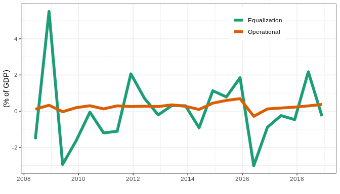
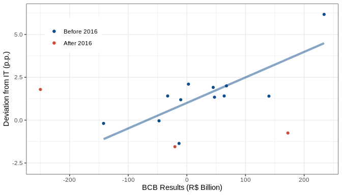

Equalization and operational results of the BCB (Figures 1 and 6)
================
João Pedro S. Macalós
2/12/2020

The objective of this notebook is to show, step by step, how the
equalization account and the operational results of the BCB was scrapped
from the financial reports of the BCB. These data was used to build the
Figure 6 of the paper “Does the accounting framework affect the
operational capacity of the central bank? Lessons from the Brazilian
experience”. We also show how the data on the inflation targets of the
BCB was collected in order to build the Figure 1 of the paper.

Load R packages:

``` r
library(reticulate)
library(tidyverse)
```

    ## ── Attaching packages ───────────────────────────────────────────────────────────────────────────────── tidyverse 1.3.0 ──

    ## ✓ ggplot2 3.2.1     ✓ purrr   0.3.3
    ## ✓ tibble  2.1.3     ✓ dplyr   0.8.3
    ## ✓ tidyr   1.0.0     ✓ stringr 1.4.0
    ## ✓ readr   1.3.1     ✓ forcats 0.4.0

    ## ── Conflicts ──────────────────────────────────────────────────────────────────────────────────── tidyverse_conflicts() ──
    ## x dplyr::filter() masks stats::filter()
    ## x dplyr::lag()    masks stats::lag()

``` r
library(lubridate)
```

    ## 
    ## Attaching package: 'lubridate'

    ## The following object is masked from 'package:base':
    ## 
    ##     date

Load python libraries:

``` python
import pandas as pd
import camelot
import numpy as np
import matplotlib.pyplot as plt
import os
import glob
```

Load pdf files:

``` python
files_jun = sorted(glob.glob('balance_sheets_pdf/*01.pdf'))
files_dez = sorted(glob.glob('balance_sheets_pdf/*02.pdf'))
```

Read pdf files:

``` python
tables_jun = []

for file in files_jun:
    t = camelot.read_pdf(file, pages = '3', flavor = 'stream', edge_tol = 500)
    tables_jun.append(t)
    
tables_dez = []
for file in files_dez:
    t = camelot.read_pdf(file, pages = '3', flavor = 'stream', edge_tol = 500)
    tables_dez.append(t)
```

Define function to clean the pdf tables:

``` python
def clean_bcb_res(file, year, jun = False):
    year_lag = str(int(year) - 1)
    
    df = file[0].df
    end = df.index[df[0].str.contains('RESULTADO NO', na = False)]
    start = df.index[df[0].str.contains('Receitas com juros', na = False)]
    df = df[start[0]:end[0]+1]
    df = df.replace('', np.nan)
    df = df.dropna(axis = 1, how = 'all')
    df.columns = ['vars', 'c2', year, year_lag]
    df = df.dropna(subset = ['vars'])
    df = df[df.vars.str.contains('RESULTADO NO PERÍODO|RESULTADO NO SEMESTRE|RESULTADO NO EXERCÍCIO')]
    df = df.loc[:,['vars', year, year_lag]]
    df = df.melt(id_vars = ['vars'], var_name = 'date', value_name = 'value')
    
    df = (df.assign(value = lambda x: x.value
               .str.replace('(', '-').str.replace(')', '')
               .str.replace('\.', '', regex = True).apply(pd.to_numeric, errors = 'coerce'))
              )
    
    if jun is True:
        df = (df.assign(vars =
              pd.np.where(df.vars.str.contains("RESULT"), "RESULT-01", df.vars))
              )
    else:
        df = (df.assign(vars =
              pd.np.where(df.vars.str.contains("RESULT"), "RESULT", df.vars))
              )
    df = df.assign(date = lambda x: x.date.astype('int64'))
    
    return(df)
```

Create list of years:

``` python
yrs = list(range(2005, 2020))
yrs = list(map(lambda x: str(x), yrs))
```

The operational results of the BCB are available on the table of page 3,
in the row that takes the name of either “RESULTADO NO PERÍODO”,
“RESULTADO NO SEMSTRE” or “RESULADO NO EXERCÍCIO”.

Get results of the BCB for the first semester of each year:

``` python
bcb_res_jun = []
for table, year in zip(tables_jun, yrs):
    t = clean_bcb_res(table, year, jun = True)
    bcb_res_jun.append(t)
```

Clean the file:

``` python
bcb_res_jun1 = pd.concat(bcb_res_jun)
bcb_res_jun1 = bcb_res_jun1.drop_duplicates()
bcb_res_jun1 = bcb_res_jun1.sort_values('date')
bcb_res_jun1 = bcb_res_jun1.groupby('date').last()
bcb_res_jun1.head()
```

    ##            vars     value
    ## date                     
    ## 2004  RESULT-01   2795700
    ## 2005  RESULT-01 -11626465
    ## 2006  RESULT-01 -12871727
    ## 2007  RESULT-01 -30304910
    ## 2008  RESULT-01   3172740

Get annual results for the BCB (released in December every year):

``` python
bcb_res_yr = []
for table, year in zip(tables_dez, yrs):
    t = clean_bcb_res(table, year)
    bcb_res_yr.append(t)
```

Clean:

``` python
bcb_res_yr1 = pd.concat(bcb_res_yr)
bcb_res_yr1 = bcb_res_yr1.drop_duplicates()
bcb_res_yr1 = bcb_res_yr1.sort_values('date')
bcb_res_yr1 = bcb_res_yr1.groupby('date').last()
bcb_res_yr1.head()
```

    ##         vars     value
    ## date                  
    ## 2004  RESULT   2709689
    ## 2005  RESULT -10494963
    ## 2006  RESULT -13392761
    ## 2007  RESULT -47514139
    ## 2008  RESULT  13345393

Get results for the second semester
only:

``` python
bcb_res_dez = bcb_res_yr1.merge(bcb_res_jun1, on = 'date', how = 'outer')
#bcb_res_dez
bcb_res_dez1 = (bcb_res_dez.assign(value = lambda x: x.value_x - x.value_y)
                .assign(vars = 'RESULT-02')
               )
bcb_res_dez1 = bcb_res_dez1.loc[:,['vars', 'value']]
bcb_res_dez1.head()
```

    ##            vars       value
    ## date                       
    ## 2004  RESULT-02    -86011.0
    ## 2005  RESULT-02   1131502.0
    ## 2006  RESULT-02   -521034.0
    ## 2007  RESULT-02 -17209229.0
    ## 2008  RESULT-02  10172653.0

Get operational results per semester:

``` python
bcb_res_semester = (bcb_res_jun1
                    .append(bcb_res_dez1)
                    .reset_index()
                    .assign(vars = lambda x: [1 if a == 'RESULT-01' else 2 for a in x['vars']])
                    .sort_values(['date', 'vars'])
                    .rename(columns = {'vars':'semester'})
                    .reset_index()
                    .drop(columns = ['index'])
                    )
bcb_res_semester.head()
```

    ##    date  semester       value
    ## 0  2004         1   2795700.0
    ## 1  2004         2    -86011.0
    ## 2  2005         1 -11626465.0
    ## 3  2005         2   1131502.0
    ## 4  2006         1 -12871727.0

### FX Equalization

With the operational results in hands, we can proceed to find the
results of the equalization accounts. Since the table reporting the
results of the equalization account are not always in the same page of
the BCB’ financial report, new pdf files with the specific pages were
created.

Load
files:

``` python
eq_files_jun = sorted(glob.glob('balance_sheets_pdf/equalization_page/*1_eq.pdf'))
eq_files_dez = sorted(glob.glob('balance_sheets_pdf/equalization_page/*2_eq.pdf'))
```

Read pdf tables:

``` python
tables_eq_jun = []

for f in eq_files_jun:
    t = camelot.read_pdf(f, pages = '1', flavor = 'stream', edge_tol = 500)
    tables_eq_jun.append(t)
    
tables_eq_dez = []

for f in eq_files_dez:
    t = camelot.read_pdf(f, pages = '1', flavor = 'stream', edge_tol = 500)
    tables_eq_dez.append(t)
```

The equalization result can be obtained in the row “(+/- transferências
…)” below **Equalização cambial** in the selected pages of the
financial reports.

See, for
    instance:

``` python
tables_eq_jun[0][0].df.iloc[[0,1,2,3,4,5,25,26,27,28,29,30],0:2]
```

    ##                                                     0             1
    ## 0   NOTAS EXPLICATIVAS ÀS DEMONSTRAÇÕES FINANCEIRA...              
    ## 1                              EM 30 DE JUNHO DE 2008              
    ## 2   (Os valores estão expressos em milhares de Rea...              
    ## 3                                                       1º sem 2008
    ## 4                     Conta Única do Tesouro Nacional              
    ## 5                                       Saldo inicial   275.843.164
    ## 25                                        Saldo final     3.175.883
    ## 26                                Equalização Cambial              
    ## 27                                      Saldo inicial             -
    ## 28                                        (+) ajustes    44.798.256
    ## 29                               (+/-) transferências  (44.798.256)
    ## 30                                        Saldo final             -

Create cleaning function:

``` python
def get_t(table, period):
    t = table[0].df.loc[:, :1]
    #t.columns = ['vars', files_eq[dfn][0:7]]
    t.columns = ['vars', 'value']
    i = t.index[t.vars.str.contains('Equaliz')].tolist()
    t = t[i[0]:i[0]+4]
    #t = clean_t(t)
    t = t[t.vars.str.contains('transfer')]
    t = (t.assign(value = t
                  .value.str.replace('(', '-').str.replace(')', '')
                  .str.replace('.', '')
                  .astype('float'))
        )
    
    t.columns = ['vars', period]
    
    t = t.melt(id_vars = ['vars'], var_name = 'date', value_name = 'value')
    t = t.assign(vars = 'equalization')
    #.assign(semester = lambda x: x.date[6:7])
    year = period[0:4]
    semester = period[6:7]
    t = t.assign(year = year).assign(semester = semester)
    t = t.loc[:,['vars', 'year', 'semester', 'value']]
    
    
    return(t)
```

Check that it works:

``` python
get_t(tables_eq_jun[0], '2008-01')
# Verify that it is the same value as was visualized above
```

    ##            vars  year semester       value
    ## 0  equalization  2008        1 -44798256.0

Create objects to store the periods:

``` python
periods_jun = []
for file in eq_files_jun:
    p = file[-14:-7]
    periods_jun.append(p)
    
periods_dez = []
for file in eq_files_dez:
    p = file[-14:-7]
    periods_dez.append(p)
    
periods_dez[:5]
```

    ## ['2008-02', '2009-02', '2010-02', '2011-02', '2012-02']

Before collecting the equalization results, we must re-read the pdf file
from 2011-01 (period\_jun 3) specifying the coordinates on the page of
the pdf
table:

``` python
tables_eq_jun[3] = camelot.read_pdf(eq_files_jun[3], pages = '1', flavor = 'stream', edge_tol = 500, table_regions = ['100, 500, 500, 40'])
```

Collect equalization first semester:

``` python
fx_eq_jun = []

for file, date in zip(tables_eq_jun, periods_jun):
    t = get_t(file, date)
    fx_eq_jun.append(t)
    
fx_eq_jun = pd.concat(fx_eq_jun)
fx_eq_jun.head()
```

    ##            vars  year semester       value
    ## 0  equalization  2008        1 -44798256.0
    ## 0  equalization  2009        1 -93787316.0
    ## 0  equalization  2010        1  -1893172.0
    ## 0  equalization  2011        1 -46199286.0
    ## 0  equalization  2012        1  32210001.0

Collect equalization for the whole year:

``` python
fx_eq_yr = []

for file, date in zip(tables_eq_dez, periods_dez):
    t = get_t(file, date)
    fx_eq_yr.append(t)
    
fx_eq_yr = pd.concat(fx_eq_yr)#.assign(year = lambda x: x.year.astype('int64')).drop(columns = ['semester'])
fx_eq_yr.head()
```

    ##            vars  year semester        value
    ## 0  equalization  2008        2  126617756.0
    ## 0  equalization  2009        2 -147718892.0
    ## 0  equalization  2010        2  -48529720.0
    ## 0  equalization  2011        2   44040773.0
    ## 0  equalization  2012        2   22309406.0

Collect equalization for the second semester only. It requires some data
merging and cleaning:

``` python
fx_eq_dez = (fx_eq_jun.merge(fx_eq_yr, on = 'year', how = 'left')
             .assign(value = lambda x: x.value_y - x.value_x)
            )

fx_eq_dez = fx_eq_dez.loc[:,['vars_x', 'year', 'semester_y', 'value']]
fx_eq_dez.columns = ['vars', 'year', 'semester', 'value']
fx_eq_dez.head()
```

    ##            vars  year semester        value
    ## 0  equalization  2008        2  171416012.0
    ## 1  equalization  2009        2  -53931576.0
    ## 2  equalization  2010        2  -46636548.0
    ## 3  equalization  2011        2   90240059.0
    ## 4  equalization  2012        2   -9900595.0

Consolidate the equalization results in a semi-annual basis:

``` python
fx_eq_semester = (fx_eq_jun.append(fx_eq_dez)
                  .sort_values(['year','semester'])
                  .iloc[:,[1,2,3]]
                  .rename(columns = {'year':'date', 'value':'equalization'})
                  .assign(date = lambda x: x.date.astype('int64'))
                  .dropna()
                  .assign(semester = lambda x: x.semester.astype('int64'))
                  )
fx_eq_semester.tail()
```

    ##     date  semester  equalization
    ## 0   2017         1   -15744789.0
    ## 9   2017         2   -30677374.0
    ## 0   2018         1   146201403.0
    ## 10  2018         2   -19133818.0
    ## 0   2019         1    -7560780.0

``` python
bcb_res_semiannual = (bcb_res_semester
                      .iloc[:,[0,1,2]]
                      .rename(columns = {'value':'operational'})
                      .merge(fx_eq_semester, on = ['date', 'semester'], how = 'left')
                      .dropna())
bcb_res_semiannual.head()
```

    ##     date  semester  operational  equalization
    ## 8   2008         1    3172740.0   -44798256.0
    ## 9   2008         2   10172653.0   171416012.0
    ## 10  2009         1    -941601.0   -93787316.0
    ## 11  2009         2    6550645.0   -53931576.0
    ## 12  2010         1   10803195.0    -1893172.0

## Figure 6

Download Brazilian GDP (accumulated in 12 monhts) using `sgs` library:

``` python
import sgs

gdp_br = sgs.time_serie(4382, start = '01/01/2005', end = '31/12/2018')

gdp_br1 = pd.DataFrame(gdp_br)
#gdp_br1.head()
gdp_br1 = (gdp_br1.assign(month = lambda x: x.index.month)
          .query('month in [6, 12]')
          .rename(columns = {4382:'gdp'})
          .assign(date = lambda x: x.index.year)
          )
          
gdp_br1 = gdp_br1.reset_index().rename(columns = {'index':'date'}).iloc[:,[0,1]]

gdp_br1.head()
```

    ##         date        gdp
    ## 0 2005-06-01  2066440.5
    ## 1 2005-12-01  2170584.5
    ## 2 2006-06-01  2271564.0
    ## 3 2006-12-01  2409449.9
    ## 4 2007-06-01  2575280.3

Join the data and clean:

``` r
bcb_results_sa <- py$bcb_res_semiannual %>%
  mutate(semester = if_else(semester == 1, '-06', '-12'),
         date = ymd(str_c(date, semester, truncated = 1))) %>%
  select(date, equalization, operational) %>%
  inner_join(py$gdp_br1 %>% mutate(date = as_date(date))) %>%
  mutate_at(vars(-date), list(~ 100 * ./(gdp*10^3))) %>%
  select(-gdp)

#write_tsv(bcb_results_sa, 'fig6_equalization_operational_raw.tsv')
```

Plot:

``` r
bcb_results_sa %>%
  gather(key, value, -date) %>%
  ggplot(aes(x = date, y = value, color = key)) +
  geom_line(size = 2) +
  ggthemes::theme_economist() +
  theme(legend.position = c(0.75, 0.88),
        legend.title = element_blank()) +
  labs(x = '', y = '(% of GDP)') +
  scale_color_brewer(palette = 'Dark2', labels = c('Equalization', 'Operational'))
```

<!-- -->

## Consolidate overall result of the BCB

``` python
bcb_yr_result = (bcb_res_yr1.reset_index()
                 .merge(fx_eq_yr.assign(year = lambda x: x.year.astype('int64')), 
                 left_on = 'date', right_on = 'year', how = 'left')
                 .fillna(0)
                 .assign(result = lambda x: x.value_x + x.value_y)
                 .loc[:,['date', 'result']]
                 )

bcb_yr_result.head()
```

    ##    date       result
    ## 0  2004    2709689.0
    ## 1  2005  -10494963.0
    ## 2  2006  -13392761.0
    ## 3  2007  -47514139.0
    ## 4  2008  139963149.0

## Deviations from the IPCA target

This part of the analysis was conducted using R.

Get the IPCA targets from the BCB
website:

``` r
url_metas = jsonlite::fromJSON('https://www.bcb.gov.br/api/servico/sitebcb/Tabela?listsite=controleinflacao&identificador=historico_metas_inflacao')

targets_ipca <- url_metas$conteudo$conteudoTabela %>% 
  xml2::read_html() %>% 
  rvest::html_table(fill = T)
```

Clean:

``` r
tg_ipca1 <- targets_ipca[[1]] %>% as_tibble() %>%
  set_names('Year', 'Norma', 'Date', 'Target', 'Band', 'Ranges', 'IPCA') %>%
  mutate_at(vars(Year:IPCA), list( ~ str_replace_all(., "\\u200b", ""))) %>%
  mutate_at(vars(Year:IPCA), list( ~ str_squish(.)))

tg_ipca1 %>% head(n = 8)
```

    ## # A tibble: 8 x 7
    ##   Year  Norma                   Date            Target Band  Ranges        IPCA 
    ##   <chr> <chr>                   <chr>           <chr>  <chr> <chr>         <chr>
    ## 1 1999  Resolução 2.615         30/6/1999       8      2     6-10          8,94 
    ## 2 2000  Resolução 2.615         30/6/1999       6      2     4-8           5,97 
    ## 3 2001  Resolução 2.615         30/6/1999       4      2     2-6           7,67 
    ## 4 2002  Resolução 2.744         28/6/2000       3,5    2     1,5-5,5       12,53
    ## 5 2003* Resolução 2.842Resoluç… 28/6/200127/6/… 3,254  22,5  1,25-5,251,5… 9,3  
    ## 6 2004* Resolução 2.972Resoluç… 27/6/200225/6/… 3,755… 2,52… 1,25-6,253-8  7,6  
    ## 7 2005  Resolução 3.108         25/6/2003       4,5    2,5   2-7           5,69 
    ## 8 2006  Resolução 3.210         30/6/2004       4,5    2     2,5-6,5       3,14

We can see that the targets for 2004 were changed. I used in this work
only the revised
targets.

Clean:

``` r
# 2004 (the targets were changed in this year. We will use the latest ones)
tg_ipca_2003 = tg_ipca1 %>% slice(5) %>%
  slice(rep(1:n(), each = 2))

tg_ipca_20032 = tg_ipca_2003 %>%
  mutate(Year = '2003',
         Norma = str_sub(Norma, -15, -1),
         Date = str_sub(Date, -9, -1),
         Target = str_sub(Target, -1, -1),
         Band = str_sub(Band, -3, -1),
         Ranges = str_sub(Ranges, -7, -1)) %>%
  slice(1)

tg_ipca_2004 = tg_ipca1 %>% slice(6) %>%
  slice(rep(1:n(), each = 2))

tg_ipca_20042 = tg_ipca_2004 %>%
  mutate(Year = '2004',
         Norma = str_sub(Norma, -15, -1),
         Date = str_sub(Date, -9, -1),
         Target = str_sub(Target, -3, -1),
         Band = str_sub(Band, -3, -1),
         Ranges = str_sub(Ranges, -3, -1)) %>%
  slice(1)
```

Clean:

``` r
tg_ipca2 = tg_ipca1 %>%
  bind_rows(tg_ipca_20032, 
            tg_ipca_20042) %>%
  slice(-5, -6) %>%
  slice(1:4, 24:25, 5:22) %>% 
  mutate_at(vars(4:7), list(~ str_replace_all(., ',', '.'))) %>%
  mutate(year = as.numeric(Year)) %>%
  select(-Year) %>%
  select(date = year, target = Target, ipca = IPCA) %>%
  mutate_at(vars(-date), list(~ as.numeric(.))) %>%
  mutate(ipca_dev = ipca - target) %>%
  filter(date >= 2004, date < 2019)

tg_ipca2
```

    ## # A tibble: 15 x 4
    ##     date target  ipca ipca_dev
    ##    <dbl>  <dbl> <dbl>    <dbl>
    ##  1  2004    5.5  7.6      2.10
    ##  2  2005    4.5  5.69     1.19
    ##  3  2006    4.5  3.14    -1.36
    ##  4  2007    4.5  4.46    -0.04
    ##  5  2008    4.5  5.9      1.4 
    ##  6  2009    4.5  4.31    -0.19
    ##  7  2010    4.5  5.91     1.41
    ##  8  2011    4.5  6.5      2   
    ##  9  2012    4.5  5.84     1.34
    ## 10  2013    4.5  5.91     1.41
    ## 11  2014    4.5  6.41     1.91
    ## 12  2015    4.5 10.7      6.17
    ## 13  2016    4.5  6.29     1.79
    ## 14  2017    4.5  2.95    -1.55
    ## 15  2018    4.5  3.75    -0.75

Combine datasets and create a flag for years after the 2015 crisis:

``` r
ipca_bcbres <- tg_ipca2 %>%
  left_join(py$bcb_yr_result) %>%
  mutate(after_crisis = case_when(date >= 2004 & date < 2016 ~ 0,
                                  TRUE ~ 1))

ipca_bcbres
```

    ## # A tibble: 15 x 6
    ##     date target  ipca ipca_dev     result after_crisis
    ##    <dbl>  <dbl> <dbl>    <dbl>      <dbl>        <dbl>
    ##  1  2004    5.5  7.6      2.10    2709689            0
    ##  2  2005    4.5  5.69     1.19  -10494963            0
    ##  3  2006    4.5  3.14    -1.36  -13392761            0
    ##  4  2007    4.5  4.46    -0.04  -47514139            0
    ##  5  2008    4.5  5.9      1.4   139963149            0
    ##  6  2009    4.5  4.31    -0.19 -142109848            0
    ##  7  2010    4.5  5.91     1.41  -32799750            0
    ##  8  2011    4.5  6.5      2      67512183            0
    ##  9  2012    4.5  5.84     1.34   47103436            0
    ## 10  2013    4.5  5.91     1.41   63641315            0
    ## 11  2014    4.5  6.41     1.91   44876743            0
    ## 12  2015    4.5 10.7      6.17  234050920            0
    ## 13  2016    4.5  6.29     1.79 -249847394            1
    ## 14  2017    4.5  2.95    -1.55  -20440663            1
    ## 15  2018    4.5  3.75    -0.75  172277207            1

``` r
#write_tsv(ipca_bcbres, 'ipca_bcbres_raw.tsv')
```

``` r
t1 <- ipca_bcbres %>%
  filter(after_crisis == 0)

t2 <- ipca_bcbres %>%
  filter(after_crisis == 1)
```

## Figure 1

``` r
ggplot(ipca_bcbres, aes(x = result/10^6, y = ipca_dev)) +
  geom_point(data = t1, aes(x = result/10^6, y = ipca_dev, color = 'blue')) +
  geom_smooth(data = t1, formula = y ~ x, method = 'lm', se = F) +
  geom_point(data = t2, aes(x = result/10^6, y = ipca_dev, color = 'red')) +
  ggthemes::theme_economist() +
  scale_color_manual(labels = c("Before 2016", 'After 2016'), values = c('dodgerblue4', 'tomato3')) +
  labs(x = 'BCB Results (R$ Bn)', y = 'Deviation from IT (p.p.)',#) + ,
       title = 'Bad profits?', subtitle = 'Relationship between the profits of the BCB and the deviations from the inflation target',
       caption = "Author's elaboration based on data from the Brazilian Central Bank.") +
  theme(legend.position = c(0.15, 0.815),
        legend.title = element_blank(),
        #legend.spacing.y = unit(0, "mm"), 
        #panel.border = element_rect(colour = "black", fill=NA),
        #aspect.ratio = 1, axis.text = element_text(colour = 1, size = 12),
        #legend.background = element_blank(),
        legend.key = element_rect(fill = 'lightblue', colour = 'black'),
        legend.box.background = element_rect(colour = "transparent", fill = 'transparent'),
        plot.caption=element_text(hjust = -0.1))
```

<!-- -->
