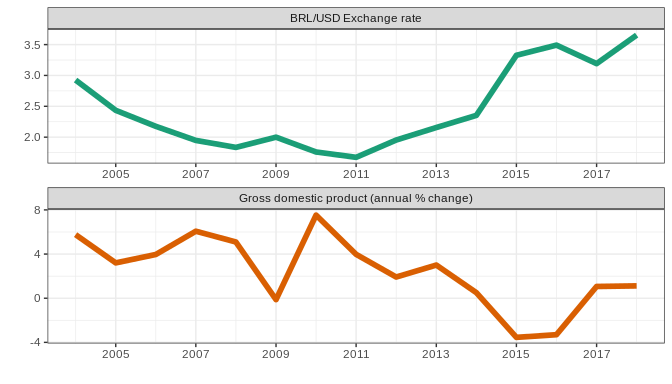

Exchange rate and GDP (Figure 4)
================
João Pedro S. Macalós
2/10/2020

In this notebook we show how we downloaded the BRL/USD exchange rate and
the Brazilian GDP from the IMF and the WB and we show the code to build
the Figure 4 in the paper “Does the accounting framework affect the
operational capacity of the central bank? Lessons from the Brazilian
experience.”

Load `tidyverse` and
    `lubridate`:

``` r
library(tidyverse)
```

    ## ── Attaching packages ─────────────────────────────────────────────────────────────────────────────────────────────────────────────── tidyverse 1.3.0 ──

    ## ✓ ggplot2 3.3.0           ✓ purrr   0.3.4      
    ## ✓ tibble  3.0.1           ✓ dplyr   0.8.99.9003
    ## ✓ tidyr   1.1.0           ✓ stringr 1.4.0      
    ## ✓ readr   1.3.1           ✓ forcats 0.5.0

    ## ── Conflicts ────────────────────────────────────────────────────────────────────────────────────────────────────────────────── tidyverse_conflicts() ──
    ## x dplyr::filter() masks stats::filter()
    ## x dplyr::lag()    masks stats::lag()

``` r
library(lubridate)
```

    ## 
    ## Attaching package: 'lubridate'

    ## The following object is masked from 'package:base':
    ## 
    ##     date

The following functions are wrappers that download and clean the the IMF
and WB series:

``` r
ifs_getA <- function(id, country = list_em2, start = 2000) {
  imfr::imf_data(database_id = "IFS", indicator = id, freq = "A", country = country, start = start) %>%
    as_tibble() %>%
    mutate(date = ymd(year, truncated = 2)) %>%
    select(iso2c, date, id) %>%
    gather(key, value, -date, -iso2c)
}

wb_getA <- function(id, country = list_em2, start = 2000, end = 2018) {
  wbstats::wb(country = country, indicator = id, freq = 'Y', startdate = start, enddate = end) %>% 
    as_tibble %>%
    select(iso2c, date, value) %>%
    mutate(date = ymd(as.numeric(date), truncated = 2)) %>%
    arrange(date) %>% arrange(iso2c)
}
```

# BRL/USD exchange rate and Brazilian GDP

``` r
exr_br <- ifs_getA('ENDA_XDC_USD_RATE', 'BR', 2004) %>% select(date, exr = value)
gdp_br <- wb_getA('NY.GDP.MKTP.KD.ZG', 'BR', start = 2004) %>% select(date, gdp = value)
```

Join the variables:

``` r
context_vars <- inner_join(gdp_br, exr_br) %>%
  gather(key, value, -date)

#write_tsv(context_vars, 'exr_gdp_vars_raw.tsv')
```

``` r
context_vars <- read_tsv('context_files/exr_gdp_vars_raw.tsv')
```

    ## Parsed with column specification:
    ## cols(
    ##   date = col_date(format = ""),
    ##   key = col_character(),
    ##   value = col_double()
    ## )

``` r
context_vars %>%
  mutate(key = if_else(key == 'exr', 'BRL/USD Exchange rate', 'Gross domestic product (annual % change)')) %>%
  ggplot(aes(x=date, y=value, color = key)) +
  geom_line(size = 2) +
  scale_color_brewer(palette = 'Dark2') +
  facet_wrap(~key, nrow =  2, scales = 'free') +
  #ggthemes::theme_economist() +
  theme_bw() +
  theme(legend.position = 'none') +
  labs(x = '', y = '') +
  scale_x_date(breaks = '2 years', date_labels = '%Y')
```

<!-- -->
