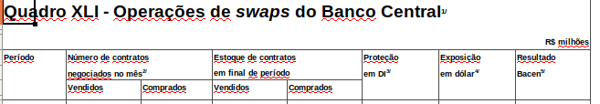
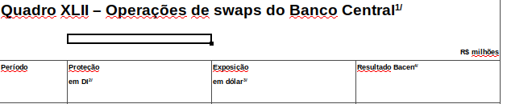
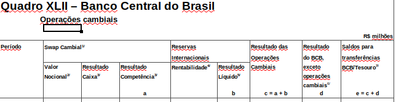

```{r setup, include=FALSE}
knitr::opts_chunk$set(echo = TRUE)
```

The notional exposition of the BCB on its FX swaps contracts are not readily available in the system of time series generator of the institution. However, it can be found in different notes to the press released by the BCB or in the website of the B3, where the FX swaps are traded.

If one decides to collect the data directly at the B3 website, it must search for information about [open contracts](http://www.b3.com.br/pt_br/market-data-e-indices/servicos-de-dados/market-data/consultas/mercado-de-derivativos/contratos-em-aberto/por-tipo-de-participante/) in that exchange by type of institutional investors. This process is curbersome because the information is available in a day-by-day basis, and the researcher must search every single day individually. However, web scrapping techniques might automate this process.

The other option to collect these data is through the notes to the press released by the central bank (either notes about open market policies or about fiscal policy). Since the fiscal policy notes are used again in this paper, we will collect the data through these notes. They are released in a monthly basis and the format of the excel sheets changed quite often, requiring an extra care of the researcher to consolidate the data. I will show how to consolidate them programmatically in this notebook since it might be useful to readers.

The raw data is available at the [BCB website](https://www.bcb.gov.br/estatisticas/historicoestatisticas). The reader can download them in the "Estatísticas Fiscais" column.

## BCB position in FX swaps (notional value of open contracts)

Import python libraries:
```{python}
import openpyxl as openpyxl
import pandas as pd
import os
import glob
```

Load all file names:
```{python}
files = sorted(glob.glob('context_files/swaps_sheets/*.xlsx'))
```

### 2004 - 2011

Snapshot of the header of the excel sheets between 2004 and 2011:
```{r}

```

Define function to clean the files:
```{python}
cols_bcb = (['year', 'month', 'empty1', 'n_sold',
        'n_buy', 'stock_sold', 'stock_buy',
        'prot_di', 'exp_fx', 'res_bcb'])

quarters = {'Mar':'04', 'Jun':'07', 'Set':'10', 'Dez':'01'}
quarters_rev = {'04':'Mar', '07':'Jun', '10':'Set', '01':'Dez'}

def clean_sw(file):
    """Clean the excel sheet and store the relevant information"""

    quarter = file[-13:-11]
    
    if quarter == '01':
        year = int(file[-18:-14]) - 1
        year = str(year)
    else:
        year = file[-18:-14]
        
    #print(year)
    
    df = pd.read_excel(file, header = None)
    
    start = df.index[df[0].str.contains('Total', na = False)]
    end = df.index[df[0].str.contains('leilões no mercado aberto', na = False)]

    df1 = df[start[0]:end[0]]
    df1.columns = cols_bcb
    df1 = df1.assign(year = lambda x: x.year.ffill())
    
    df1 = df1.replace({'month':quarters})
    transform = ['year', 'month']
    df1[transform] = df1[transform].astype('str')
    df1 = df1[df1.year == year]
    df1 = df1[df1.month == quarter] 
    df1 = df1.replace({'month':quarters_rev})
    
       
    return(df1)
```

```{python}
clean_sw(files[27])
```

Clean the files until 2011-01
```{python}
bcb_notional = []

for file in files[0:28]:
    t1 = clean_sw(file)
    bcb_notional.append(t1)
    
bcb_notional = pd.concat(bcb_notional)
```

```{python}
bcb_notional.tail()
```

### 2011 - 2014

From 2011 to 2014, the configuration of the excel sheet changed, and information about contracts purchased or sold and about the stocks of open swaps were not informed anymore.

```{python}
files[28:31]
```

```{r}

```

```{python}
cols_bcb2 = (['year', 'month', 'empty1',
        'prot_di', 'exp_fx', 'res_bcb'])

def clean_sw2(file):
    """Clean the excel sheet and store the relevant information"""

    year = int(file[-18:-14]) - 1
    year = str(year)
        
    #print(year)
    
    df = pd.read_excel(file, header = None)
    
    start = df.index[df[0].str.contains('Período', na = False)]
    end = df.index[df[0].str.contains('leilões no mercado aberto', na = False)]

    df1 = df[start[0]:end[0]]
    df1.columns = cols_bcb2
    df1 = df1.assign(year = lambda x: x.year.ffill())
    
    transform = ['year', 'month']
    df1[transform] = df1[transform].astype('str')
    df1 = df1[df1.year == year]
    df1 = df1[df1.month != 'nan']
    #df1 = df1.dropna(axis = 'columns')
    df1 = df1[df1.month.isin(['Mar', 'Jun', 'Set', 'Dez'])]
           
    return(df1)
```

```{python}
bcb_notional2 = []

for file in files[28:31]:
    t1 = clean_sw2(file)
    bcb_notional2.append(t1)
    
bcb_notional2 = pd.concat(bcb_notional2)
```

```{python}
bcb_notional2.head()
```

### 2014 - 2019

```{r}

```

```{python}
cols_bcb3 = (['year', 'month', 'empty1',
        'notional', 'res_caixa', 'res_competencia'])

def clean_sw3(file):
    """Clean the excel sheet and store the relevant information"""

    year = int(file[-18:-14]) - 1
    year = str(year)
        
    #print(year)
    
    df = pd.read_excel(file, header = None)
    
    start = df.index[df[0].str.contains('Período', na = False)]
    end = df.index[df[0].str.contains('leilões no mercado aberto', na = False)]

    df1 = df[start[0]:end[0]]
    df1 = df1.iloc[:, :6]
    df1.columns = cols_bcb3
    df1 = df1.assign(year = lambda x: x.year.ffill())
    
    #df1 = df1.replace({'month':quarters})
    transform = ['year', 'month']
    df1[transform] = df1[transform].astype('str')
    df1 = df1[df1.year == year]
    df1 = df1[df1.month != 'nan']
    df1 = df1[df1.month.isin(['Mar', 'Jun', 'Set', 'Dez'])]
           
    return(df1)
```

```{python}
bcb_notional3 = []

for file in files[31:]:
    t1 = clean_sw3(file)
    bcb_notional3.append(t1)
```

```{python}
bcb_notional3 = pd.concat(bcb_notional3)
```

```{python}
bcb_notional3.tail()
```

Finally, we collect the first two quarters of 2019 with another specific function:

```{python}
def clean_sw4(file):
    """Clean the excel sheet and store the relevant information"""

    year = file[-18:-14]
    df = pd.read_excel(file, header = None)
    
    start = df.index[df[0].str.contains('Período', na = False)]
    end = df.index[df[0].str.contains('leilões no mercado aberto', na = False)]

    df1 = df[start[0]:end[0]]
    df1 = df1.iloc[:, :6]
    df1.columns = cols_bcb3
    df1 = df1.assign(year = lambda x: x.year.ffill())
    
    #df1 = df1.replace({'month':quarters})
    transform = ['year', 'month']
    df1[transform] = df1[transform].astype('str')
    df1 = df1[df1.year == year]
    df1 = df1[df1.month != 'nan']
    df1 = df1[df1.month.isin(['Mar', 'Jun'])]
           
    return(df1)
```

And we append the values to the `bcb_notional3` DataFrame:

```{python}
bcb_notional3 = bcb_notional3.append(clean_sw4(files[-1]))
bcb_notional3.tail()
```

We can now consolidate the DataFrames and remove the undesired columns:

```{python}
bcb_n1 = bcb_notional.loc[:, ['year', 'month', 'exp_fx']]
bcb_n2 = bcb_notional2.loc[:, ['year', 'month', 'exp_fx']]
bcb_n3 = bcb_notional3.loc[:, ['year', 'month', 'notional']].rename(columns = {'notional':'exp_fx'})
```

```{python}
bcb_n = bcb_n1.append(bcb_n2).append(bcb_n3).reset_index().loc[:, ['year', 'month', 'exp_fx']]
```

```{python}
bcb_n
```

We can now switch back to R to finish the analysis:

```{r}
library(tidyverse)
library(lubridate)
library(reticulate)
```


We need the international reserves and the exchange rate at the end of the period (to convert the notional exposition to dollars):

Function to download and clean quarterly data from the IMF
```{r, eval = F}
ifs_getQ <- function(id, country = list_em2, start = 2000) {
  imfr::imf_data(database_id = "IFS", indicator = id, freq = "Q", country = country, start = start) %>%
    as_tibble() %>%
    mutate(date = yq(year_quarter)) %>%
    select(iso2c, date, id) %>%
    gather(key, value, -date, -iso2c)
}
```


```{r, eval = F}
res_br <- ifs_getQ('RAFA_USD', 'BR', 2004) %>% select(date, res = value)
```

We will use the exchange rate from the BCB, code 1, retrieved using the `BETS` package. We are going to convert the stocks by the exchange rate of the last day of the quarter:

```{r, eval = F}
exen_br <- BETS::BETSget(1, data.frame = FALSE)
```

```{r, eval = F}
exen_br1 <- exen_br %>%
  mutate(year = year(date),
         quarter = quarter(date)) %>%
  group_by(year, quarter) %>%
  summarize(value = last(value)) %>%
  ungroup %>%
  mutate(date = yq(str_c(year, '-', quarter))) %>%
  select(date, exr = value) %>%
  filter(date >= '2004-01-01')
```

```{r, eval = F}
bcb_n <- py$bcb_n %>% 
  mutate(exp_fx = unlist(exp_fx))
```

```{r, eval = F}
bcb_n1 <- bcb_n %>%
  mutate(year = as.numeric(year),
         month = case_when(month == 'Mar' ~ 1,
                           month == 'Jun' ~ 2,
                           month == 'Set' ~ 3,
                           month == 'Dez' ~ 4)) %>%
  mutate(date = yq(str_c(year, '-', month))) %>%
  select(date, exp_fx)
```

```{r, eval = F}
bcb_n2 <- bcb_n1 %>%
  inner_join(res_br) %>%
  inner_join(exen_br1) %>%
  mutate(notional = exp_fx / exr) %>%
  mutate(net_res = res + notional) %>%
  select(date, notional, res, net_res)

#write_tsv(bcb_n2, 'context_files/res_swaps_raw.tsv')
```

```{r}
bcb_n2 <- read_tsv('context_files/res_swaps_raw.tsv')
```


```{r}
fx_res1 <- bcb_n2 %>%
  select(date, res) %>%
  gather(key, value, -date)

fx_res2 <- bcb_n2 %>%
  select(date, net_res) %>%
  gather(key, value, -date)
```


## Figure 5

```{r fig.width=7, fig.height=4}
fx_res1 %>%
  ggplot(aes(x=date)) +
  geom_area(data = fx_res1, stat = 'identity', aes(y = value / 10^3, fill = key), alpha = 0.8) +
  geom_line(data = fx_res2, aes(y = value / 10^3, color = key), size = 2) +
  labs(x = '', y = 'US$ Billion') +
  #scale_fill_viridis_d() +
  scale_fill_manual('', values = c('#44aabb'), labels = 'Reserves') +
  scale_color_manual('', values = 'black', labels = 'Net FX position\n(Reserves - FX Swaps)') +
  scale_x_date(breaks = '3 years', date_label = '%Y', limits = c(as.Date('2004-01-01'), as.Date('2019-07-01'))) +
  #ggthemes::theme_economist() +
  theme_bw() +
  theme(legend.position = c(0.15, 0.75))
```
