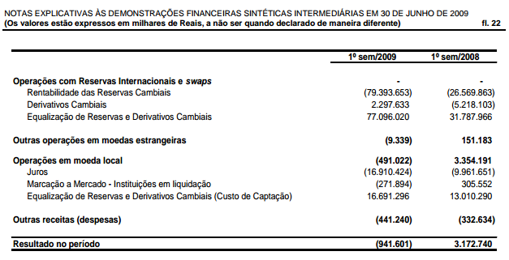
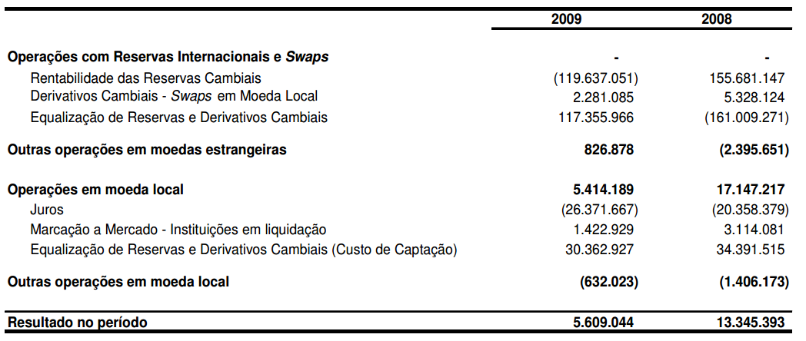

```{r setup, include=FALSE}
knitr::opts_chunk$set(echo = TRUE)
```

The objective of this table is to demonstrate how the data to generate the Table 4 (Detailed results of the BCB) was collected and how the variables were cleaned and summarized.

This table is an expanded version of the table released by the BCB in its fiscal policy notes between 2015 and 2019. Furthermore, we decided to present the data in semi-annual basis, corresponding to the frequency of transfers between the BCB and the Brazilian Treasury.

Steps:

1. Load excel files between 2015 and 2019 and summarize semi-annual data from 2014 to 2019.
2. Consolidate with data between 2008 and 2013

### 2014 - 2019

```{r}
library(reticulate)
library(tidyverse)
```


Load python libraries:
```{python}
import pandas as pd
import numpy as np
import glob
import os
```

Pandas display configuration:
```{python}
pd.set_option('display.max_columns', 10)
pd.set_option('display.max_rows', 50)
pd.set_option('display.width', 1000)
```


```{python}
files = sorted(glob.glob('context_files/swaps_sheets/*.xlsx'))
```

Head of the tables:
```{r}
knitr::include_graphics("context_files/swaps_sheets/snapshot_header3.png")
```


```{python}
cols1 = (['year', 'month', 'empty1',
             'notional', 'res_caixa', 'res_competencia',
             'profits', 'res_res', 'fx_ops',
             'operational', 'total_res'])

def clean_sw1(file, last = False):
    """Clean the excel sheet and store the relevant information"""

    if last is True:
        year = file[-18:-14]
        
    else:
        year = int(file[-18:-14]) - 1
        year = str(year)
        
    #print(year)
    
    df = pd.read_excel(file, header = None)
    
    start = df.index[df[0].str.contains('Período', na = False)]
    end = df.index[df[0].str.contains('leilões no mercado aberto', na = False)]

    df1 = df[start[0]:end[0]]
    df1 = df1.iloc[:, :11]
    df1.columns = cols1
    df1 = df1.assign(year = lambda x: x.year.ffill())
    
    transform = ['year', 'month']
    df1[transform] = df1[transform].astype('str')
    df1 = df1[df1.year == year]
    df1 = df1[df1.month != 'nan']
    df1 = df1.assign(sem = pd.np.where(df1.month.str.contains('Jan|Fev|Mar|Abr|Mai|Jun'), 1, 2))
    df1 = (df1[df1.month.isin(['Jan', 'Fev', 'Mar', 'Abr', 'Mai', 'Jun', 
                               'Jul', 'Ago', 'Set', 'Out', 'Nov', 'Dez'])])
    
    df1 = df1.drop(columns = ['empty1'])
    
    # Summarize flow columns by summing
    df2 = df1.drop(columns = ['year', 'month', 'notional'])
    df2 = df2.groupby('sem').sum()
    
    # Summarize stock column by taking the last value
    df3 = df1.loc[:, ['year', 'month', 'sem', 'notional']]
    df3 = df3.groupby('sem').last()
    
    df4 = df3.merge(df2, on = 'sem', how = 'left')
    df4 = df4.reset_index()
           
    return(df4)
```

Check that it works:
```{python}
clean_sw1(files[35]).round(2)
```

```{python}
bcb_det1419 = []

for file in files[31:]:
    t = clean_sw1(file)
    bcb_det1419.append(t)

bcb_det1419 = pd.concat(bcb_det1419)
bcb_det1419.tail()
```

Collect Jun for the last year using the last option in `clean_sw1` function:
```{python}
bcb_det1901 = clean_sw1(files[-1], last = True).loc[:0,:]
bcb_det1901
```

```{python}
bcb_det1419 = bcb_det1419.append(bcb_det1901)
bcb_det1419.tail()
```

```{python}
bcb_det1419.iloc[:, :6].round(2)
```


## Step 2

Complete the semi-annual table with values from 2008 to 2013.

1. Load results of the BCB table (FX equalization and operational results)
2. Load swaps tables (notional)
3. Load competence results
3. Load carrying costs
4. Summarize

#### 1. Results of the BCB table (FX equalization and operational results)

These data was loaded in the `figure1_bad_profits.Rmd` file and stored into the `fig6_equalization_operational_raw.tsv` file:

```{python}
bcb_eqop = pd.read_csv('figure1_bad_profits_files/fig6_equalization_operational_raw.tsv', sep = '\t')
```

Check how the values are exactly the same as the ones collected above for `fx_ops` and `operational` (although collected directly from the financial reports of the BCB instead of the fiscal policy tables).
```{python}
bcb_eqop1 = (bcb_eqop.assign(equalization = lambda x: x.equalization.div(1000))
                .assign(operational = lambda x: x.operational.div(1000))
                )
                
bcb_eqop1.tail()
```

#### 2. Load swaps tables (notional value)

These data was loaded in the `figure5_res_swaps.Rmd` file and stored as a column into the `context_files/res_swaps_raw.tsv` file:

```{python}
bcb_notional = pd.read_csv('context_files/res_swaps_raw.tsv', sep = '\t', usecols = ['date', 'notional'])
bcb_notional = bcb_notional.assign(date = lambda x: x.date.astype('datetime64[ns]'))
bcb_notional = bcb_notional.set_index('date')
bcb_notional = bcb_notional[bcb_notional.index.month.isin([4,10])].reset_index()
```

```{python}
bcb_notional.head()
```


#### 3. Load competence results (swaps)

To load the data on competence results of the BCB, we need to look at the notes on the financial reports. The information is disclosed in the section "Resultado no período", row "Derivativos cambiais".

```{r}

```

This table is more tricky to collect because it is not always in the same page nor position in the page. The good news is that every year also discloses the results from the previous periods, so only half of the years are needed. The following values present the name of the files, the page and the area in the page:


```{python}
paths_rescp = ['2009-01', '2011-01', '2013-01', '2009-02', '2011-02', '2013-02']
paths_rescp = ['balance_sheets_pdf/' + p + '.pdf' for p in paths_rescp]

pages_rescp = ['23', '20', '31', '40', '38', '43']

areas_rescp = (['85, 750, 550, 650',
                '85, 280, 550, 50',
                '85, 780, 550, 650',
                '85, 390, 550, 170',
                '85, 370, 550, 140',
                '85, 690, 550, 450'])
```

```{python}
import camelot
def get_cam(path, page, area = '85, 750, 550, 650'):
    """ Read pdf table """
    t1 = camelot.read_pdf(path, pages = page, flavor = 'stream', table_areas = [area])
    t1 = t1[0].df
    return(t1)
```


Test:
```{python}
get_cam('balance_sheets_pdf/2009-01.pdf', '23', area = '85, 750, 550, 650')
```

```{python}
tables_rescp = []

for file, page, area in zip(paths_rescp, pages_rescp, areas_rescp):
    t = get_cam(file, page, area)
    tables_rescp.append(t)
```

```{python}
tables_rescp[0]
```


```{python}
def get_competence(df, first = True):
    """ Clean competence table """
    
    d1 = df.iloc[0,2][-4:]
    d2 = df.iloc[0,1][-4:]
    
    cols = ['var', d2, d1]
    
    t1 = df
    
    t1.columns = cols
    
    t1 = t1.loc[3:3, :].melt(id_vars = 'var', var_name = 'date', value_name = 'value')
    
    t1 = (t1.assign(value = t1.value.str.replace('(', '-')
                         .str.replace(')', '')
                         .str.replace('.', '')
                         .str.replace(',', '.')
                         .apply(pd.to_numeric, errors='coerce')
                         .fillna(0))
            .assign(date = lambda x: x.date.astype('int64'))
            )
    
    if first is True:
        t1 = t1.assign(sem = 1)
    else:
        t1 = t1.assign(sem = 2)
             
    return(t1)
```

```{python}
competence_1sem = []
for table in tables_rescp[0:3]:
    t = get_competence(table)
    competence_1sem.append(t)
    
competence_1sem = pd.concat(competence_1sem).sort_values('date')
```

```{python}
competence_1sem = competence_1sem.drop(columns = ['var'])
competence_1sem
```

The values for the second semester are consolidated for the whole year. Therefore, they must be joined to the values from the first semester and then subtracted:

```{r}

```

```{python}
competence_2sem = []
for table in tables_rescp[3:]:
    t = get_competence(table, first = False)
    competence_2sem.append(t)
    
competence_2sem = pd.concat(competence_2sem).sort_values('date')
```

```{python}
competence_2sem = (competence_2sem.merge(competence_1sem, on = 'date', how = 'left')
                   .assign(value = lambda x: x.value_x - x.value_y)
                   .loc[:,['date', 'value', 'sem_x']]
                   .rename(columns = {'sem_x':'sem'})
                   )

```

```{python}
competence_semiannual = (competence_2sem.append(competence_1sem)
                        .sort_values(by = ['date', 'sem'])
                        .reset_index(drop = True)
                        .assign(value = lambda x: x.value.div(1000))
                        )
```

```{python}
competence_semiannual.tail()
```

#### 4. Carrying costs

This is probably the most boring part of the work. We actually need the tables from every semester starting from 2008 to 2019 and they are in different parts of the pdf file.

Load the table with the positions:
```{python}
position_carrying = pd.read_csv('table4_detailed_files/position_carrying_costs.md', sep = '|')
position_carrying = position_carrying.rename(columns=lambda x: x.strip())

```

Clean it:
```{python}
position_carrying1 = position_carrying.loc[1:23, ['name', 'page', 'area', 'cols']]

pos_cr1 = (position_carrying1.assign(name = lambda x: x.name.str.replace(' ', ''))
                   .assign(page = lambda x: x.page.str.replace(' ', ''))
                   .assign(area = lambda x: x.area.str.replace(' ', ''))
                   .assign(cols = lambda x: x.cols.str.replace(' ', ''))
                   )
new_pos_cr1 = pos_cr1.area.str.split(',', n = 1, expand = True)
pos_cr1 = pos_cr1.merge(new_pos_cr1, how = 'left', left_index = True, right_index=True)
pos_cr1.columns = ['name', 'page', 'area', 'cols', 'a1', 'a2']
pos_cr1.head()
```

Further additions to the positions table:
```{python}
pos_cr1['name'] = ['balance_sheets_pdf/' + p + '.pdf' for p in pos_cr1.name]
pos_cr1['area'] = ['90,' + a1 + ',520,' + a2 for a1, a2 in zip(pos_cr1.a1, pos_cr1.a2)]
```

```{python}
pos_cr2 = pos_cr1.assign(area = lambda x: x.area.str.replace("'", '')).assign(cols = lambda x: x.cols.str.replace("'", ""))
pos_cr2.head()
```

Function to load the pdf tables:
```{python}
def extract_table(path, page, area, cols):
    cols_cost = ['date', 'reserves', 'profit_rate', 'cost_rate', 'net_rate', 'net_profits']
    
    t = camelot.read_pdf(path, page, flavor = 'stream', table_areas = [area], columns = [cols])
    
    year = path[-11:-7]
    semester = path[-5:-4]
    
    if semester == '1':
        quarter = ['1', '2']
    else:
        quarter = ['3', '4']
    
    t1 = t[0].df
    t1.columns = cols_cost
    t1 = t1.drop([0,3])
    t1['year'] = year
    t1['sem'] = semester
    t1['quarter'] = quarter
    
    return(t1)
```

Load the tables:
```{python}
t_table = []
for path, page, area, cols in zip(pos_cr2.iloc[:,0], pos_cr2.iloc[:,1], pos_cr2.iloc[:,2], pos_cr2.iloc[:,3]):
    t = extract_table(path, page, area, cols)
    t_table.append(t)
t_tb1 = pd.concat(t_table)
```

View the table:
```{python}
t_tb1 = t_tb1.reset_index(drop = True)
```

```{python}
t_tb1.head()
```


Now we must clean the table. Note that there is an inconsistency in the `cost_rate` values of the second semester of 2008 and 2009. They are negative (as can be inferred by the difference between the profit rate and the net rate) but it is not explicit. That's why one should **always** look at the data before cleaning.

```{python}
t_tb1['cost_rate'] = pd.np.where(t_tb1.cost_rate.str.contains('%'), '-' + t_tb1.cost_rate, t_tb1.cost_rate)
```

Clean the rest of the columns:
```{python}
cols_to_mutate = ['reserves', 'profit_rate', 'cost_rate', 'net_rate', 'net_profits']

for col in cols_to_mutate:
    t_tb1[col] = (t_tb1[col].str.replace('(', '-')
                 .str.replace(')', '')
                 .str.replace('.', '')
                 .str.replace(',','.')
                 .str.replace('%', '')
                 .apply(pd.to_numeric, errors = 'coerce')
                 )

```

```{python}
t_tb1.head()
```

With these date it is possible to calculate:

1. Carrying costs: ($CC = Res \cdot (CostRate/100)$)
2. Gross profits: ($GP = Res \cdot (ProfitRate/100)$)

It is important to note that it is possible to calculate these values because the interest and profit rates are expressed in quarterly basis. Therefore, we can also calculate these rates in annualized terms with the following formula:
$$
AnnualRate = 100 \cdot ([(1+\frac{QuarterlyRate}{100})^4]-1)
$$

Applying these calculations:
```{python}
t_tb2 = (t_tb1.assign(carrying = t_tb1.reserves * (t_tb1.cost_rate/100))
        .assign(gross_profits = t_tb1.reserves * (t_tb1.profit_rate/100))
        .assign(cost_rate_sem = 100 * (((1 + (t_tb1.cost_rate/100)) ** 2) -1))
        .assign(cost_rate_annual = 100 *(((1 + (t_tb1.cost_rate/100)) ** 4) - 1))
        )
        
```

```{python}
t_tb2.head()
```

Summarize the data by semester:
```{python}
t_tb3 = (t_tb2.groupby(['year', 'sem'])
        .agg({'net_profits':'sum', 'reserves':'mean', 'cost_rate':'mean', 'carrying':'sum', 
        'cost_rate_annual':'mean', 'gross_profits':'sum', 'profit_rate':'mean', 'cost_rate_sem':'mean'})
        .assign(carr_check = lambda x: x.reserves * x.cost_rate_sem/100)
        .reset_index())
```

Check. The difference is due to rounding and averaging the quarters.
```{python}
t_tb3.loc[:6, ['carrying', 'carr_check']]
```

Print the final carrying costs table:
```{python}
final_carrying = (t_tb3.loc[:,['year', 'sem', 'reserves', 'gross_profits', 
          'carrying', 'net_profits', 'cost_rate_annual']]
          )
cols = ['year', 'sem']

final_carrying['carrying'] = final_carrying['carrying'].divide(-1)

for col in cols:
    final_carrying[col] = final_carrying[col].astype('int64')

cols = ['reserves', 'gross_profits', 'net_profits', 'carrying']

for col in cols:
    final_carrying[col] = final_carrying[col].divide(1000)
    
```

```{python}
final_carrying.round(3)
```

## Summarize

The final table has the following items:

period, notional value, competence results, average reserves, gross profits (reserves), carrying costs, net results, realized fx results, equalization account, operational results, total BCB result, cost rate (p.y.), variation of the exchange rate.

```{python}
bcb_notional2 = (bcb_notional.assign(year = lambda x: pd.DatetimeIndex(x.date).year)
             .assign(sem = lambda x: pd.DatetimeIndex(x.date).month)
             )
bcb_notional2['sem'] = pd.np.where(bcb_notional2['sem'] == 4, 1, 2)

bcb_not3 = bcb_notional2.loc[8:19,['year', 'sem', 'notional']].reset_index(drop = True)
bcb_not3
```
```{python}
competence_semiannual2 = competence_semiannual.rename(columns = {'date':'year', 'value':'competence'})
```

```{python}
bcb_fd2 = bcb_not3.merge(competence_semiannual2, on = ['year', 'sem'], how = 'left')
bcb_fd2.head()
```

```{python}
bcb_fd3 = bcb_fd2.merge(final_carrying, on = ['year', 'sem'], how = 'inner').drop(columns = ['reserves', 'cost_rate_annual', 'carrying'])
bcb_fd3.head()

```


```{python}
bcb_eqop1.date = pd.to_datetime(bcb_eqop1.date)
bcb_eqop1['year'] = pd.DatetimeIndex(bcb_eqop1['date']).year
bcb_eqop1['sem'] = pd.DatetimeIndex(bcb_eqop1['date']).month
bcb_eqop1['sem'] = pd.np.where(bcb_eqop1['sem'] == 6, 1, 2)
```

```{python}
bcb_fd4 = bcb_fd3.merge(bcb_eqop1[['year', 'sem', 'equalization', 'operational']], on = ['year', 'sem'], how = 'inner')
bcb_fd4 = bcb_fd4.assign(total_res = lambda x: x.equalization + x.operational)
bcb_fd4.head()
```


```{python}
bcb_fd5 = bcb_det1419[['year', 'sem', 'notional', 'res_competencia', 'profits', 'res_res', 'fx_ops', 'operational', 'total_res']]
bcb_fd5 = bcb_fd5.rename(columns = {'res_competencia':'competence', 'profits':'gross_profits', 'res_res':'net_profits', 'fx_ops':'equalization'})
bcb_fd5.head()
```

```{python}
bcb_fd6 = pd.concat([bcb_fd4, bcb_fd5]).reset_index(drop=True)
cols = ['year', 'sem']
for col in cols:
    bcb_fd6[col] = bcb_fd6[col].astype('int64')
    
bcb_fd6.head()
```

```{python}
bcb_fd7 = final_carrying[['year', 'sem', 'reserves', 'cost_rate_annual', 'carrying']]
```


```{python}
bcb_fd8 = bcb_fd7.merge(bcb_fd6, on = ['year', 'sem'], how = 'inner').round(3)
bcb_fd8 = bcb_fd8.assign(realized = lambda x: x.competence - x.carrying)
bcb_fd8.head()
```

To finalize this notebook, we need two more items: the variation of the BRL/USD exchange rate and the Brazilian GDP to normalize the items.

```{python}
import sgs
br_exchange_rate = sgs.time_serie(1, start = '01/01/2008', end = '01/07/2019')
```

```{python}
br_exchange_rate.head()
```


```{python}
br_exr = pd.DataFrame(br_exchange_rate).resample('M').last()

br_exr = (br_exr.assign(month = lambda x: x.index.month)
         .query('month == 6 | month == 12')
         )
br_exr.columns = ['er', 'month']
br_exr = (br_exr.assign(d_er = lambda x: x.er.pct_change() * 100)
         .dropna()
         .assign(year = lambda x: x.index.year)
         .assign(sem = lambda x: np.where(x.month == 6, 1, 2))
         .reset_index(drop = True)
         )

br_exr = br_exr[['year', 'sem', 'd_er']]
br_exr.head()
```

```{python}
gdp_raw = sgs.time_serie(4382, start = '01/01/2008', end = '01/07/2019')
```


```{python}
gdp = pd.DataFrame(gdp_raw)
gdp = (gdp
      .assign(month = lambda x: x.index.month)
      .query('month == 6 | month == 12')
      .assign(year = lambda x: x.index.year)
      .assign(sem = lambda x: np.where(x.month == 6, 1, 2))
      )
      
gdp.columns = ['gdp', 'month', 'year', 'sem']
gdp = gdp.reset_index(drop = True).drop(columns = 'month')
gdp.head()
```

Save a backup copy
```{python}
final_detailed = bcb_fd8.merge(br_exr, on = ['year', 'sem'], how = 'inner')
final_detailed

#final_detailed.to_csv('table4_detailed_raw.csv')
```

## Final table

```{python}
fn_py = final_detailed.merge(gdp, on = ['year', 'sem'], how = 'inner')

cols = (['reserves', 'notional', 'competence', 'gross_profits', 'carrying', 
        'net_profits', 'equalization', 'operational', 'total_res', 'realized'])

for col in cols:
    fn_py[col] = fn_py[col].div(fn_py['gdp']).mul(100)
    
final_det_prop = fn_py[['year', 'sem', 'notional', 'competence', 'reserves', 'gross_profits', 'carrying',
      'net_profits', 'realized', 'equalization', 'operational', 'total_res',
      'cost_rate_annual', 'd_er']].round(1)

```


```{r, warning=F}
final_table <- py$final_det_prop %>%
    unite(period, year:sem, sep = '-0')

#write_tsv(final_table, 'bcb_detailed_prop_raw.tsv')

library(kableExtra)
kable(final_table, format = 'markdown') %>%
 kable_styling(bootstrap_options = c("striped", "hover"),
               full_width = F)
```


