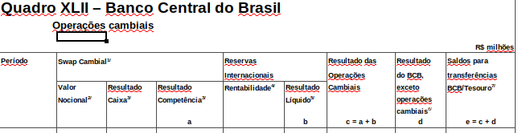

Detailed results of the BCB (Table 4)
================
João Pedro S. Macalós
2/13/2020

The objective of this table is to demonstrate how the data to generate
the Table 4 (Detailed results of the BCB) was collected and how the
variables were cleaned and summarized.

This table is an expanded version of the table released by the BCB in
its fiscal policy notes between 2015 and 2019. Furthermore, we decided
to present the data in semi-annual basis, corresponding to the frequency
of transfers between the BCB and the Brazilian Treasury.

Steps:

1.  Load excel files between 2015 and 2019 and summarize semi-annual
    data from 2014 to 2019.
2.  …

### 2014 - 2019

``` r
library(reticulate)
library(tidyverse)
```

    ## ── Attaching packages ─────────────────────────────────────── tidyverse 1.3.0 ──

    ## ✓ ggplot2 3.2.1     ✓ purrr   0.3.3
    ## ✓ tibble  2.1.3     ✓ dplyr   0.8.3
    ## ✓ tidyr   1.0.0     ✓ stringr 1.4.0
    ## ✓ readr   1.3.1     ✓ forcats 0.4.0

    ## ── Conflicts ────────────────────────────────────────── tidyverse_conflicts() ──
    ## x dplyr::filter() masks stats::filter()
    ## x dplyr::lag()    masks stats::lag()

Load python libraries:

``` python
import pandas as pd
import numpy as np
import glob
import os
```

Pandas display configuration:

``` python
pd.set_option('display.max_columns', 10)
pd.set_option('display.max_rows', 50)
pd.set_option('display.width', 1000)
```

``` python
files = sorted(glob.glob('context_files/swaps_sheets/*.xlsx'))
```

Head of the
tables:

``` r

```

<!-- -->

``` python
cols1 = (['year', 'month', 'empty1',
             'notional', 'res_caixa', 'res_competencia',
             'profits', 'res_res', 'fx_ops',
             'operational', 'total_res'])

def clean_sw1(file, last = False):
    """Clean the excel sheet and store the relevant information"""

    if last is True:
        year = file[-18:-14]
        
    else:
        year = int(file[-18:-14]) - 1
        year = str(year)
        
    #print(year)
    
    df = pd.read_excel(file, header = None)
    
    start = df.index[df[0].str.contains('Período', na = False)]
    end = df.index[df[0].str.contains('leilões no mercado aberto', na = False)]

    df1 = df[start[0]:end[0]]
    df1 = df1.iloc[:, :11]
    df1.columns = cols1
    df1 = df1.assign(year = lambda x: x.year.ffill())
    
    transform = ['year', 'month']
    df1[transform] = df1[transform].astype('str')
    df1 = df1[df1.year == year]
    df1 = df1[df1.month != 'nan']
    df1 = df1.assign(sem = pd.np.where(df1.month.str.contains('Jan|Fev|Mar|Abr|Mai|Jun'), 1, 2))
    df1 = (df1[df1.month.isin(['Jan', 'Fev', 'Mar', 'Abr', 'Mai', 'Jun', 
                               'Jul', 'Ago', 'Set', 'Out', 'Nov', 'Dez'])])
    
    df1 = df1.drop(columns = ['empty1'])
    
    # Summarize flow columns by summing
    df2 = df1.drop(columns = ['year', 'month', 'notional'])
    df2 = df2.groupby('sem').sum()
    
    # Summarize stock column by taking the last value
    df3 = df1.loc[:, ['year', 'month', 'sem', 'notional']]
    df3 = df3.groupby('sem').last()
    
    df4 = df3.merge(df2, on = 'sem', how = 'left')
    df4 = df4.reset_index()
           
    return(df4)
```

Check that it
    works:

``` python
clean_sw1(files[35]).round(2)
```

    ##    sem  year month   notional  res_caixa  ...    profits    res_res     fx_ops  operational  total_res
    ## 0    1  2018   Jun -258295.35  -16428.35  ...  209838.62  163866.53  146201.38     19655.29  165856.67
    ## 1    2  2018   Dez -259921.02    1303.33  ...   24259.66  -22538.62  -19133.81     25554.33    6420.52
    ## 
    ## [2 rows x 11 columns]

``` python
bcb_det1419 = []

for file in files[31:]:
    t = clean_sw1(file)
    bcb_det1419.append(t)

bcb_det1419 = pd.concat(bcb_det1419)
bcb_det1419.tail()
```

    ##    sem  year month       notional     res_caixa  ...        profits        res_res         fx_ops   operational      total_res
    ## 1    2  2016   Dez  -85504.413676   5899.361688  ...   -1259.934941  -60771.201803  -55673.842630   7780.387165  -47893.455465
    ## 0    1  2017   Jun  -91700.339277   4259.131332  ...   37120.917326  -19081.654920  -15744.789008  11271.661733   -4473.131196
    ## 1    2  2017   Dez  -78332.894504   2773.403608  ...   10743.015937  -33623.237616  -30677.360404  14709.837715  -15967.522689
    ## 0    1  2018   Jun -258295.349809 -16428.347811  ...  209838.616893  163866.530332  146201.379445  19655.291730  165856.671175
    ## 1    2  2018   Dez -259921.017506   1303.332870  ...   24259.658136  -22538.623823  -19133.805915  25554.329747    6420.523832
    ## 
    ## [5 rows x 11 columns]

Collect Jun for the last year using the last option in `clean_sw1`
function:

``` python
bcb_det1901 = clean_sw1(files[-1], last = True).loc[:0,:]
bcb_det1901
```

    ##    sem  year month       notional    res_caixa  ...       profits       res_res       fx_ops   operational     total_res
    ## 0    1  2019   Jun -259309.962101  5967.363796  ...  29767.400934 -12434.700062 -7560.801694  21072.848303  13512.046609
    ## 
    ## [1 rows x 11 columns]

``` python
bcb_det1419 = bcb_det1419.append(bcb_det1901)
bcb_det1419.tail()
```

    ##    sem  year month       notional     res_caixa  ...        profits        res_res         fx_ops   operational      total_res
    ## 0    1  2017   Jun  -91700.339277   4259.131332  ...   37120.917326  -19081.654920  -15744.789008  11271.661733   -4473.131196
    ## 1    2  2017   Dez  -78332.894504   2773.403608  ...   10743.015937  -33623.237616  -30677.360404  14709.837715  -15967.522689
    ## 0    1  2018   Jun -258295.349809 -16428.347811  ...  209838.616893  163866.530332  146201.379445  19655.291730  165856.671175
    ## 1    2  2018   Dez -259921.017506   1303.332870  ...   24259.658136  -22538.623823  -19133.805915  25554.329747    6420.523832
    ## 0    1  2019   Jun -259309.962101   5967.363796  ...   29767.400934  -12434.700062   -7560.801694  21072.848303   13512.046609
    ## 
    ## [5 rows x 11 columns]

Create column for the carrying costs: `res_res` -
`profits`:

``` python
bcb_det1419 = bcb_det1419.assign(carrying = lambda x: x.profits - x.res_res)
```

``` python
bcb_det1419.iloc[:, :6].round(2)
```

    ##    sem  year month   notional  res_caixa  res_competencia
    ## 0    1  2014   Jun -198483.01   20174.49         20274.59
    ## 1    2  2014   Dez -284959.09  -37503.24        -30955.17
    ## 0    1  2015   Jun -336938.05  -33134.69        -37026.04
    ## 1    2  2015   Dez -426770.00  -56522.46        -65602.31
    ## 0    1  2016   Jun -195223.69   69663.01         78706.31
    ## 1    2  2016   Dez  -85504.41    5899.36          5097.36
    ## 0    1  2017   Jun  -91700.34    4259.13          3336.87
    ## 1    2  2017   Dez  -78332.89    2773.40          2945.88
    ## 0    1  2018   Jun -258295.35  -16428.35        -17665.15
    ## 1    2  2018   Dez -259921.02    1303.33          3404.82
    ## 0    1  2019   Jun -259309.96    5967.36          4873.90

## Step 2

Complete the semi-annual table with values from 2008 to 2013.

1.  Load results of the BCB table (FX equalization and operational
    results)
2.  Load swaps tables (notional)
3.  Load competence results
4.  Load carrying
costs
5.  Summarize

#### 1\. Results of the BCB table (FX equalization and operational results)

These data was loaded in the `figure1_bad_profits.Rmd` file and stored
into the `fig6_equalization_operational_raw.tsv`
file:

``` python
bcb_eqop = pd.read_csv('figure1_bad_profits_files/fig6_equalization_operational_raw.tsv', sep = '\t')
```

Check how the values are exactly the same as the ones collected above
for `fx_ops` and `operational` (although collected directly from the
financial reports of the BCB instead of the fiscal policy
tables).

``` python
bcb_eqop1 = (bcb_eqop.assign(equalization = lambda x: x.equalization.div(1000))
                .assign(operational = lambda x: x.operational.div(1000))
                )
                
bcb_eqop1.tail()
```

    ##           date  equalization  operational        gdp
    ## 17  2016-12-01    -55674.283     7780.387  6269328.0
    ## 18  2017-06-01    -15744.789    11271.662  6434425.0
    ## 19  2017-12-01    -30677.374    14709.838  6583319.0
    ## 20  2018-06-01    146201.403    19655.292  6722989.3
    ## 21  2018-12-01    -19133.818    25554.330  6889176.1

#### 2\. Load swaps tables (notional value)

These data was loaded in the `figure5_res_swaps.Rmd` file and stored as
a column into the `context_files/res_swaps_raw.tsv`
file:

``` python
bcb_notional = pd.read_csv('context_files/res_swaps_raw.tsv', sep = '\t', usecols = ['date', 'notional'])
bcb_notional = bcb_notional.assign(date = lambda x: x.date.astype('datetime64[ns]'))
bcb_notional = bcb_notional.set_index('date')
bcb_notional = bcb_notional[bcb_notional.index.month.isin([4,10])].reset_index()
```

``` python
bcb_notional.head()
```

    ##         date      notional
    ## 0 2004-04-01 -16656.198622
    ## 1 2004-10-01 -14445.168965
    ## 2 2005-04-01  -2353.041556
    ## 3 2005-10-01   6342.249068
    ## 4 2006-04-01  17404.776066

#### 3\. Load competence results (swaps)

To load the data on competence results of the BCB, we need to look at
the notes on the financial reports. The information is disclosed in the
section “Resultado no período”, row “Derivativos cambiais”.

``` r
knitr::include_graphics("snapshot_competence.png")
```

<!-- -->

This table is more tricky to collect because it is not always in the
same page nor position in the page. The good news is that every year
also discloses the results from the previous periods, so only half of
the years are needed. The following values present the name of the
files, the page and the area in the
page:

``` python
paths_rescp = ['2009-01', '2011-01', '2013-01', '2009-02', '2011-02', '2013-02']
paths_rescp = ['balance_sheets_pdf/' + p + '.pdf' for p in paths_rescp]

pages_rescp = ['23', '20', '31', '40', '38', '43']

areas_rescp = (['85, 750, 550, 650',
                '85, 280, 550, 50',
                '85, 780, 550, 650',
                '85, 390, 550, 170',
                '85, 370, 550, 140',
                '85, 690, 550, 450'])
```

``` python
import camelot
def get_cam(path, page, area = '85, 750, 550, 650'):
    """ Read pdf table """
    t1 = camelot.read_pdf(path, pages = page, flavor = 'stream', table_areas = [area])
    t1 = t1[0].df
    return(t1)
```

Test:

``` python
get_cam('balance_sheets_pdf/2009-01.pdf', '23', area = '85, 750, 550, 650')
```

    ##                                                 0             1             2
    ## 0                                                   1º sem/2009   1º sem/2008
    ## 1   Operações com Reservas Internacionais e swaps             -             -
    ## 2             Rentabilidade das Reservas Cambiais  (79.393.653)  (26.569.863)
    ## 3                            Derivativos Cambiais     2.297.633   (5.218.103)
    ## 4  Equalização de Reservas e Derivativos Cambiais    77.096.020    31.787.966
    ## 5         Outras operações em moedas estrangeiras       (9.339)       151.183

``` python
tables_rescp = []

for file, page, area in zip(paths_rescp, pages_rescp, areas_rescp):
    t = get_cam(file, page, area)
    tables_rescp.append(t)
```

``` python
tables_rescp[0]
```

    ##                                                 0             1             2
    ## 0                                                   1º sem/2009   1º sem/2008
    ## 1   Operações com Reservas Internacionais e swaps             -             -
    ## 2             Rentabilidade das Reservas Cambiais  (79.393.653)  (26.569.863)
    ## 3                            Derivativos Cambiais     2.297.633   (5.218.103)
    ## 4  Equalização de Reservas e Derivativos Cambiais    77.096.020    31.787.966
    ## 5         Outras operações em moedas estrangeiras       (9.339)       151.183

``` python
def get_competence(df, first = True):
    """ Clean competence table """
    
    d1 = df.iloc[0,2][-4:]
    d2 = df.iloc[0,1][-4:]
    
    cols = ['var', d2, d1]
    
    t1 = df
    
    t1.columns = cols
    
    t1 = t1.loc[3:3, :].melt(id_vars = 'var', var_name = 'date', value_name = 'value')
    
    t1 = (t1.assign(value = t1.value.str.replace('(', '-')
                         .str.replace(')', '')
                         .str.replace('.', '')
                         .str.replace(',', '.')
                         .apply(pd.to_numeric, errors='coerce')
                         .fillna(0))
            .assign(date = lambda x: x.date.astype('int64'))
            )
    
    if first is True:
        t1 = t1.assign(sem = 1)
    else:
        t1 = t1.assign(sem = 2)
             
    return(t1)
```

``` python
competence_1sem = []
for table in tables_rescp[0:3]:
    t = get_competence(table)
    competence_1sem.append(t)
    
competence_1sem = pd.concat(competence_1sem).sort_values('date')
```

``` python
competence_1sem = competence_1sem.drop(columns = ['var'])
competence_1sem
```

    ##    date      value  sem
    ## 1  2008 -5218103.0    1
    ## 0  2009  2297633.0    1
    ## 1  2010        0.0    1
    ## 0  2011 -1732793.0    1
    ## 1  2012   809627.0    1
    ## 0  2013  -524651.0    1

The values for the second semester are consolidated for the whole year.
Therefore, they must be joined to the values from the first semester and
then subtracted:

``` r
knitr::include_graphics("snapshot_competence2.png")
```

<!-- -->

``` python
competence_2sem = []
for table in tables_rescp[3:]:
    t = get_competence(table, first = False)
    competence_2sem.append(t)
    
competence_2sem = pd.concat(competence_2sem).sort_values('date')
```

``` python
competence_2sem = (competence_2sem.merge(competence_1sem, on = 'date', how = 'left')
                   .assign(value = lambda x: x.value_x - x.value_y)
                   .loc[:,['date', 'value', 'sem_x']]
                   .rename(columns = {'sem_x':'sem'})
                   )
```

``` python
competence_semiannual = (competence_2sem.append(competence_1sem)
                        .sort_values(by = ['date', 'sem'])
                        .reset_index(drop = True)
                        .assign(value = lambda x: x.value.div(1000))
                        )
```

``` python
competence_semiannual.tail()
```

    ##     date     value  sem
    ## 7   2011  2427.140    2
    ## 8   2012   809.627    1
    ## 9   2012   314.789    2
    ## 10  2013  -524.651    1
    ## 11  2013 -1857.541    2

#### 4\. Carrying costs

This is probably the most boring part of the work. We actually need the
tables from every semester starting from 2008 to 2019 and they are in
different parts of the pdf file.

Load the table with the
positions:

``` python
position_carrying = pd.read_table('position_carrying_costs.md', sep = '|')
position_carrying = position_carrying.rename(columns=lambda x: x.strip())
```

Clean
it:

``` python
position_carrying1 = position_carrying.loc[1:23, ['name', 'page', 'area', 'cols']]

pos_cr1 = (position_carrying1.assign(name = lambda x: x.name.str.replace(' ', ''))
                   .assign(page = lambda x: x.page.str.replace(' ', ''))
                   .assign(area = lambda x: x.area.str.replace(' ', ''))
                   .assign(cols = lambda x: x.cols.str.replace(' ', ''))
                   )
new_pos_cr1 = pos_cr1.area.str.split(',', n = 1, expand = True)
pos_cr1 = pos_cr1.merge(new_pos_cr1, how = 'left', left_index = True, right_index=True)
pos_cr1.columns = ['name', 'page', 'area', 'cols', 'a1', 'a2']
pos_cr1.head()
```

    ##       name page         area                   cols     a1     a2
    ## 1  2008-01   21  '560','465'  '185,245,308,350,385'  '560'  '465'
    ## 2  2008-02   51  '490','390'  '160,250,335,375,440'  '490'  '390'
    ## 3  2009-01   26  '230','150'  '160,250,335,375,440'  '230'  '150'
    ## 4  2009-02   56  '550','450'  '160,250,335,375,440'  '550'  '450'
    ## 5  2010-01   26  '455','380'  '160,250,325,385,440'  '455'  '380'

Further additions to the positions
table:

``` python
pos_cr1['name'] = ['balance_sheets_pdf/' + p + '.pdf' for p in pos_cr1.name]
pos_cr1['area'] = ['90,' + a1 + ',520,' + a2 for a1, a2 in zip(pos_cr1.a1, pos_cr1.a2)]
```

``` python
pos_cr2 = pos_cr1.assign(area = lambda x: x.area.str.replace("'", '')).assign(cols = lambda x: x.cols.str.replace("'", ""))
pos_cr2.head()
```

    ##                              name page            area                 cols     a1     a2
    ## 1  balance_sheets_pdf/2008-01.pdf   21  90,560,520,465  185,245,308,350,385  '560'  '465'
    ## 2  balance_sheets_pdf/2008-02.pdf   51  90,490,520,390  160,250,335,375,440  '490'  '390'
    ## 3  balance_sheets_pdf/2009-01.pdf   26  90,230,520,150  160,250,335,375,440  '230'  '150'
    ## 4  balance_sheets_pdf/2009-02.pdf   56  90,550,520,450  160,250,335,375,440  '550'  '450'
    ## 5  balance_sheets_pdf/2010-01.pdf   26  90,455,520,380  160,250,325,385,440  '455'  '380'

Function to load the pdf tables:

``` python
def extract_table(path, page, area, cols):
    cols_cost = ['date', 'reserves', 'profit_rate', 'cost_rate', 'net_rate', 'net_profits']
    
    t = camelot.read_pdf(path, page, flavor = 'stream', table_areas = [area], columns = [cols])
    
    year = path[-11:-7]
    semester = path[-5:-4]
    
    if semester == '1':
        quarter = ['1', '2']
    else:
        quarter = ['3', '4']
    
    t1 = t[0].df
    t1.columns = cols_cost
    t1 = t1.drop([0,3])
    t1['year'] = year
    t1['sem'] = semester
    t1['quarter'] = quarter
    
    return(t1)
```

Load the tables:

``` python
t_table = []
for path, page, area, cols in zip(pos_cr2.iloc[:,0], pos_cr2.iloc[:,1], pos_cr2.iloc[:,2], pos_cr2.iloc[:,3]):
    t = extract_table(path, page, area, cols)
    t_table.append(t)
t_tb1 = pd.concat(t_table)
```

View the
    table:

``` python
t_tb1 = t_tb1.reset_index(drop = True)
```

``` python
t_tb1.head()
```

    ##                 date     reserves profit_rate cost_rate net_rate   net_profits  year sem quarter
    ## 0       1º Trimestre  328.770.077        3,34    (2,03)     1,31     4.296.504  2008   1       1
    ## 1       2º Trimestre  326.530.733     (11,50)    (1,94)  (13,44)  (43.876.657)  2008   1       2
    ## 2  3º Trimestre/2008  341.475.852      20,86%     3,13%   17,73%    60.549.968  2008   2       3
    ## 3  4º Trimestre/2008  454.076.744      24,44%     2,35%   22,09%   100.319.817  2008   2       4
    ## 4  1º Trimestre/2009  458.669.464      (1,29)    (2,18)   (3,47)  (15.913.077)  2009   1       1

Now we must clean the table. Note that there is an inconsistency in the
`cost_rate` values of the second semester of 2008 and 2009. They are
negative (as can be inferred by the difference between the profit rate
and the net rate) but it is not explicit. That’s why one should
**always** look at the data before
cleaning.

``` python
t_tb1['cost_rate'] = pd.np.where(t_tb1.cost_rate.str.contains('%'), '-' + t_tb1.cost_rate, t_tb1.cost_rate)
```

Clean the rest of the
columns:

``` python
cols_to_mutate = ['reserves', 'profit_rate', 'cost_rate', 'net_rate', 'net_profits']

for col in cols_to_mutate:
    t_tb1[col] = (t_tb1[col].str.replace('(', '-')
                 .str.replace(')', '')
                 .str.replace('.', '')
                 .str.replace(',','.')
                 .str.replace('%', '')
                 .apply(pd.to_numeric, errors = 'coerce')
                 )
```

``` python
t_tb1.head()
```

    ##                 date   reserves  profit_rate  cost_rate  net_rate  net_profits  year sem quarter
    ## 0       1º Trimestre  328770077         3.34      -2.03      1.31      4296504  2008   1       1
    ## 1       2º Trimestre  326530733       -11.50      -1.94    -13.44    -43876657  2008   1       2
    ## 2  3º Trimestre/2008  341475852        20.86      -3.13     17.73     60549968  2008   2       3
    ## 3  4º Trimestre/2008  454076744        24.44      -2.35     22.09    100319817  2008   2       4
    ## 4  1º Trimestre/2009  458669464        -1.29      -2.18     -3.47    -15913077  2009   1       1

With these date it is possible to calculate: 1. Carrying costs:
(\(CC = Res \cdot (CostRate/100)\)) 2. Gross profits:
(\(GP = Res \cdot (ProfitRate/100)\))

It is important to note that it is possible to calculate these values
because the interest and profit rates are expressed in quarterly basis.
Therefore, we can also calculate these rates in annualized terms with
the following formula: \[
AnnualRate = 100 \cdot ([(1+\frac{QuarterlyRate}{100})^4]-1)
\]

Applying these calculations:

``` python
t_tb2 = (t_tb1.assign(carrying = t_tb1.reserves * (t_tb1.cost_rate/100))
        .assign(gross_profits = t_tb1.reserves * (t_tb1.profit_rate/100))
        #.assign(date = np.array([date, date])).
        .assign(cost_rate_sem = 100 * (((1 + (t_tb1.cost_rate/100)) ** 2) -1))
        .assign(cost_rate_annual = 100 *(((1 + (t_tb1.cost_rate/100)) ** 4) - 1))
        #.assign(cost_rate_annual = lambda x: 100 * (((1 + (x.cost_rate_sem/100)) ** 2) -1))
        )
        
```

``` python
t_tb2.head()
```

    ##                 date   reserves  profit_rate  cost_rate  net_rate  ...  quarter      carrying gross_profits cost_rate_sem  cost_rate_annual
    ## 0       1º Trimestre  328770077         3.34      -2.03      1.31  ...        1 -6.674033e+06  1.098092e+07     -4.018791         -7.876075
    ## 1       2º Trimestre  326530733       -11.50      -1.94    -13.44  ...        2 -6.334696e+06 -3.755103e+07     -3.842364         -7.537090
    ## 2  3º Trimestre/2008  341475852        20.86      -3.13     17.73  ...        3 -1.068819e+07  7.123186e+07     -6.162031        -11.944356
    ## 3  4º Trimestre/2008  454076744        24.44      -2.35     22.09  ...        4 -1.067080e+07  1.109764e+08     -4.644775         -9.073811
    ## 4  1º Trimestre/2009  458669464        -1.29      -2.18     -3.47  ...        1 -9.998994e+06 -5.916836e+06     -4.312476         -8.438978
    ## 
    ## [5 rows x 13 columns]

Summarize the data by semester:

``` python
t_tb3 = (t_tb2.groupby(['year', 'sem'])
        .agg({'net_profits':'sum', 'reserves':'mean', 'cost_rate':'mean', 'carrying':'sum', 
        'cost_rate_annual':'mean', 'gross_profits':'sum', 'profit_rate':'mean', 'cost_rate_sem':'mean'})
        .assign(carr_check = lambda x: x.reserves * x.cost_rate_sem/100)
        .reset_index())
```

Check. The difference is due to rounding and averaging the quarters.

``` python
t_tb3.loc[:6, ['carrying', 'carr_check']]
```

    ##        carrying    carr_check
    ## 0 -1.300873e+07 -1.287855e+07
    ## 1 -2.135900e+07 -2.149346e+07
    ## 2 -1.667870e+07 -1.639909e+07
    ## 3 -1.367246e+07 -1.355189e+07
    ## 4 -1.607728e+07 -1.592750e+07
    ## 5 -1.914910e+07 -1.893618e+07
    ## 6 -2.370154e+07 -2.342304e+07

Print the final carrying costs
table:

``` python
final_carrying = (t_tb3.loc[:,['year', 'sem', 'reserves', 'gross_profits', 
          'carrying', 'net_profits', 'cost_rate_annual']]
          )
cols = ['year', 'sem']

final_carrying['carrying'] = final_carrying['carrying'].divide(-1)

for col in cols:
    final_carrying[col] = final_carrying[col].astype('int64')

cols = ['reserves', 'gross_profits', 'net_profits', 'carrying']

for col in cols:
    final_carrying[col] = final_carrying[col].divide(1000)
    
```

``` python
final_carrying.round(3)
```

    ##     year  sem     reserves  gross_profits    carrying  net_profits  cost_rate_annual
    ## 0   2008    1   327650.405     -26570.114   13008.729   -39580.153            -7.707
    ## 1   2008    2   397776.298     182208.219   21358.998   160869.785           -10.509
    ## 2   2009    1   438075.574     -79393.613   16678.701   -96084.949            -7.344
    ## 3   2009    2   402004.990     -40231.955   13672.457   -53915.028            -6.628
    ## 4   2010    1   440389.220      14160.113   16077.276    -1893.172            -7.103
    ## 5   2010    2   470050.072     -27450.640   19149.102   -46636.548            -7.895
    ## 6   2011    1   519588.276     -20777.299   23701.539   -44466.494            -8.813
    ## 7   2011    2   600933.870     114338.120   26572.957    87812.919            -8.587
    ## 8   2012    1   679814.564      59664.739   28292.592    31400.374            -8.083
    ## 9   2012    2   770854.848      16818.895   27033.173   -10215.384            -6.833
    ## 10  2013    1   765798.488      43498.072   27218.140    16291.153            -6.912
    ## 11  2013    2   853443.098      52063.356   34223.900    17776.471            -7.773
    ## 12  2014    1   866098.507     -44444.621   27053.723   -71498.227            -6.114
    ## 13  2014    2   908542.958     152616.692   56436.457    96128.664           -11.871
    ## 14  2015    1  1105320.927     157566.496   74143.154    83432.656           -12.802
    ## 15  2015    2  1366913.454     286116.238  109527.995   176540.397           -15.149
    ## 16  2016    1  1383607.265    -234368.941   29021.366  -263351.712            -4.170
    ## 17  2016    2  1228484.466      -1211.719   59562.246   -60771.202            -9.350
    ## 18  2017    1  1194202.052      37113.355   56230.736   -19081.655            -9.092
    ## 19  2017    2  1220361.996      10652.245   44303.785   -33623.238            -7.065
    ## 20  2018    1  1309456.844     209823.667   45884.366   163866.530            -6.798
    ## 21  2018    2  1481125.927      24240.291   46738.608   -22538.624            -6.152
    ## 22  2019    1  1469645.384      29642.158   42166.044   -12434.700            -5.618

## Summarize

The final table has the following items:

period, notional value, competence results, average reserves, gross
profits (reserves), carrying costs, net results, realized fx results,
equalization account, operational results, total BCB result, cost rate
(p.y.), variation of the exchange
rate.

``` python
bcb_notional2 = (bcb_notional.assign(year = lambda x: pd.DatetimeIndex(x.date).year)
             .assign(sem = lambda x: pd.DatetimeIndex(x.date).month)
             )
bcb_notional2['sem'] = pd.np.where(bcb_notional2['sem'] == 4, 1, 2)

bcb_not3 = bcb_notional2.loc[8:19,['year', 'sem', 'notional']].reset_index(drop = True)
bcb_not3
```

    ##     year  sem      notional
    ## 0   2008    1  22468.383200
    ## 1   2008    2 -11873.568008
    ## 2   2009    1   -366.459595
    ## 3   2009    2      0.000000
    ## 4   2010    1      0.000000
    ## 5   2010    2      0.000000
    ## 6   2011    1   9532.632663
    ## 7   2011    2   1607.961790
    ## 8   2012    1  -4577.373144
    ## 9   2012    2  -2057.340229
    ## 10  2013    1 -18249.910755
    ## 11  2013    2 -74883.441607

``` python
competence_semiannual2 = competence_semiannual.rename(columns = {'date':'year', 'value':'competence'})
```

``` python
bcb_fd2 = bcb_not3.merge(competence_semiannual2, on = ['year', 'sem'], how = 'left')
bcb_fd2.head()
```

    ##    year  sem      notional  competence
    ## 0  2008    1  22468.383200   -5218.103
    ## 1  2008    2 -11873.568008   10546.227
    ## 2  2009    1   -366.459595    2297.633
    ## 3  2009    2      0.000000     -16.548
    ## 4  2010    1      0.000000       0.000

``` python
bcb_fd3 = bcb_fd2.merge(final_carrying, on = ['year', 'sem'], how = 'inner').drop(columns = ['reserves', 'cost_rate_annual'])
#bcb_fd3 = bcb_fd3.assign(realized_fx = lambda x: x.competence - x.carrying)
bcb_fd3.head()
```

    ##    year  sem      notional  competence  gross_profits      carrying  net_profits
    ## 0  2008    1  22468.383200   -5218.103  -26570.113723  13008.728783   -39580.153
    ## 1  2008    2 -11873.568008   10546.227  182208.218961  21358.997652   160869.785
    ## 2  2009    1   -366.459595    2297.633  -79393.612646  16678.701275   -96084.949
    ## 3  2009    2      0.000000     -16.548  -40231.954535  13672.456932   -53915.028
    ## 4  2010    1      0.000000       0.000   14160.112779  16077.276027    -1893.172

``` python
bcb_eqop1.date = pd.to_datetime(bcb_eqop1.date)
bcb_eqop1['year'] = pd.DatetimeIndex(bcb_eqop1['date']).year
bcb_eqop1['sem'] = pd.DatetimeIndex(bcb_eqop1['date']).month
bcb_eqop1['sem'] = pd.np.where(bcb_eqop1['sem'] == 6, 1, 2)
```

``` python
bcb_fd4 = bcb_fd3.merge(bcb_eqop1[['year', 'sem', 'equalization', 'operational']], on = ['year', 'sem'], how = 'inner')
bcb_fd4 = bcb_fd4.assign(total_res = lambda x: x.equalization + x.operational)
bcb_fd4.head()
```

    ##    year  sem      notional  competence  gross_profits      carrying  net_profits  equalization  operational   total_res
    ## 0  2008    1  22468.383200   -5218.103  -26570.113723  13008.728783   -39580.153    -44798.256     3172.740  -41625.516
    ## 1  2008    2 -11873.568008   10546.227  182208.218961  21358.997652   160869.785    171416.012    10172.653  181588.665
    ## 2  2009    1   -366.459595    2297.633  -79393.612646  16678.701275   -96084.949    -93787.316     -941.601  -94728.917
    ## 3  2009    2      0.000000     -16.548  -40231.954535  13672.456932   -53915.028    -53931.576     6550.645  -47380.931
    ## 4  2010    1      0.000000       0.000   14160.112779  16077.276027    -1893.172     -1893.172    10803.195    8910.023

``` python
bcb_fd5 = bcb_det1419[['year', 'sem', 'notional', 'res_competencia', 'profits', 'carrying', 'res_res', 'fx_ops', 'operational', 'total_res']]
bcb_fd5 = bcb_fd5.rename(columns = {'res_competencia':'competence', 'profits':'gross_profits', 'res_res':'net_profits', 'fx_ops':'equalization'})
bcb_fd5.head()
```

    ##    year  sem       notional    competence  gross_profits       carrying    net_profits   equalization   operational      total_res
    ## 0  2014    1 -198483.006790  20274.593688  -44452.354081   27045.873028  -71498.227109  -51223.637668   5271.503000  -45952.134668
    ## 1  2014    2 -284959.091008 -30955.168728  152617.459929   56488.795981   96128.663949   65173.471949  25655.376000   90828.847949
    ## 0  2015    1 -336938.045456 -37026.042144  157653.446000   74220.790000   83432.656000   46406.613856  35184.659000   81591.272856
    ## 1  2015    2 -426770.002523 -65602.309199  286010.131616  109469.734721  176540.396895  110938.087696  41521.539225  152459.626921
    ## 0  2016    1 -195223.686130  78706.310566 -234337.424129   29014.287667 -263351.711796 -184645.401230 -17307.680574 -201953.081804

``` python
bcb_fd6 = pd.concat([bcb_fd4, bcb_fd5]).reset_index(drop=True)
cols = ['year', 'sem']
for col in cols:
    bcb_fd6[col] = bcb_fd6[col].astype('int64')
    
bcb_fd6.head()
```

    ##    year  sem      notional  competence  gross_profits      carrying  net_profits  equalization  operational   total_res
    ## 0  2008    1  22468.383200   -5218.103  -26570.113723  13008.728783   -39580.153    -44798.256     3172.740  -41625.516
    ## 1  2008    2 -11873.568008   10546.227  182208.218961  21358.997652   160869.785    171416.012    10172.653  181588.665
    ## 2  2009    1   -366.459595    2297.633  -79393.612646  16678.701275   -96084.949    -93787.316     -941.601  -94728.917
    ## 3  2009    2      0.000000     -16.548  -40231.954535  13672.456932   -53915.028    -53931.576     6550.645  -47380.931
    ## 4  2010    1      0.000000       0.000   14160.112779  16077.276027    -1893.172     -1893.172    10803.195    8910.023

``` python
bcb_fd7 = final_carrying[['year', 'sem', 'reserves', 'cost_rate_annual']]
```

``` python
bcb_fd8 = bcb_fd7.merge(bcb_fd6, on = ['year', 'sem'], how = 'inner').round(3)
bcb_fd8 = bcb_fd8.assign(realized = lambda x: x.competence - x.carrying)
bcb_fd8.head()
```

    ##    year  sem    reserves  cost_rate_annual   notional  ...  net_profits  equalization  operational   total_res   realized
    ## 0  2008    1  327650.405            -7.707  22468.383  ...   -39580.153    -44798.256     3172.740  -41625.516 -18226.832
    ## 1  2008    2  397776.298           -10.509 -11873.568  ...   160869.785    171416.012    10172.653  181588.665 -10812.771
    ## 2  2009    1  438075.574            -7.344   -366.460  ...   -96084.949    -93787.316     -941.601  -94728.917 -14381.068
    ## 3  2009    2  402004.990            -6.628      0.000  ...   -53915.028    -53931.576     6550.645  -47380.931 -13689.005
    ## 4  2010    1  440389.220            -7.103      0.000  ...    -1893.172     -1893.172    10803.195    8910.023 -16077.276
    ## 
    ## [5 rows x 13 columns]

To finalize this notebook, we need two more items: the variation of the
BRL/USD exchange rate and the Brazilian GDP to normalize the
items.

``` python
import sgs
```

``` python
br_exchange_rate = sgs.time_serie(1, start = '01/01/2008', end = '01/07/2019')
```

``` python
br_exchange_rate.head()
```

    ## 2007-12-31    1.7713
    ## 2008-01-02    1.7722
    ## 2008-01-03    1.7569
    ## 2008-01-04    1.7574
    ## 2008-01-07    1.7675
    ## Name: 1, dtype: float64

``` python
br_exr = pd.DataFrame(br_exchange_rate).resample('M').last()

br_exr = (br_exr.assign(month = lambda x: x.index.month)
         .query('month == 6 | month == 12')
         )
br_exr.columns = ['er', 'month']
br_exr = (br_exr.assign(d_er = lambda x: x.er.pct_change() * 100)
         .dropna()
         .assign(year = lambda x: x.index.year)
         .assign(sem = lambda x: np.where(x.month == 6, 1, 2))
         .reset_index(drop = True)
         )

br_exr = br_exr[['year', 'sem', 'd_er']]
br_exr.head()
```

    ##    year  sem       d_er
    ## 0  2008    1 -10.128154
    ## 1  2008    2  46.805704
    ## 2  2009    1 -16.491228
    ## 3  2009    2 -10.780898
    ## 4  2010    1   3.463129

``` python
gdp_raw = sgs.time_serie(4382, start = '01/01/2008', end = '01/07/2019')
```

``` python
gdp = pd.DataFrame(gdp_raw)
gdp = (gdp
      .assign(month = lambda x: x.index.month)
      .query('month == 6 | month == 12')
      .assign(year = lambda x: x.index.year)
      .assign(sem = lambda x: np.where(x.month == 6, 1, 2))
      )
      
gdp.columns = ['gdp', 'month', 'year', 'sem']
gdp = gdp.reset_index(drop = True).drop(columns = 'month')
gdp.head()
```

    ##          gdp  year  sem
    ## 0  2899765.6  2008    1
    ## 1  3109803.1  2008    2
    ## 2  3187927.3  2009    1
    ## 3  3333039.4  2009    2
    ## 4  3603877.0  2010    1

Save a backup
copy

``` python
final_detailed = bcb_fd8.merge(br_exr, on = ['year', 'sem'], how = 'inner')
final_detailed

#final_detailed.to_csv('table4_detailed_raw.csv')
```

    ##     year  sem     reserves  cost_rate_annual    notional  ...  equalization  operational   total_res    realized       d_er
    ## 0   2008    1   327650.405            -7.707   22468.383  ...    -44798.256     3172.740  -41625.516  -18226.832 -10.128154
    ## 1   2008    2   397776.298           -10.509  -11873.568  ...    171416.012    10172.653  181588.665  -10812.771  46.805704
    ## 2   2009    1   438075.574            -7.344    -366.460  ...    -93787.316     -941.601  -94728.917  -14381.068 -16.491228
    ## 3   2009    2   402004.990            -6.628       0.000  ...    -53931.576     6550.645  -47380.931  -13689.005 -10.780898
    ## 4   2010    1   440389.220            -7.103       0.000  ...     -1893.172    10803.195    8910.023  -16077.276   3.463129
    ## 5   2010    2   470050.072            -7.895       0.000  ...    -46636.548     4926.775  -41709.773  -19149.102  -7.510408
    ## 6   2011    1   519588.276            -8.813    9532.633  ...    -46199.286    12230.706  -33968.580  -25434.332  -6.307766
    ## 7   2011    2   600933.870            -8.587    1607.962  ...     90240.059    11240.704  101480.763  -24145.817  20.158862
    ## 8   2012    1   679814.564            -8.083   -4577.373  ...     32210.001    12499.142   44709.143  -27482.965   7.756690
    ## 9   2012    2   770854.848            -6.833   -2057.340  ...     -9900.595    12294.888    2394.293  -26718.384   1.098303
    ## 10  2013    1   765798.488            -6.912  -18249.911  ...     15766.502    17688.071   33454.573  -27742.791   8.421825
    ## 11  2013    2   853443.098            -7.773  -74883.442  ...     15918.931    14267.811   30186.742  -36081.441   5.732082
    ## 12  2014    1   866098.507            -6.114 -198483.007  ...    -51223.638     5271.503  -45952.135   -6771.279  -5.980534
    ## 13  2014    2   908542.958           -11.871 -284959.091  ...     65173.472    25655.376   90828.848  -87443.965  20.599319
    ## 14  2015    1  1105320.927           -12.802 -336938.045  ...     46406.614    35184.659   81591.273 -111246.832  16.805963
    ## 15  2015    2  1366913.454           -15.149 -426770.003  ...    110938.088    41521.539  152459.627 -175072.044  25.855734
    ## 16  2016    1  1383607.265            -4.170 -195223.686  ...   -184645.401   -17307.681 -201953.082   49692.023 -17.798607
    ## 17  2016    2  1228484.466            -9.350  -85504.414  ...    -55673.843     7780.387  -47893.455  -54413.908   1.535921
    ## 18  2017    1  1194202.052            -9.092  -91700.339  ...    -15744.789    11271.662   -4473.131  -52865.706   1.506551
    ## 19  2017    2  1220361.996            -7.065  -78332.895  ...    -30677.360    14709.838  -15967.523  -41420.377  -0.006046
    ## 20  2018    1  1309456.844            -6.798 -258295.350  ...    146201.379    19655.292  165856.671  -63637.238  16.559855
    ## 21  2018    2  1481125.927            -6.152 -259921.018  ...    -19133.806    25554.330    6420.524  -43393.464   0.492764
    ## 22  2019    1  1469645.384            -5.618 -259309.962  ...     -7560.802    21072.848   13512.047  -37328.203  -1.099412
    ## 
    ## [23 rows x 14 columns]

## Final table

``` python
fn_py = final_detailed.merge(gdp, on = ['year', 'sem'], how = 'inner')

cols = (['reserves', 'notional', 'competence', 'gross_profits', 'carrying', 
        'net_profits', 'equalization', 'operational', 'total_res', 'realized'])

for col in cols:
    fn_py[col] = fn_py[col].div(fn_py['gdp']).mul(100)
    
final_det_prop = fn_py[['year', 'sem', 'notional', 'competence', 'reserves', 'gross_profits', 'carrying',
      'net_profits', 'realized', 'equalization', 'operational', 'total_res',
      'cost_rate_annual', 'd_er']].round(1)
```

``` r
final_table <- py$final_det_prop %>%
    unite(period, year:sem, sep = '-0')

library(kableExtra)
```

    ## 
    ## Attaching package: 'kableExtra'

    ## The following object is masked from 'package:dplyr':
    ## 
    ##     group_rows

``` r
#options("kableExtra.html.bsTable" = T)
kable(final_table, format = 'markdown') %>%
 kable_styling(bootstrap_options = c("striped", "hover"),
               full_width = F)
```

|    | period  | notional | competence | reserves | gross\_profits | carrying | net\_profits | realized | equalization | operational | total\_res | cost\_rate\_annual |  d\_er |
| :- | :------ | -------: | ---------: | -------: | -------------: | -------: | -----------: | -------: | -----------: | ----------: | ---------: | -----------------: | -----: |
| 0  | 2008-01 |      0.8 |      \-0.2 |     11.3 |          \-0.9 |      0.4 |        \-1.4 |    \-0.6 |        \-1.5 |         0.1 |      \-1.4 |              \-7.7 | \-10.1 |
| 1  | 2008-02 |    \-0.4 |        0.3 |     12.8 |            5.9 |      0.7 |          5.2 |    \-0.3 |          5.5 |         0.3 |        5.8 |             \-10.5 |   46.8 |
| 2  | 2009-01 |      0.0 |        0.1 |     13.7 |          \-2.5 |      0.5 |        \-3.0 |    \-0.5 |        \-2.9 |         0.0 |      \-3.0 |              \-7.3 | \-16.5 |
| 3  | 2009-02 |      0.0 |        0.0 |     12.1 |          \-1.2 |      0.4 |        \-1.6 |    \-0.4 |        \-1.6 |         0.2 |      \-1.4 |              \-6.6 | \-10.8 |
| 4  | 2010-01 |      0.0 |        0.0 |     12.2 |            0.4 |      0.4 |        \-0.1 |    \-0.4 |        \-0.1 |         0.3 |        0.2 |              \-7.1 |    3.5 |
| 5  | 2010-02 |      0.0 |        0.0 |     12.1 |          \-0.7 |      0.5 |        \-1.2 |    \-0.5 |        \-1.2 |         0.1 |      \-1.1 |              \-7.9 |  \-7.5 |
| 6  | 2011-01 |      0.2 |        0.0 |     12.5 |          \-0.5 |      0.6 |        \-1.1 |    \-0.6 |        \-1.1 |         0.3 |      \-0.8 |              \-8.8 |  \-6.3 |
| 7  | 2011-02 |      0.0 |        0.1 |     13.7 |            2.6 |      0.6 |          2.0 |    \-0.6 |          2.1 |         0.3 |        2.3 |              \-8.6 |   20.2 |
| 8  | 2012-01 |    \-0.1 |        0.0 |     14.8 |            1.3 |      0.6 |          0.7 |    \-0.6 |          0.7 |         0.3 |        1.0 |              \-8.1 |    7.8 |
| 9  | 2012-02 |      0.0 |        0.0 |     16.0 |            0.3 |      0.6 |        \-0.2 |    \-0.6 |        \-0.2 |         0.3 |        0.0 |              \-6.8 |    1.1 |
| 10 | 2013-01 |    \-0.4 |        0.0 |     15.1 |            0.9 |      0.5 |          0.3 |    \-0.5 |          0.3 |         0.3 |        0.7 |              \-6.9 |    8.4 |
| 11 | 2013-02 |    \-1.4 |        0.0 |     16.0 |            1.0 |      0.6 |          0.3 |    \-0.7 |          0.3 |         0.3 |        0.6 |              \-7.8 |    5.7 |
| 12 | 2014-01 |    \-3.6 |        0.4 |     15.5 |          \-0.8 |      0.5 |        \-1.3 |    \-0.1 |        \-0.9 |         0.1 |      \-0.8 |              \-6.1 |  \-6.0 |
| 13 | 2014-02 |    \-4.9 |      \-0.5 |     15.7 |            2.6 |      1.0 |          1.7 |    \-1.5 |          1.1 |         0.4 |        1.6 |             \-11.9 |   20.6 |
| 14 | 2015-01 |    \-5.7 |      \-0.6 |     18.7 |            2.7 |      1.3 |          1.4 |    \-1.9 |          0.8 |         0.6 |        1.4 |             \-12.8 |   16.8 |
| 15 | 2015-02 |    \-7.1 |      \-1.1 |     22.8 |            4.8 |      1.8 |          2.9 |    \-2.9 |          1.9 |         0.7 |        2.5 |             \-15.1 |   25.9 |
| 16 | 2016-01 |    \-3.2 |        1.3 |     22.6 |          \-3.8 |      0.5 |        \-4.3 |      0.8 |        \-3.0 |       \-0.3 |      \-3.3 |              \-4.2 | \-17.8 |
| 17 | 2016-02 |    \-1.4 |        0.1 |     19.6 |            0.0 |      0.9 |        \-1.0 |    \-0.9 |        \-0.9 |         0.1 |      \-0.8 |              \-9.4 |    1.5 |
| 18 | 2017-01 |    \-1.4 |        0.1 |     18.6 |            0.6 |      0.9 |        \-0.3 |    \-0.8 |        \-0.2 |         0.2 |      \-0.1 |              \-9.1 |    1.5 |
| 19 | 2017-02 |    \-1.2 |        0.0 |     18.5 |            0.2 |      0.7 |        \-0.5 |    \-0.6 |        \-0.5 |         0.2 |      \-0.2 |              \-7.1 |    0.0 |
| 20 | 2018-01 |    \-3.8 |      \-0.3 |     19.5 |            3.1 |      0.7 |          2.4 |    \-0.9 |          2.2 |         0.3 |        2.5 |              \-6.8 |   16.6 |
| 21 | 2018-02 |    \-3.8 |        0.0 |     21.5 |            0.4 |      0.7 |        \-0.3 |    \-0.6 |        \-0.3 |         0.4 |        0.1 |              \-6.2 |    0.5 |
| 22 | 2019-01 |    \-3.7 |        0.1 |     20.9 |            0.4 |      0.6 |        \-0.2 |    \-0.5 |        \-0.1 |         0.3 |        0.2 |              \-5.6 |  \-1.1 |
